# 10장_QueryDSL

<b>✨설명 전 Point 잡고 가기✨</b> 

1. QueryDSL은 쿼리를 문자가 아닌 코드로 작성해도, 쉽고 간결하며 그 모양도 쿼리와 비슷하게 개발할 수 있게 해준다. 
2. QueryDSL도 JPQL 빌더 역할을 하기때문에 JPA Criteria를 대체할 수 있다
3. QueryDSL은 오픈소스 프로젝트다.
4.  처음에는 HQL(하이버네이트 쿼리언어)을 코드로 작성할 수 있도록 해주는 프로젝트로 시작해서 지금은 JPA, JDO, JDBC, 
Lucene, Hibernate Search, 몽고DB, 자바 컬렉션 등을 다양하게 지원한다.

## 10.4.1 QueryDSL 설정

(pom.xml)

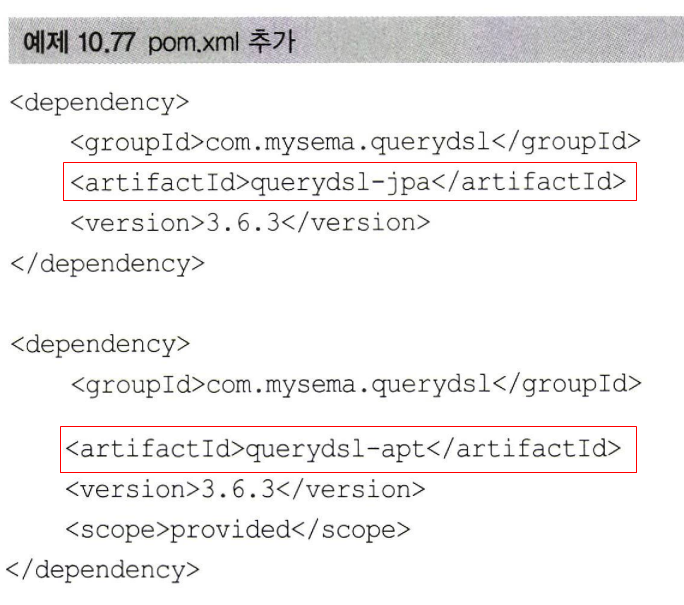   
- querydsl-jpa : QueryDSL JPA 라이브러리
- querydsl-apt : 쿼리타입(Q)을 생성할 때 필요한 라이브러리

### 환경설정
- QueryDSL는 엔티티를 기반으로 쿼리 타입이라는 쿼리용 클래스를 생성해야한다.

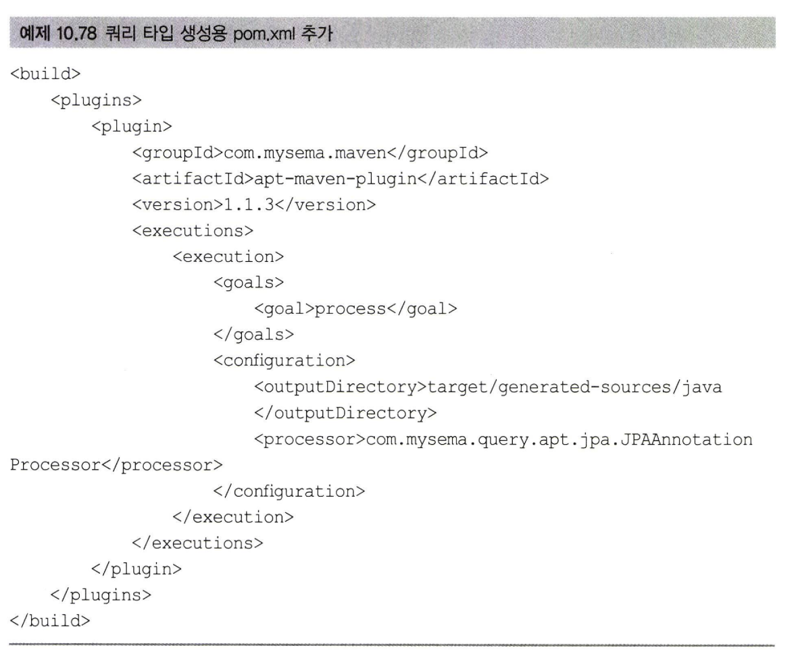   

- 쿼리 타입 생성용 플러그인을 pom.xml에 위에 처럼 추가한다.
- 콘솔에서 mvn compile을 입력하면 outputDirectory에 지정한 target/generated-sources 위치에 QMember. java처럼 Q로 시작하는 쿼리 타입들이 생성 된다.
- target/generated-sources를 소스 경로에 추가하면 된다.

## 10.2 시작

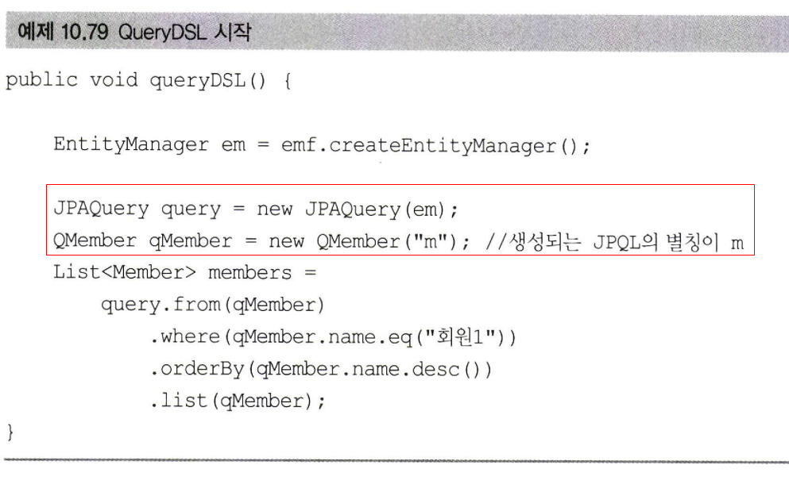   
- QueryDSL을 사용하려면 우선 com.mysema.query.jpa.impl.JPAQuery 객체를 생성해야 한다.
- JPAQuery 객체를 생성할 때 엔티티 매니저를 생성자에 넘겨준다.
- 사용할 쿼리 타입(Q)을 생성하는데 별칭을 만들어서 생성자에 넘겨준다. 
- 이 별칭은 JPQL에서 별칭으로 사용된다.

### 기본 Q 생성

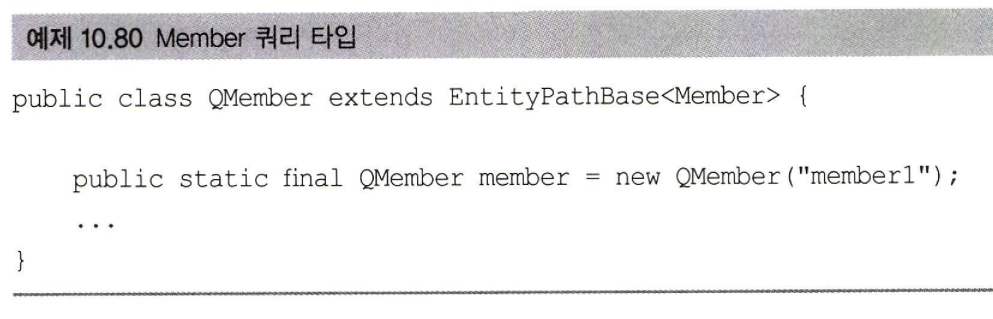 |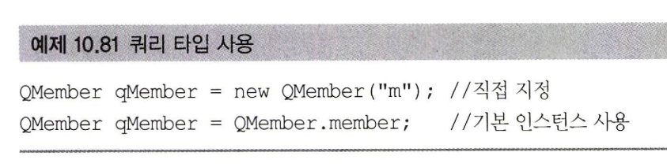
|----|----|
- 쿼리 타입(Q)을 사용하기 편리하도록 기본 인스턴스를 보관하고 있다.
- 단, 같은 엔티티를 조회하거나 조인하거나 같은 엔티티를 서브쿼리에서 사용하면 같은 별칭이 사용되므로 이때는 별칭을 직접 지정해줘야한다.
- 쿼리 타입의 기본 인스턴스를 사용하면 import static을 활용해서 코드를 더 간결하게 작성할 수 있다. 

    

- 쿼리 타입을 기본 인스턴스로 보관해서 사용하면 QMember.member가 아닌 member로 사용할 수 있게 된다. 

### 10.4.3 검색 조건 쿼리

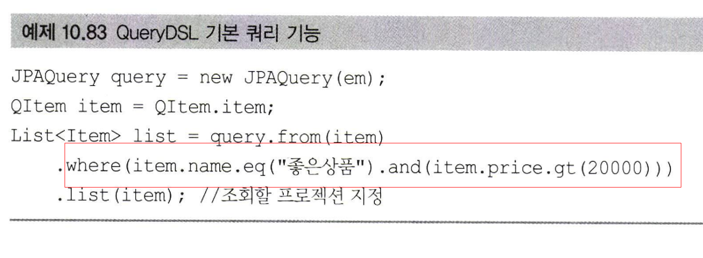 |
|----|----|

- QueryDSL의 where 절에는 and 나 or을 사용할 수 있다. 또한 다음처럼 여러 검색 조건을 사용해도 된다. 이 때는 and 연산이 된다.
- .where(item.name.eq("좋은상품"),item.price.gt(20000)) 로 and를 쓰지 않고 ,로도 표현해서 사용할 수 있다.

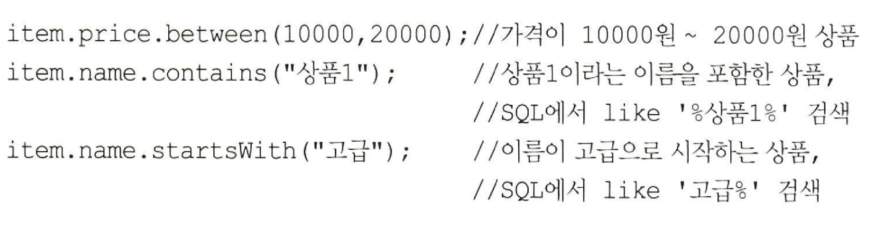   

- where()에서 사용되는 여러 메소드 들이 있다.
- IDE가 제공하는 코드 자동 완성 기능의 도움을 받으면 필요한 메소드를 손쉽게 찾을 수 있다.

### 10.4.4 결과 조회

- 쿼리 작성이 끝나고 결과 조회 메소드를 호출하면 실제 데이터베이스를 조회한다.
- uniqueResult()나 list()를 사용하고 파라미터로 프로젝션 대상을 넘겨준다.
- 결과 조회 API는 com.myserna.query.Projectable에 정의되어 있다.
- 대표 결과 조회 메소드가 아래와 같다.
  - uniqueResult() : 조회 결과가 한 건일 때 사용한다. 조회 결과가 없으면 null을 반환하고 결과가 하나 이상이면 com.mysema.query . NonUniqueResultException 예외가 발생한다.
  -  singleResult() : uniqueResult()와 같지만 결과가 하나 이상이면 처음 데이터를 반환한다.
  -  list() : 결과가 하나 이상일 때 사용한다. 결과가 없으면 빈 컬렉션을 반환한다.
    
### 10.4.5 페이징과 정렬

   

- 정렬은 orderBy를 사용하는데 쿼리 타입(Q)이 제공하는 asc(),desc ()를 사용한다.
- 페이징은 offset과 limit을 적절히 사용해서 사용하면 된다.

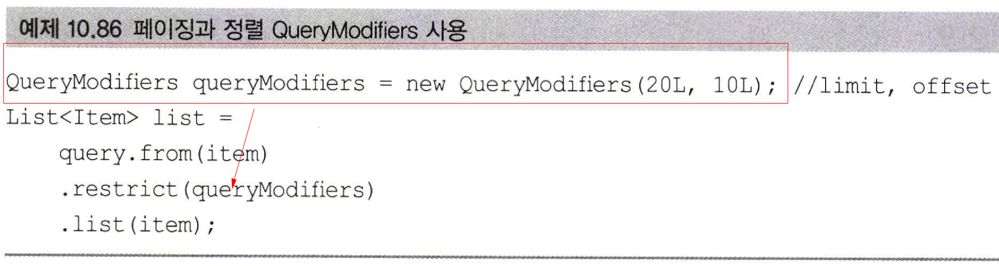   
- restrict () 메소드에 com.mysema.query.QueryModifiers를 파라미터로 사용해도 된다.

- 실제 페이징 처리를 하려면 검색된 전체 데이터 수를 알아야 한다.

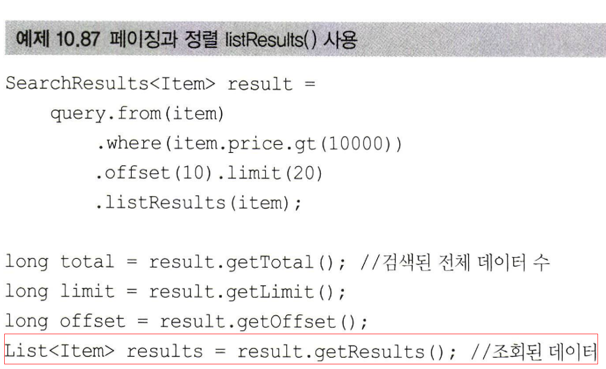   
- list() 대신에 listResults()를 사용한다.
- listResults()를 사용하면 전체 데이터를 조회를 위한 count 쿼리를 한번 더 실행한다.
- SearchResults()를 반환하는데 이 객체에서 전체 데이터 수를 조회할 수 있다.
  
### 10.4.6 그룹

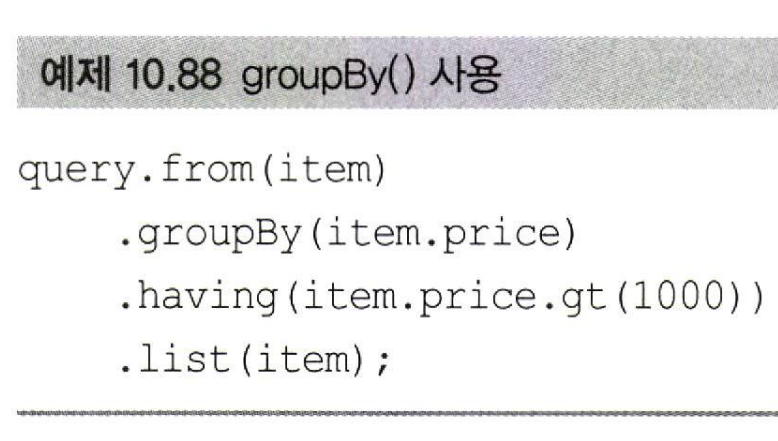   

- groupBy를 사용하고 그룹화된 결과를 제한하려면 having을 사용하면 된다.

### 10.4.7 조인
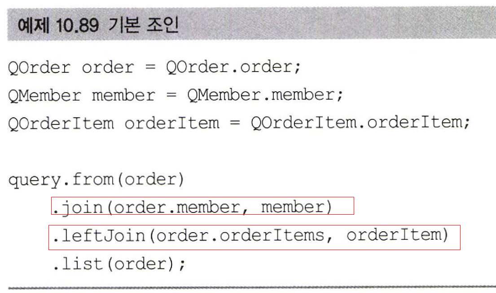   
- 조인(join)은 innerJoin (join) leftJoin , rightJoin, fullJoin 을 사용할 수 있고 추가로 JPQL의 on과 성능 최적화를 위한 fetch 조인도 사용할 수 있다.
- 조인을 사용할 때 첫 번째 파라미터에 조인 대상을 지정하고, 두 번째 파라미터에 별칭alias으로 사용할 쿼리 타입을 지정한다.

### 조인 on
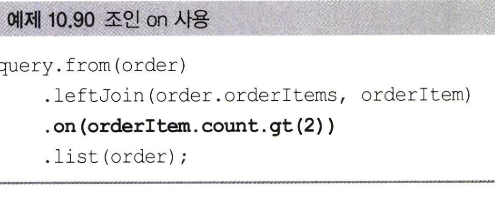   

- on 조건을 걸어 join할 대상의 조건을 걸어준다. 

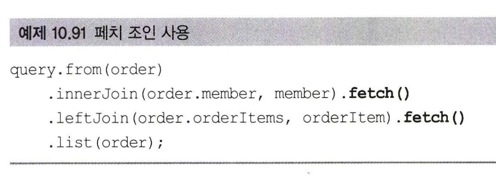   

- join에 페치조인을 사용할 수 있다. 
- 페치조인 많이 사용하낟.

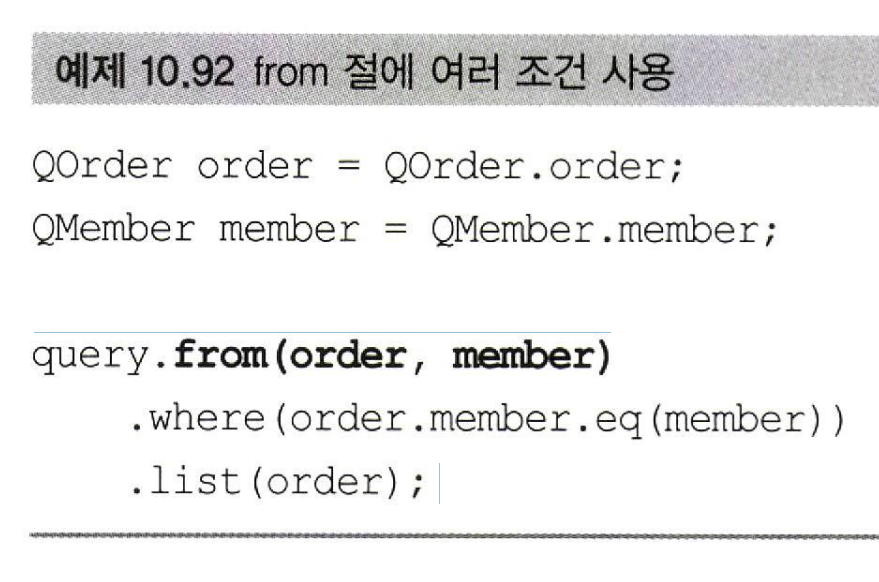   

- from 절에 여러 조인을 사용하는 세타 조인 방법이다.

<details>
<summary>세타 조인</summary></summary>

<!-- summary 아래 한칸 공백 두어야함 -->
세타 조인(Theta Join)은 일반적인 조인 유형 중 하나로, 조인 조건에 특정 연산자(보통 등호(=) 외의 연산자)를 사용하여 조인하는 것을 말합니다

</details>

### 10.4.8 서브쿼리

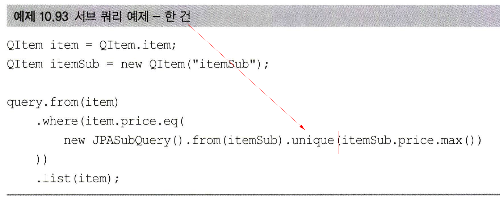|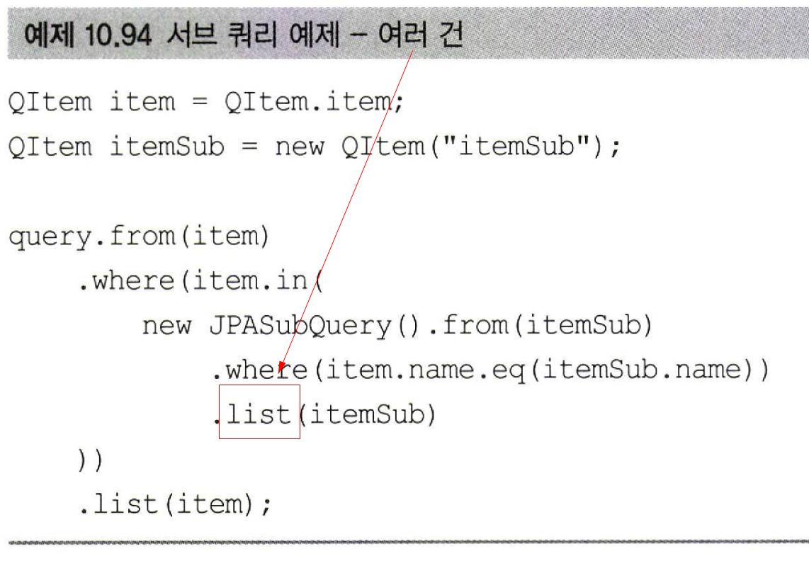  
|------|------|

- com.mysema.query.jpa.JPASubQuery를 생성해서 사용한다.
- 서브쿼리 결과가 하나면 unique(), 여러 건이면 list()를 사용할 수 있다. 

### 10.4.9 프로젝션과 결과 반환

- select 절에 조회 대상을 지정하는 것을 프로젝션이라 한다.

#### 프로젝션 대상이 하나
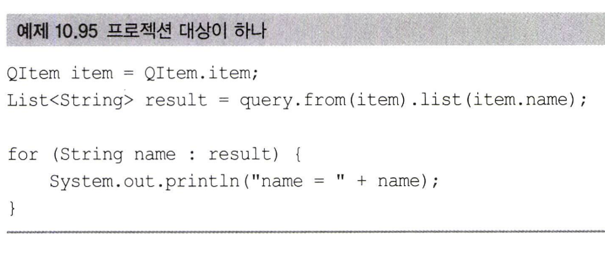  
- 프로젝션이 하나면 해당 타입으로 반환한다.

#### 프로젝션 대상이 여러개
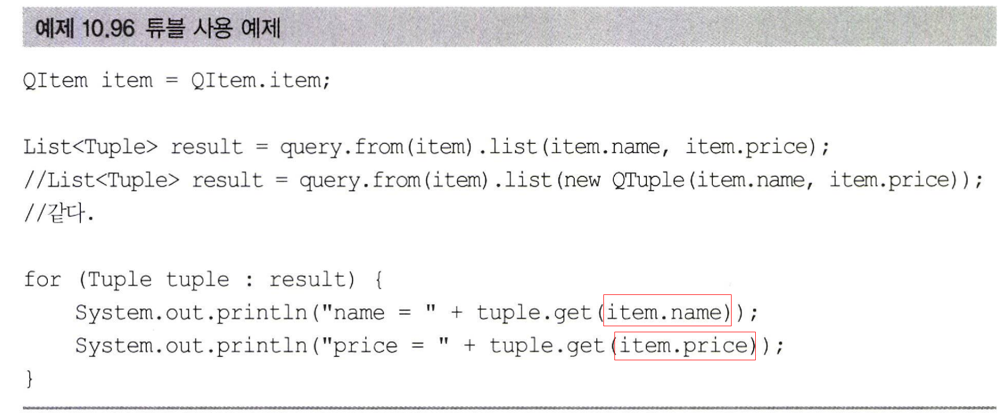  

- 프로젝션 대상으로 여러 필드를 선택하면 QueryDSL은 기본으로 com.mysemaquery.Tuple이라는 Map과 비슷한 내부 타입을 사용한다.
- 조회 결과는 tuple.get() 메소드에 조회한 쿼리타입을 지정하면 된다.

- 쿼리결과를 엔티티가 아닌 특정 객체로 받고싶으면 빈 생성 기능을 사용한다.
- QueryDSL은 객체를 생성하는 다양한 방법을 제공한다.
  - 프로퍼티 접근
  - 필드 직접 접근
  - 생성자 사용
- 원하는 방법을 지정하기 위해 com.mysem.query, types.Projections를 사용하면 된다.

#### 프로퍼티 접근
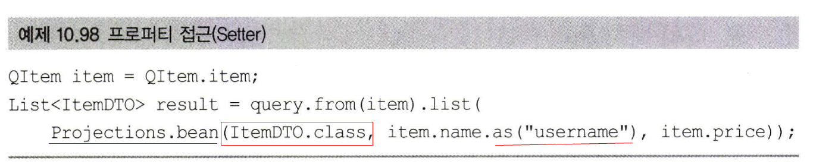  
- Projections.bean () 메소드는 수정자(Setter)를 사용해서 값을 채운다.
-  쿼리 결과는 name인데 ItemDTO는 username 프로퍼티를 가지고 있다. 이렇게 쿼리 결과와 매핑 프로퍼티 이름이 다르면 as 별칭을 주면된다.

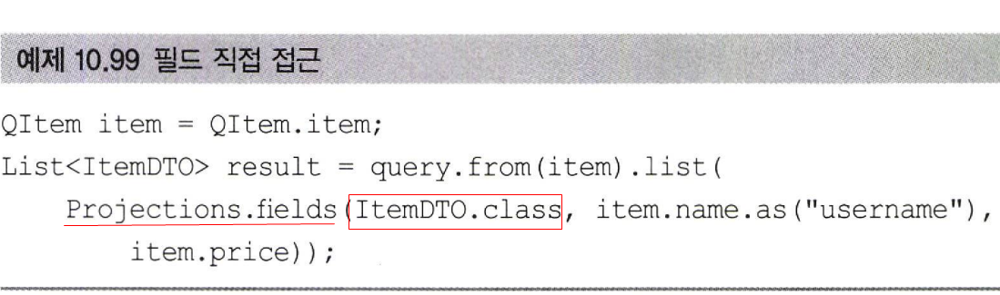  
- Projections.fields() 메소드를 사용하면 필드에 직접 접근해서 값을 채워준다.
- 필드를 private로 설정해도 동작한다.


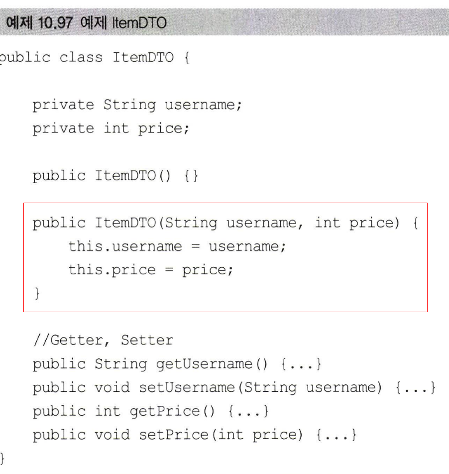|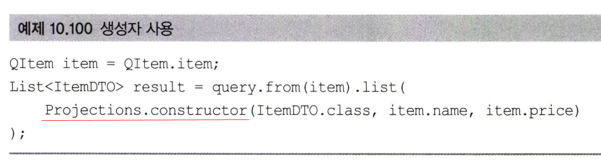  
|------|------|

-  Projections.constructor() 메소드는 생성자를 사용한다.
-  프로젝션과 파라미터 순서가 같은 생성자가 필요하다.

#### Distinct

```java
query.distinct().from(item)...
```
### 10.4.10 수정，삭제 배치 쿼리
- QueryDSL도 수정，삭제 같은 배치 쿼리를 지원한다.
- JPQL 배치 쿼리와 같이 영속성 컨텍스트를 무시하고 데이터베이스를 직접 쿼리를 실행한다.
<details>
<summary>배치 쿼리 </summary>

<!-- summary 아래 한칸 공백 두어야함 -->

JPQL 배치 쿼리는 JPA(Java Persistence API)에서 제공하는 기능 중 하나입니다. 이는 대량의 데이터를 처리할 때 성능을 향상시키는 방법 중 하나다.

JPQL 배치 쿼리를 사용하면 일괄 업데이트 또는 삭제와 같은 대량 작업을 처리할 때 단일 쿼리를 실행하여 모든 엔티티를 처리할 수 있습니다. 이를 통해 데이터베이스와의 통신 횟수를 줄이고 처리 시간을 단축할 수 있습니다.

</details>
  
### 10.4.11 동적 쿼리

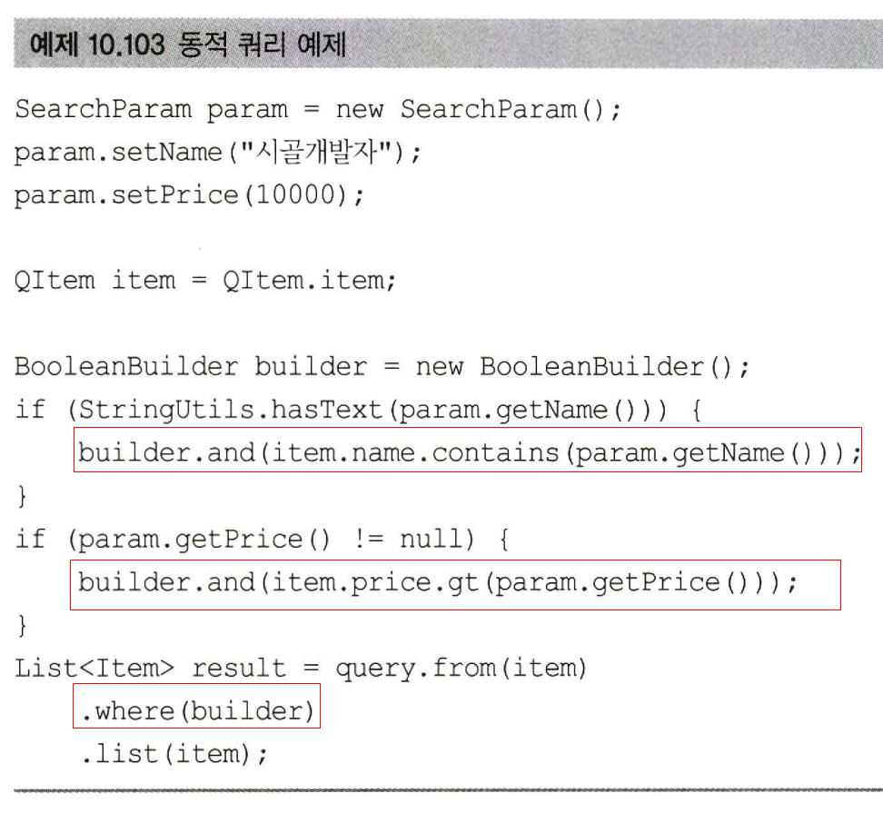  
- com.mysema.query.BooleanBuilder를 사용하면 특정 조건에 따른 동적 쿼리를 편리하게 생성할 수 있다

### 10.4.12 메소드 위임
- ????
  
## 10.5 네이티브 SQL
- JPQL은 표준 SQL이 지원하는 대부분의 문법과 SQL 함수들을 지원하지만 특정 데이터베이스에 종속적인 기능은 지원하지 않는다.
- 아래 기능들은 특정 데이터베이스에 종속되기 때문에 JPA에서 사용하지 않는다.
  - 특정 데이터베이스에서만 지원하는 함수,문법,SQL쿼리 힌트
  - 인라인뷰,UNION,INTERSECT
  - 스토어 프로시저
- JPA는 특정 데이터베이스에 종속적인 기능을 사용할 수 있는 다양한 방법을 열어두었다.
- 특정 데이터베이스에 종속적인 기능을 지원하는 방법은 아래와 같다.
  - 특정 데이터베이스만 사용하는 함수
    - JPQL에서 네이티브 SQL 함수를 호출할 수 있다.
    - 하이버네이트는 데이터베이스 방언에 각 데이터베이스에 종속적인 함수들을 정의해두었다. 또한 직접 호출할 함수를 정의할 수도 있다.
  - 특정 데이터베이스만 지원하는 SQL 쿼리 힌트
    - 하이버네이트를 포함한 몇몇 JPA 구현체들이 지원한다.
  - 인라인 뷰(From 절에서 사용하는 서브쿼리)，UNION, INTERSECT
    - 하이버네이트는 지원하지 않지만 일부 JPA 구현체들이 지원한다.
  - 스토어 프로시저
    - JPQL에서 스토어드 프로시저를 호출할 수 있다(JPA 2.1)
  - 특정 데이터베이스만 지원하는 문법
    - 오라클의 CONNECT BY처럼 특정 데이터베이스에 너무 종속적인 SQL 문법은 지원하지는 않는다. 이때는 네이티브 SQL을 사용해야 한다.
   
- 다양한 이유로 JPQL을 사용할 수 없을 때 JPA는 SQL을 직 접 사용할 수 있는 기능을 제공하는데 이것을 네이티브 SQL이라 한다.
- JPQL을 사용하면 JPA가 SQL을 생성한다.
- 네이티브 SQL을 사용하면 엔티티를 조회할 수 있고 JPA가 지원하는 영속성 컨텍스트의 기능을 그대로 사용할 수 있다.

### 10.5.1 네이티브 SQL 사용

#### 엔티티 조회
  ```java
  //결과 타입 정의
  public Query createNativeQuery(String sqlString, Class resultClass)
  ```
  - 네이티브 SQL은 em.createNativeQuery (SQL, 결과클래스) 문법으로 사용한다.
  - 첫 번째 파라미터는 네이티브 SQL을 입력하고 두 번째 파라미터는 조회할 엔티티 클래스의 타입을 입력한다.
  
  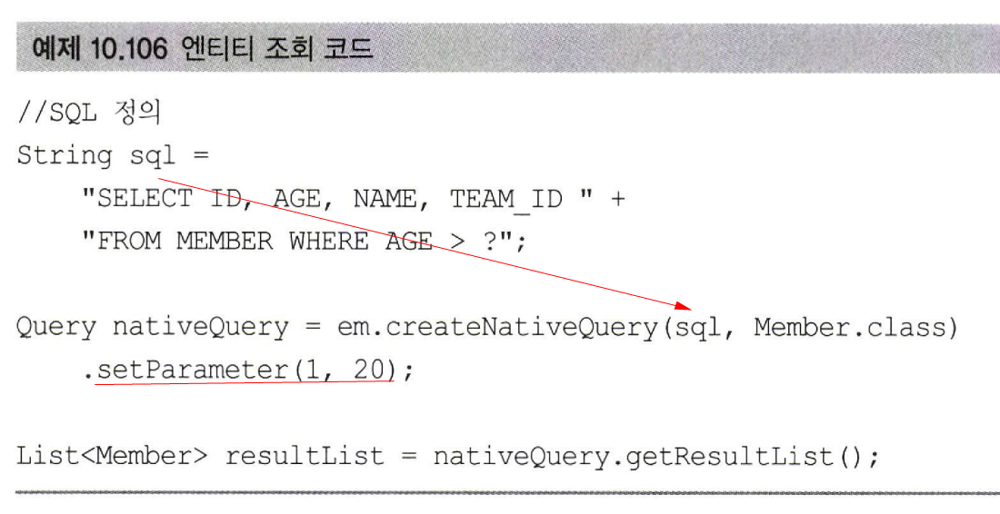  

  - JPQL를 사용할 때와 거의 비슷하지만 실제 데이터베이스 SQL을 사용한다는 것과 위치기반 파라미터만 지원한다는 차이가 있다
  - 여기서 가장 중요한 점은 네이티브 SQL로 SQL만 직접 사용할 뿐이지 나머지는 JPQL을 사용할 때와 같다.
  - 조회한 엔티티도 영속성 컨텍스트에서 관리된다.

<details>
<summary>네이티브 SQL 위치기반 파라미터</summary>

<!-- summary 아래 한칸 공백 두어야함 -->

네이티브 SQL에서 위치기반 파라미터는 위치(순서)에 따라 전달되는 파라미터를 의미합니다. 위치기반 파라미터는 SQL 쿼리에서 ? 와 같은 형태로 사용되며, 해당 위치에 매칭되는 파라미터 값이 SQL 쿼리에 바인딩됩니다.

</details>

> JPA는 공식적으로 네이티브 SQL에서 이름 기반 파라미터를 지원하지 않고 위치 기반 파라미 
터만 지원한다. 하지만 하이버네이트는 네이티브 就 1L에 이름 기반 파라미터를 사용할 수 있다. 
따라서 하이버네이트 구현체를 사용한다면 예제를 이름 기반 파라미터로 변경해도 동작한다.

> em.createNativeQueryO를 호출하면서 타입 정보를 주었는데도 TypeQuery가 아닌 Query가 리 
턴되는데 이것은 JPA1.0에서 API 규약이 정의되어 버려서 그렇다. 너무 신경 쓰지 않아도 된다.

#### 값 조회

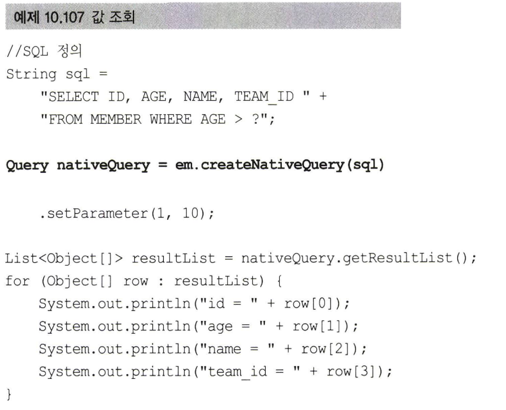  
- 엔티티로 조회하지 않고 단순히 값으로 조회했다.
- JPA는 조회한 값들을 Object []에 담아서 반환한다.
- 여기서는 스칼라 값들을 조회했을 뿐이므로 결과를 영속성 컨텍스트가 관리하지 않는다.

#### 결과 매핑 사용

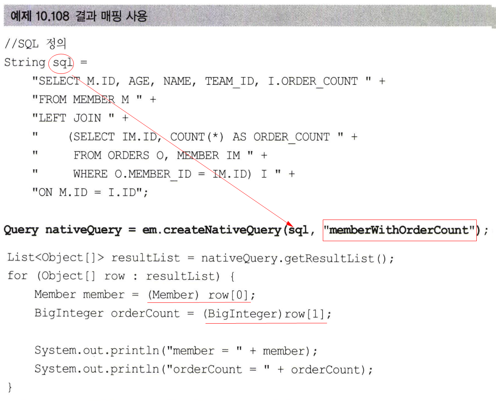 | 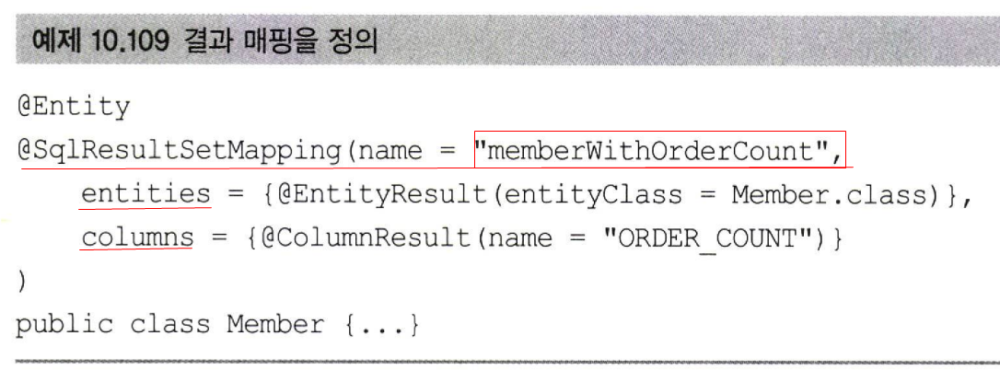 
|-------|-------|

- 그림1에서 em.createNativeQuery (sql, "meiTiberWithOrderCourvtn")의 두 번째 파라미터에 결과 매핑 정보의 이름이 사용되었다.
- 그림2 memberWithOrderCount의 결과 매핑을 잘 보면 회원 엔티 티와 ORDER_COUNT 컬럼을 매핑했다.
- 사용한 쿼리 결과에서 ID, AGE, NAME, TEAM_ID는 Member 엔티티와 매핑했고 ORDER_C0UNT는 단순히 값으로 매핑한다.
- entities, columns라는 이름에서 알 수 있듯이 여러 엔티티와 여러 컬럼을 매핑할 수 있다.

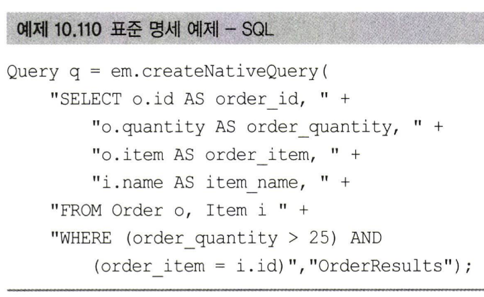 | 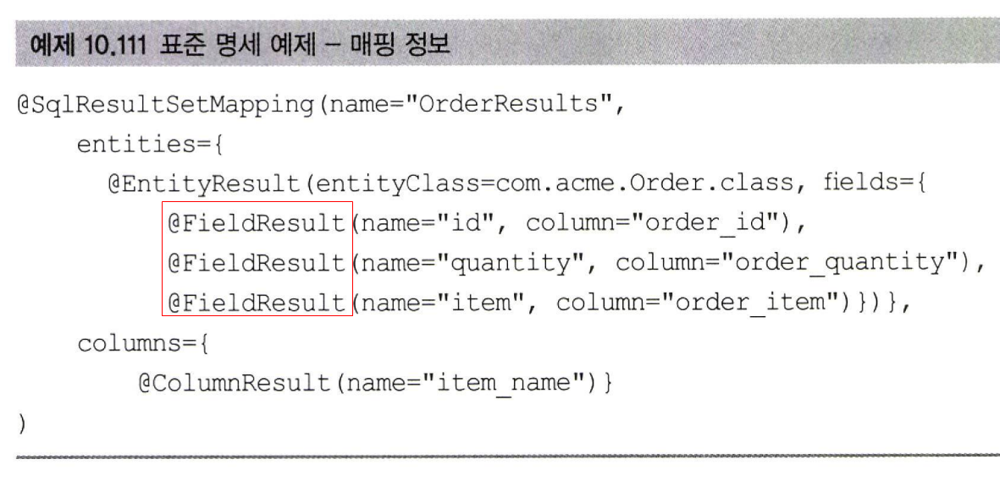 
|-------|-------|

- @FieldResult를 사용해서 컬럼 명과 필드명을 직접 매핑한다
- 이 설정은 엔티티의 필드에 정의한 @Column보다 앞선다.
- 조금 불편한 것은 @FieldResult를 한 번이라도 사용하면 전체 필드를 @FieldResult로 매핑해야 한다.

```java
SELECT A.ID, B.ID FROM A, B
```
```xml
SELECT
A. ID AS A_ID,
B. ID AS B_ID
FROM A, B
```
- 두 엔티티를 조회하는데 컬럼명이 중복될 때도 @FieldResult를 사용해야 한다.
- A, B 둘 다 ID라는 필드를 가지고 있으므로 컬럼명이 충돌한다. 따라서 다음과 같이 별칭을 적절히 사용하고 @FieldResult로 매핑하면 된다.

#### 결과 매핑 어노테이션
- @SqlResultSetMapping 
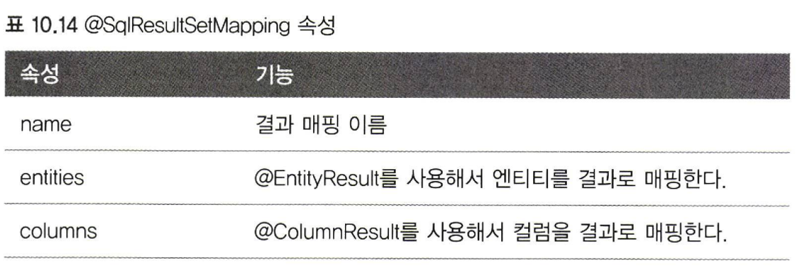

- ©EntityResult
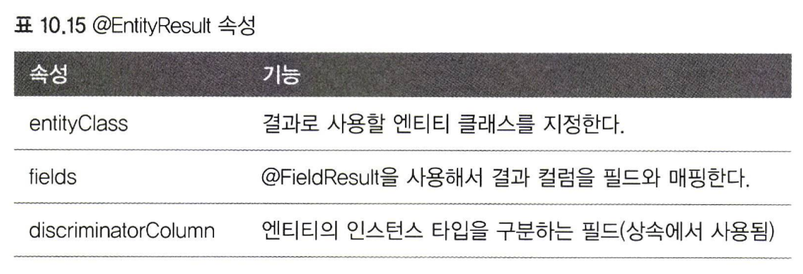

- ©FieldResult
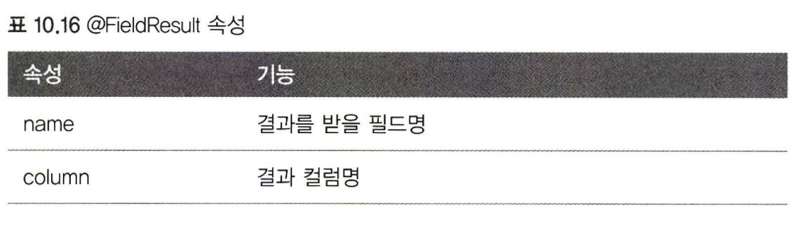

- @ColumnResult


### 10.5.2 Named 네이티브 SQL

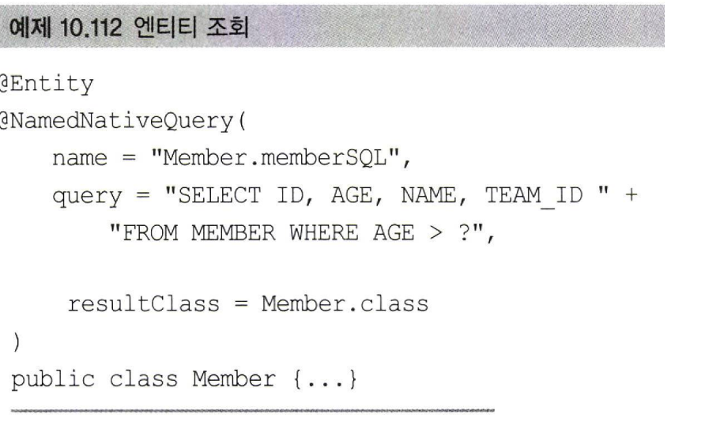|
|--------|---------|
- JPQL처 럼 네이티브 SQL도 Named 네이티브 SQL을 사용해서 정적 SQL을 작성할 수 있다. 
- @NamedNativeQuery로 Named 네이티브 SQL을 등록한다.
- JPQL Named 쿼리와 같은 createNamedQuery 메소드를 한다. 따라서 TypeQuery를 사용할 수 있다.

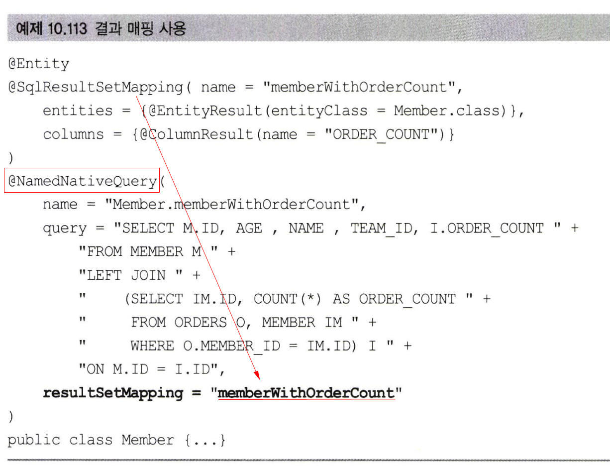|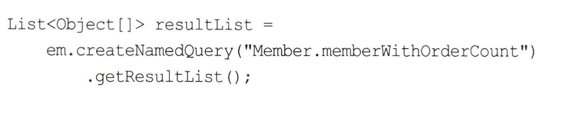
|--------|---------|
- Named 네이티브 쿼리에서 resultSetMapping = "memberWithOrderCount"로 조회 결과를 매핑할 대상까지 지정했다.
- 정의한 Named 네이티브 쿼리를 em.createNamedQuery ("Member.memberWithOrderCount").getResultList()로 사용할 수 있다.

#### @NamedNativeQuery
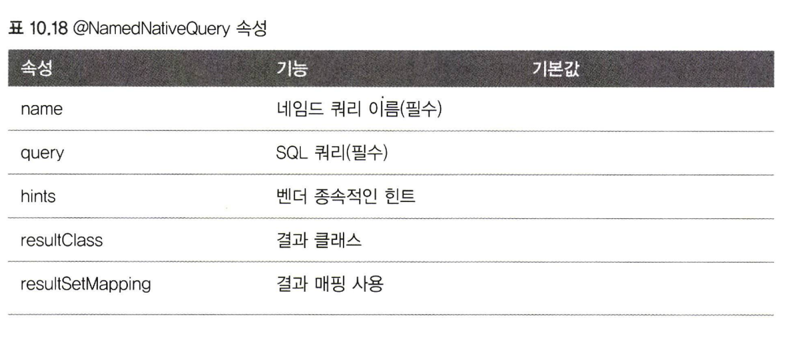
- hints 속성이 있는데 이것은 SQL 힌트가 아니라 하이버네이트 같은 JPA 구현체에 제공하는 힌트다.

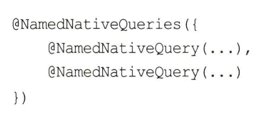
- 여러 Named 네이티브 쿼리를 선언할 수 있다.

### 네이티브 SQL XML에 정의

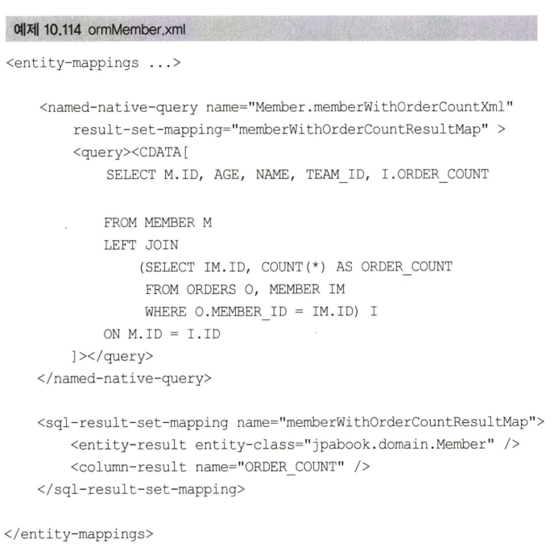

- XML에 정의할 때는 순서를 지켜야한다.<named-native-query>를 먼저 정의하고 <sql-result-set-mapping>를 정의해야 한다.

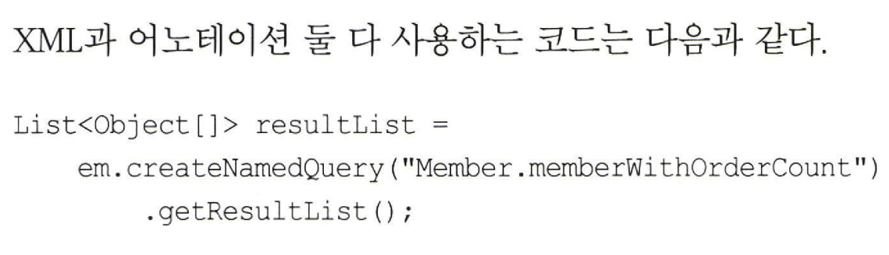

> 네이티브 SQL은 보통 JPQL로 작성하기 어려운 복잡한 SQL 쿼리를 작성하거나 SQL을 최적화해서 데이터베이스 성능을 향상할 때 사용한다.
>  이런 쿼리들은 대체로 복잡하고 라인수가 많다. 따라서 어노테이션보다는 XML 사용하는 것이 여러모로 편리하다.
> 자바는 멀티 라인 문자열을 지원하지 않으므로 라인을 변경할 때마다 문자열을 더해야 하는 큰 불편함이 있다. 반면에 XML을 사용하면 SQL 개발 도구에서 완성한 SQL을 바로 붙여 넣을 수 있어 편리하다

### 네이티브 SQL 정리

- 네이티브 SQL도 JPQL을 사용할 때와 마찬가지로 Query, TypeQuery (Named 네이티브 쿼리의 경우에만) 를 반환한다. 따라서 JPQL API를 그대로 사용할 수 있다.

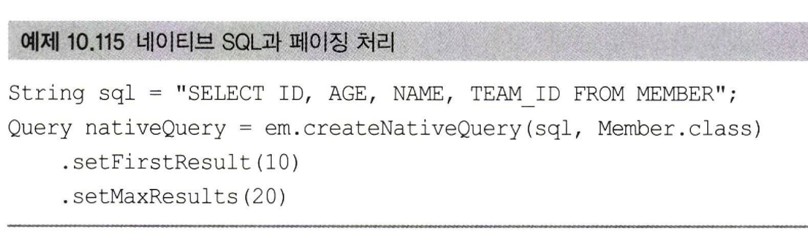|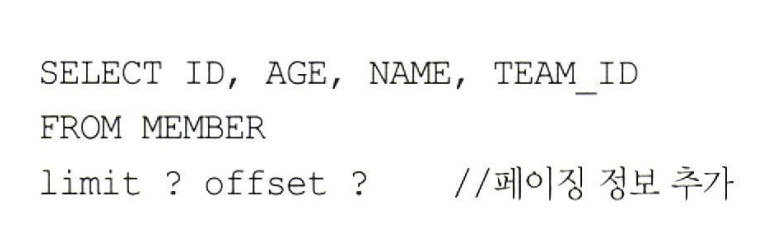
|--------|---------|
- 네이티브 SQL을 사용해도 페이징 처리 API를 적용할 수 있다
  
- 네이티브 SQL은 JPQL이 자동 생성하는 SQL을 수동으로 직접 정의하는 것이다. 따라서 JPA가 제공하는 기능 대부분을 그대로 사용할 수 있다
- 네이티브 SQL은 관리하기 쉽지 않고 자주 사용하면 특정 데이터베이스에 종속적인 쿼리가 증가해서 이식성이 떨어진다.
- 표준 JPQL을 사용하고 기능이 부족하면 차선책으로 하이버네이트 같은 JPA 구현체가 제공하는 기능을 사용하자.
- 네이티브 SQL로도 부족함을 느낀다면 MyBatis나 스프링 프레임워크가 제공하는 JdbcTemplate 같은 SQL매퍼와 JPA를 함께 사용하는 것도 고려할만하다.

### 스토어드 프로시저(JP A 2.1)

#### 스토어드 프로시저 사용
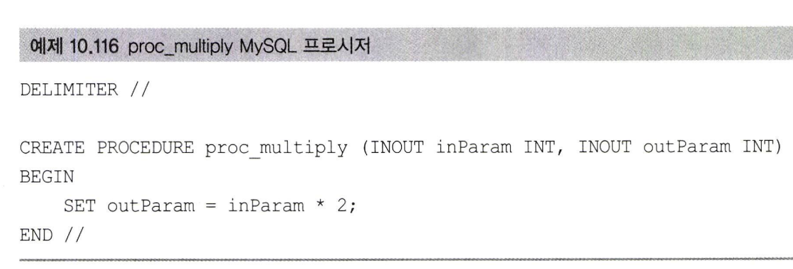|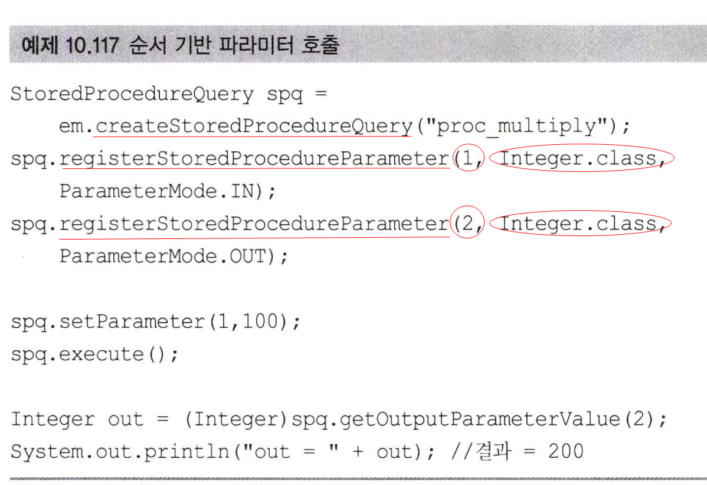
|-------|--------|

- 단순히 입력 값을 두 배로 증가시켜 주는 proc_m ultiply라는 스토어드 프로시저가 있다
- 스토어드 프로시저를 사용하려면 em.createStoredProcedureQuery () 메소드에 사용할 스토어드 프로시저 이름을 입력하면 된다.
- registerStoredProcedureParameter() 메소드를 사용해서 프로시저에서 사용할 파라미터를 순서，타입，파라미터 모드 순으로 정의하면 된다.

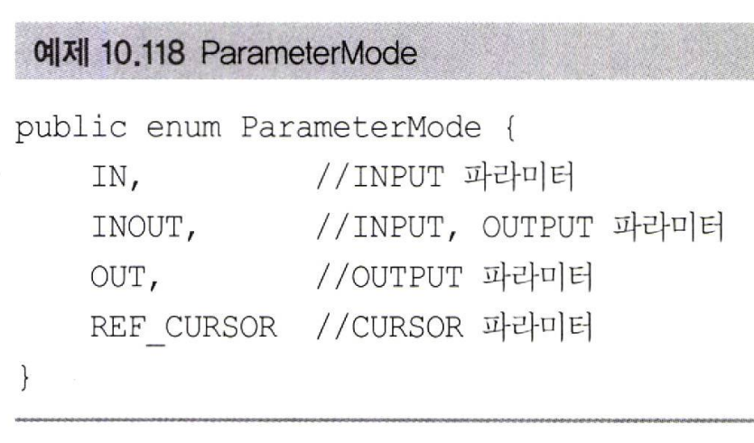|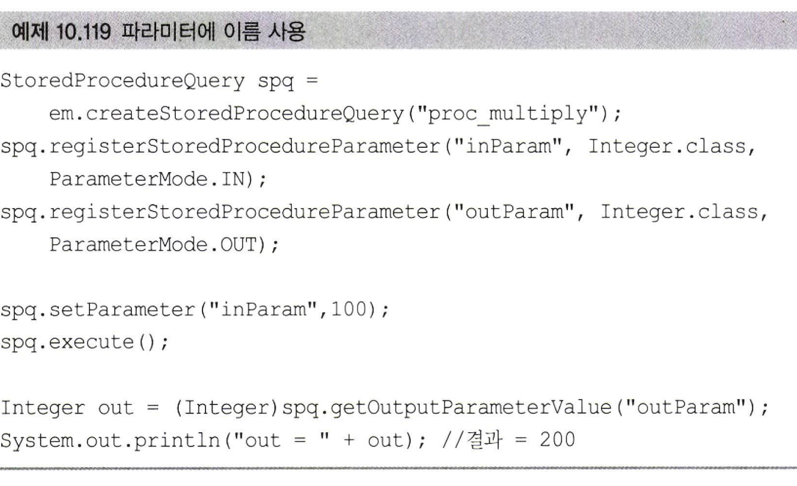
|-------|--------|

#### Named 스토어드 프로시저 사용
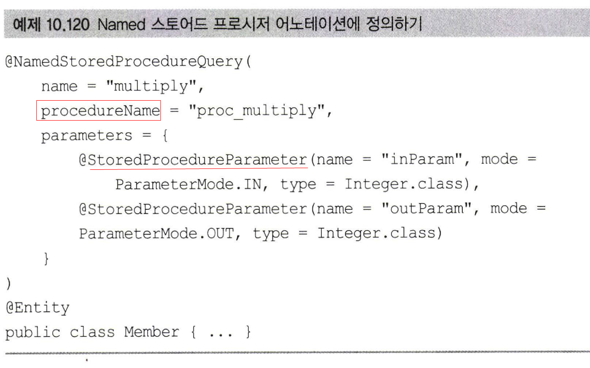
- 스토어드 프로시저 쿼리에 이름을 부여해서 사용하는 것을 Named 스토어드 프로시저라 한다
- @NamedStoredProcedureQuery로 정의하고 name 속성으로 이름을 부여한다.
- procedureName 속성에 실제 호줄할 프로시저 이름을 적어준다.
- @StoredProcedureParameter를 사용해서 파라미터 정보를 정의한다.
- 둘 이상을 정의하려면 @NamedStoredProcedureQueries를 사용하면 된다.

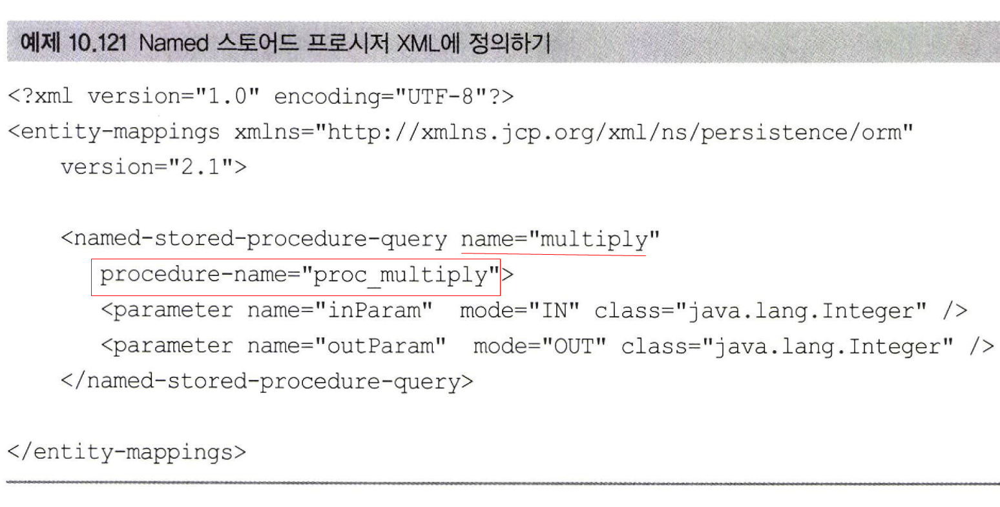|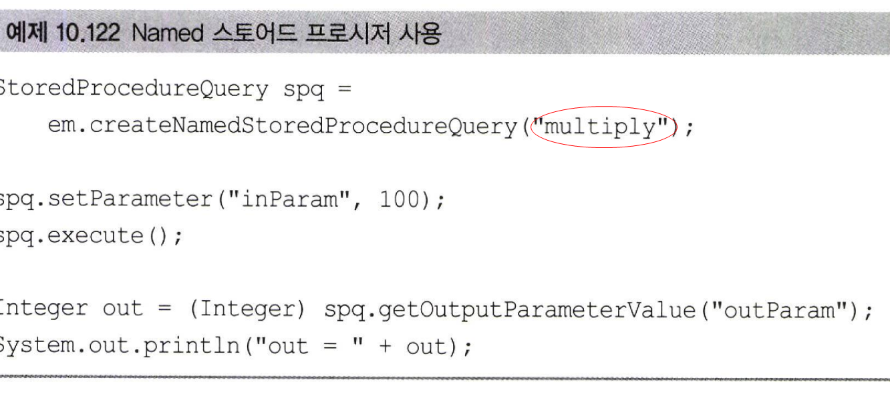
|-------|--------|

- Named 스토어드 프로시저는 em.createNamedStoredProcedureQuery() 메소드에 등록한 Named 스토어드 프로시저 이름을 파라미터로 사용해서 찾아올 수 있다.
 
## 10.6 객체지향 쿼리 심화

### 10.6.1 벌크연산

- 엔티티를 수정하려면 영속성 컨텍스트의 변경 감지 기능이나 병합을 사용하고，삭제하려면 EntityManager.remove () 메소드를 사용한다.
- 하지만 이 방법으로 수백개 이상의 엔티티를 하나씩 처리하기에는 시간이 너무 오래 걸린다.
- 이럴 때 여러 건을 한 번에 수정하거 나 삭제하는 벌크 연산을 사용하면 된다.

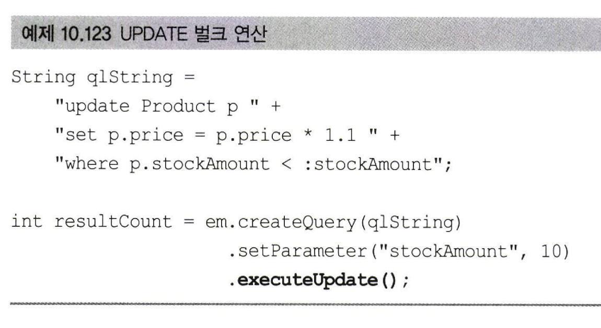

- 벌크 연산은 executeUpdate () 메소드를 사용한다.
- 이 메소드는 벌크 연산으로 영향을 받은 엔티티 건수를 반환한다.

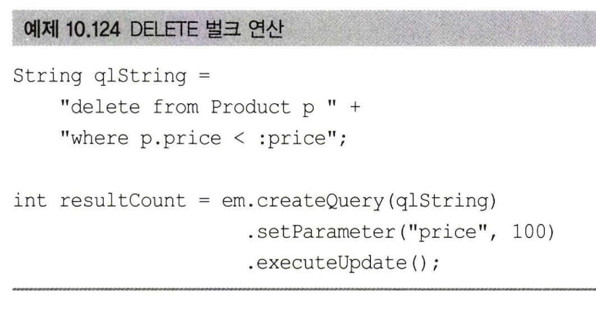
- 삭제도 업데이트와 같은 메소드를 사용한다

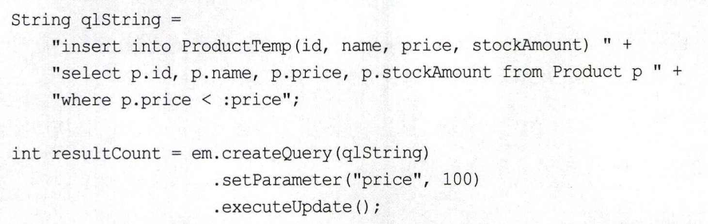

- JPA 표준은 아니지만 하이버네이트는 INSERT 벌크 연산도 지원한다.

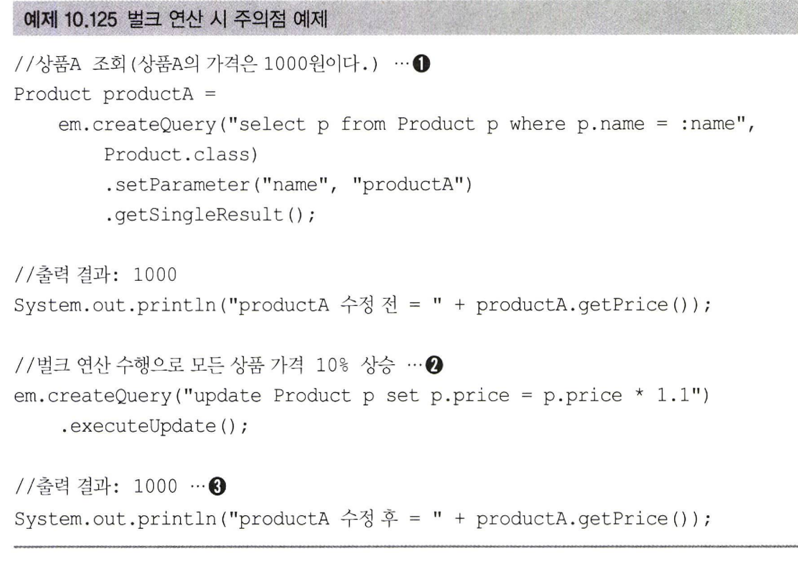
- 벌크 연산을 사용할 때는 벌크 연산이 영속성 컨텍스트를 무시하고 데이터베이스에 직접 쿼리한다는 점에 주의해야 한다.

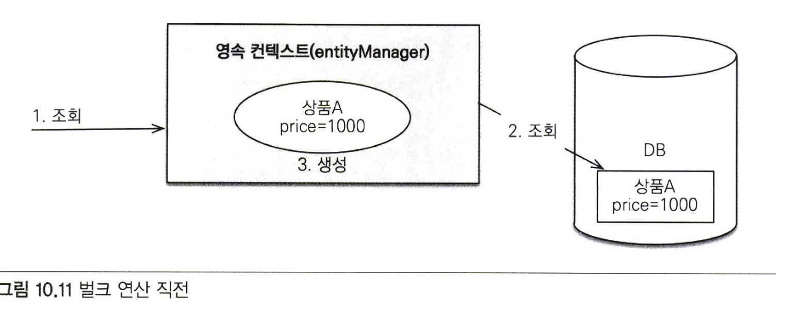|
|-------|--------|

- 벌크 연산 직전의 상황을 나타낸다. 상품 A를 조회 했으므로 가격이 1000원인 상품A가 영속성 컨텍스트에 관리된다.
- 벌크 연산은 영속성 컨텍스트를 통하지 않고 데이터베이스에 직접 쿼리한다.
- 벌크 연산 수행 후에는 영속성 컨텍스트에 있는 데이터와 데이터베이스에 있는 데이터가 다를 수 있다

- 영속성 컨텍스트에 있는 데이터와 데이터베이스에 있는 데이터가 다를 수 있는 문제를 해결하는 다양한 방법을 보자.

#### em.refresh()
```java
em. refresh (productA) ; / /데 이 터 베 이 스 에 서 상 품 A를 다 시 조 회 한 다 .
```
- 벌크 연산을 수행한 직후 정확한 엔티티를 사용해야 한다면 em.refresh()를 사용해서 데이터베이스에서 다시 조회하면 된다.

#### 벌크 연산 먼저 실행
- 가장 실용적인 해결책은 벌크 연산을 가장 먼저 실행하는 것이다.
- 이미 변경된 데이터로 조회하게 되니깐!

#### 벌크 연산 수행 후 영속성 컨텍스트 초기화
- 벌크 연산을 수행한 직후에 바로 영속성 컨텍스트를 초기화해서 영속성 컨텍스트에 남아 있는 엔티티를 제거하는 것도 좋은 방법이다.
- 그렇지 않으면 엔티티를 조회할 때 영속성 컨텍스트에 남아 있는 엔티티를 조회할 수 있어 벌크 연산이 적용되어 있지 않다.
- 영속성 컨텍스트를 초기화하면 이후 엔티티를 조회할 때 벌크 연산이 적용된 데이터베이스에서 엔티티를 조회한다.
- 벌크 연산은 영속성 컨텍스트와 2차 캐시를 무시하고 데이터베이스에 직접 실행한다.
- 그래서 영속성 컨텍스트와 데이터베이스 간에 데이터 차이가 발생할 수 있으므로 주의해서 사용해야 한다.
- 가능하면 벌크 연산을 가장 먼저 수행하는 것이 좋고 상황에 따라 영속성 컨텍스트를 초기화하는 것도 필요하다

### 10.6.2 영속성 컨텍스트와 JPQL 

#### 쿼리 후 영속 상태인 것과 아닌 것

- JPQL의 조회 대상은 엔티티，임베디드 타입，값 타입 같이 다양한 종류가 있다. 
- JPQL로 엔티티를 조회하면 영속성 컨텍스트에서 관리되지만 엔티티가 아니면 영속성 컨텍스트에서 관리되지 않는다.
- 조회한 엔티티만 영속성 컨텍스트가 관리한다.

#### JPQL로 조회한 엔티티와 영속성 컨텍스트


- JPQL로 데이터베이스에서 조회한 엔티티가 영속성 컨텍스트에 이미 있으면 JPQL로 데이터베이스에서 조회한 결과를 버리고 대신에 영속성 컨텍스트에 있던 
엔티티를 반환한다


|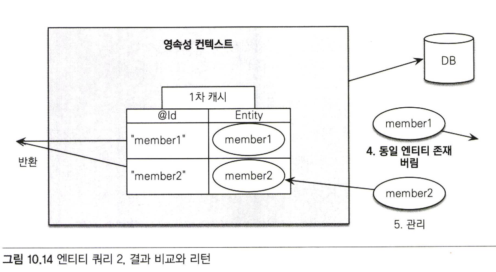
|-------|--------|

1. JPQL을 사용해서 조회를 요청한다.
2. JPQL은 SQL로 변환되어 데이터베이스를 조회한다.
3. 조회한 결과와 영속성 컨텍스트를 비교한다.
4. 식별자 값을 기준으로 memberl은 이미 영속성 컨텍스트에 있으므로 버리고 기존에 있던 memberl이 반환 대상이 된다.
5. 식별자 값을 기준으로 merrber2는 영속성 컨텍스트에 없으므로 영속성 컨텍스트에 추가한다
6. 쿼리 결과인 memberl, member2를 반환한다. 여기서 memberl은 쿼리 결과가 아닌 영속성 컨텍스트에 있던 엔티티다.

- JPQL로 조회한 엔티티는 영속 상태다.
- 영속성 컨텍스트에 이미 존재하는 엔티티가 있으면 기존 엔티티를 반환한다.
- 기존 엔티티를 보존하는 이유는 영속성 컨텍스트에 수정 중인 데이터가 사라질 수 있으므로 위험하기때문이다.
- 그래서 기존 엔티티를 보존해서 영속성 컨텍스트는 엔티티의 동일성을 보장한다.
- 영속성 컨텍스트는 영속 상태인 엔티티의 동일성을 보장한다. em.find () 로 조회하든 JPQL을 사용하든 영속성 컨텍스트가 같으면 동일한 엔티티를 반환한다.

#### find() vs JPQL
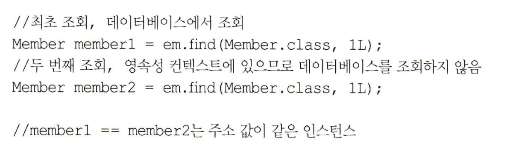|
|-------|--------|

- 결과 가 같을까? = 같다!!
- 두 방법 모두 두개의 값에 대해 주소값이 동일하게 조회되는 것을 볼 수 있다.
- 주소 값이 같은 인스턴스를 반환하고 결과도 같다. 하지만 내부 동작방식은 조금 다르다
  - JPQL은 항상 먼저 데이터베이스에 SQL을 실행해서 결과를 조회한다.
  - em.find() 메소드는 영속성 컨텍스트에서 엔티티를 먼저 찾고 없으면 데이터베이스를 조회한다.
    
### 10.6.3 JPQL 라 플러시 모드
- 플러시는 영속성 컨텍스트의 변경 내역을 데이터베이스에 동기화하는 것이다
- JPA는 플러시가 일어날 때 영속성 컨텍스트에 등록，수정，삭제한 엔티티를 찾아서 INSERT, UPDATE, DELETE SQL을 만들어 데이터베이스에 반영 한다
- 플러시를 호출하려 면 em.flush () 메소드를 직접 사용해도 되지만 보통 플러시 모드 FlushMode에 따라 커밋하기 직전이나 쿼리 실행 직전에 자동으로 플러시가 호출된다.


- 플러시 모드는 FlushModeType.AUTO가 기본값이다. 따라서 JPA는 트랜잭션 커밋 직전이나 쿼리 실행 직전에 자동으로 플러시를 호출한다,
- 다른 읍션으로는 FlushModeType.COMMIT이 있는데 이 모드는 커밋 시에만 플러시를 호출하고 쿼리실행 시에는 플러시를 호출하지 않는다. (성능최적화옵션)

### 쿼리와플러시 모드

- JPQL은 영속성 컨텍스트에 있는 데이터를 고려하지 않고 데이터베이스에서 데이터를 조회한다.
- JPQL을 실행하기 전에 영속성 컨텍스트의 내용을 데이터베이스에 반영해야 한다. 그렇지 않으면 의도하지 않은 결과가 발생할 수 있다
- 직접 em.flush()를 호출하거나 다음 코드처럼 Query 객체에 플러시 모드를 설정한다.
- 쿼리를 실행할 때 플러시를 자동으로 호출하지 않는다.
- 만약 쿼리 실행 전에 플러시를 호출하고 싶으면 주석으로 처리해둔 1. em.flush() 의 주석을 풀어서 수동으로 플러시 하거나 아니면
  2. setFlushMode () 로 해당 쿼리에서만 사용할 플러시 모드를 AUTO로 변경하면 된다.
- 이렇게 쿼리에 설정하는 플러시 모드는 엔티티 매니저에 설정하는 플러시 모드보다 우선권을 가진다.
- 플러시 모드의 기본값은 AUTO로 설정되어 있으므로 일반적인 상황에서는 방금 설명 한 내용을 고민하지 않아도 된다. 그

### 플러시 모드와 최적화
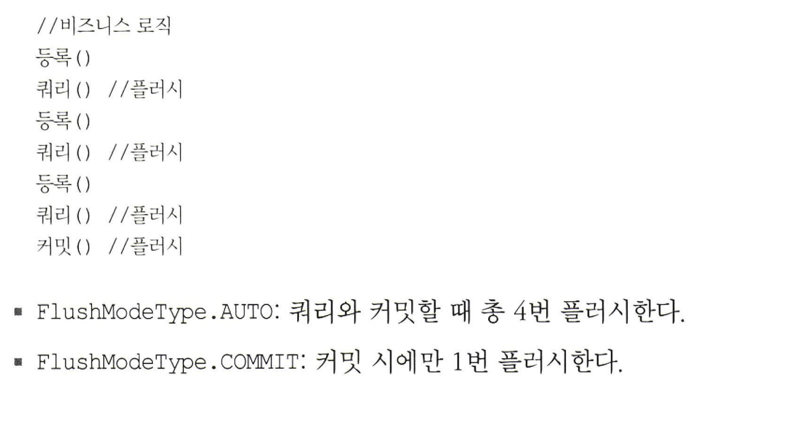
- FlushModeType.COMMIT 모드는 트랜잭션을 커밋할 때만 플러시하고 쿼리를 실행할 때는 플러시하지 않는다
- JPA 쿼리를 사용할 때 영속성 컨텍스트에는 있지만 아직 데이터베이스에 반영하지 않은 데이터를 조회할 수 없다.
- 잘못하면 데이터 무결성에 심각한 피해를 줄 수 있다. 그럼에도 다음과 같이 플러시가 너무 자주 일어나는 상황에 이 모드를 사용하면 쿼리시 발생하는 플러시 횟수를 줄여서 성능을 최적화할 수 있다.
- JPA를 사용하지 않고 JDBC를 직접 사용해서 SQL을 실행할 때도 플러시 모드를 고민해야 한다.
- JDBC로 쿼리를 실행하기 직전에 em.flush () 를 호출해서 영속성 컨텍스트의 내용을 데이터베이스에 동기화하는 것이 안전하다
