  # 10장_프록시와 연관관계 관리

<b>✨설명 전 Point 잡고 가기✨</b> 
1. JPA는 복잡한 검색조건을 사용해서 엔티티 객체를 조회할 수 있는 다양한 쿼리 기술을 지원한다.
2. 쿼리 기술
   * JPQL
   * Criteria
   * QueryDSI
3. JPQL은 가장 중요한 객체지향 쿼리 언어이고 Criteria나 QueryDSL은 결국 JPQL을 편리하게 사용하도록 도와주는 기술이다.
4. 이 장 마지막에는 객체지향 쿼리에 대한 심화 내용을 다룬다.

# 10.1 객체지향 쿼리 소개 
## 10.1.1 JPQL 소개
 - JPQL(Java Persistence Query Language)은 엔티티 객체를 조회하는 객체지향 쿼리다.
 - JPQL 특징으로
   - SQL 문법과 비슷하다.
   - ANSI 표준 SQL이 제공하는 기능을 유사하게 지원한다.
   - SQL을 추상화했기때문에 특정 데이터베이스에 의존하지 않는다.
      <details>
      <summary>JPQL은 SQL을 추상화한 것?</summary>
      
      <!-- summary 아래 한칸 공백 두어야함 -->
      - 추상화는 특정한 세부 사항을 숨기고 핵심 개념 또는 기능에만 집중할 수 있도록하는 것을 의미한다.
      - JPQL이 SQL을 추상화한다는 것은 JPQL이 데이터베이스의 상호 작용하는 방법을 추상화한다는 의미다.
      - 결국 개발자가 데이터베이스에 대해 구체적으로 알 필요없이도 더 높은 수준에서 작업을 할 수 있게 도와준다.
      - 즉, JPQL의 세부 사항을 숨기고 개발자가 보다 추상적인 수준에서 작업할 수 있도록 합니다. 
      </details>
   - 데이터베이스 방언만 변경하면 JPQL을 수정하지 않아도 자연스럽게 데이터베이스를 변경할 수 있다.
   - JPQL이 제공하는 표준화된 함수를 사용하면 선택한 방언에 따라 해당 데이터베이스에 맞춘 적절한 SQL 함수가 실행된다.
   - 엔티티 직접조회, 묵시적 조인, 다형성 지원 등 이러한 이유로 JPQL은 SQL보다 간결하다. 

 |
|----|----|

- JPQL에서 Member은 테이블 이름이 아니라 엔티티 이름이다.
- m.username은 테이블 컬럼명이 아니라 엔티티 객체의 필드다.
```java
em.CreateQuery(jpql,Member.class).getResultList()
```
- em.CreateQuery메소드에 실행할 JPQL과 반환할 엔티티 클래스 타입인 Member.class를 넘겨주고 getResultList() 메소드를 실행하면 JPA는 JPQL을 SQL로 변환해서 데이터베이스를 조회한다. 그리고  조회한 결과로 Member 엔티티를 생성해서 반환한다.

 |
|----|----|

- JPQL을 실행하면 실제 SQL은 오른쪽과 같이 실행된다. 

## 10.1.2 Criteria 쿼리 소개
- Criteria는 JPQL을 생성하는 빌더 클래스다. 
  <details>

    <summary>빌더 패턴</summary>
    
    <!-- summary 아래 한칸 공백 두어야함 -->
    - 빌더 패턴은 객체를 생성하는 디자인 패턴 중 하나다.
    - 빌더 패턴은 객체의 생성과정을 단순화하고 유연하게 만든다.
    - 복잡한 객체를 생성할 때 사용되는 매개변수를 지정하거나 생햑할 수 있다. 
    객체의 생성 과정이 단계별로 나누어져있어 가독성 향상이되며 유지보수가 용이해진다. 
    - Critria와 QueryDSL에서 빌더 클래스라고 불리는 것은 이러한 빌더 패턴의 특징을 반영하기 위함이다.
    - 쿼리를 생성하는 과정을 객체의 생성과 유사하게 보기 때문에, 이를 표현하기 위해 "빌더"라는 용어를 사용한다.
      
  </details>
  query.select(m).where(...)
- Criteria의 장점은 문자가 아닌 프로그래밍 코드로 JQPL을 작성할 수 있다.
- Criteria는 문자가 아닌 코드로 JQPL을 작성해서 컴파일 시점에 오류를 발견할 수 있다. (컴파일시 오류 발견)
  (비교 : 문자기반 쿼리는 컴파일은 성공해서 서버에 배포했는데 해당 쿼리가 실행되는 런타임 시점에 오류가 발생한다는 단점이 있다.)
- Criteria의 장점은 아래와 같다. 
  - 컴파일 시점에 오류를 발견할 수 있다.
  - IDE 사용하면 코드 자동완성을 지원한다.
  - 동적 쿼리를 작성하기 편하다
  - JPA는 2.0부터 Criteria를 지원한다.  

- 쿼리가 아닌 코드로 작성한 것을 볼 수 있다. (.where(~))
- Criteria가 가진 장점이 많지만 모든 장점을 상쇄할 정도로 복잡하고 장황하다.
- Criteria로 작성한 코드도 한눈에 들어오지 않는다는 단점이 있다.

## 10.1.3 QueryDSL 소개
- QueryDSL JPQL 빌더 역할을 한다.
- QueryDSL의 장점은 코드 기반이면서 단순하고 사용하기 쉽다.
> 참고로, QueryDSL은 JPA 표준은 아니고 오픈소스 프로젝트다.<br>
  JPA,JDO,몽고DB,Java Collection, Lucene, Hibernate Search도 거의 같은 문법으로 지원한다. 
  Criteria보다 QueryDSL을 선호한다.


- QueryDSL도 어노테이션 프로세서를 사용해서 쿼리 전용 클래스를 만들어야한다.
- 이 소스에서 QueryDSL 쿼리 전용 클래스는 QMember다.
- QMember는 Member 엔티티 클래스를 기반으로 생성했다.

## 10.1.4 네이티브 SQL 소개
- JPA는 SQL을 직접 사용할 수 있는 기능을 지원하는데 이를 네이티브 SQL라 한다. 
- 특정 데이터베이스에 의존하는 기능을 사용해야할 때 네이티브 SQL을 사용한다. 
  - 오라클 데이터베이스만 사용하는 CONNECT BY 기능
  - 특정 데이터베이스에서만 동작하는 SQL 힌트
  - 위 기능들은 전혀 표준화되어 있지 않으므로 JPQL에서 사용할 수 없다.
- SQL은 지원하지만 JPQL이 지원하지 않는 기능도 있는데 이때도 네이티브 SQL을 사용한다.
- 네이티브 SQL의 단점은 특정 데이터베이스에 의존하는 SQL을 작성해야 한다는 점이다. 


- 네이티브 SQL은 em.createNativeQuery()를 사용해서 직접 작성한 sql을 데이터베이스에 전달한다.

## 10.1.5 JDBC 직접 사용, 마이바티스 같은 SQL 매퍼 프레임워크 사용
- JPA는 JDBC 커넥션을 획득하는 API를 제공하지 않는다.
- JDBC 커넥션에 직접 접근하고 싶으면 JPA 구현체가 제공하는 방법을 사용해야 한다.


- JDBC Connection을 획득하는 방법
  - JPA EntityManager에서 하이버네이트 Session을 구하고 Session의 doWork() 메소드를 호출한다.
- JDBC나 마이바티스를 JPA와 함께 사용하면 영속성 컨텍스트를 적절한 시점에 강제로 프러시해야 한다.
  - JDBC를 직접 사용하거나 마이바티스 같은 SQL 매퍼와 사용하면 모두 JPA를 우회해서 데이터베이스에 접근한다. 이렇게 우회하는 SQL에 대해서는 JPA가 전혀 인식을 하지 못해서 문제가 된다. (무결성 훼손)
- 다시 강조하면, JPA를 우회해서 SQL을 실행하기 직전에 영속성 컨텍스트를 수동으로 플러시해서 데이터베이스와 영속성 컨텍스트를 동기화하면 된다.
- 참고로,스프링 프레임워크를 사용하면 JPA와 마이바티스를 손쉽게 통합할 수 있다.
- 스프링 프레임워크의 AOP를 적절히 활용해서 JPA를 우회하여 데이터베이스에 접근하는 메소드를 호출할 때마다 영속성 컨텍스트를 플러시하면 된다.
  <details>

    <summary>스프링 프레임워크 AOP 사용해서 플러시</summary>
    
    <!-- summary 아래 한칸 공백 두어야함 -->

    ```java 
    @Aspect
    @Component
    public class FlushPersistenceContextAspect {
    
        @PersistenceContext
        private EntityManager entityManager;
    
        @Before("execution(* com.example.service.*.*(..)) && !@annotation(Transactional)")
        public void beforeNonTransactionalServiceMethods() {
            // 트랜잭션 어노테이션이 없는 서비스 메소드가 호출될 때마다 영속성 컨텍스트를 플러시
            entityManager.flush();
        }
    }

    ```
    - AOP는 스프링 프레임워크에서 제공하는 기능 중 하나다.
    - AOP의 핵심 개념은 Advice(조언),Join Point(결합 지점), Pointcut(결합 지점 선정) , Aspect(관점)등이 있다.
    - AOP를 활용해서 영속성 컨텍스트를 플러시 하기위해 Aspect를 사용한다.
    - Aspect(관점)은 여러 결합 지점과 Advice의 조합을 의미한다. 예를 들어, 로깅과 트랜잭션 관리를 위한 Aspect를 정의할 수 있다.
    - FlushPersistenceContextAspect 클래스는 @Aspect 어노테이션을 사용하여 Aspect로 정의한다.
    - @Before 어노테이션을 사용하여 Advice를 정의한다.
    - Aspect는 execution(* com.example.service.*.*(..)) && !@annotation(Transactional) 포인트컷 표현식을 사용하여 com.example.service 패키지에 속한 모든 메소드 중 @Transactional 어노테이션이 없는 메소드를 대상으로 한다.
    - Advice 내에서 entityManager.flush()를 호출하여 영속성 컨텍스트를 플러시한다.
    - 이렇게 하면 JPA가 관리하는 엔티티의 상태가 데이터베이스와 동기화된다.
  </details>
  
# 10.2 JPQL

 |
|----|----|

- 예제 사용할 도메인 모델은 위와 같다.
- 왼쪽이 샘플 모델 UML이고 오른쪽이 샘플 모델 ERD다.
- 회원이 상품을 주문하는 다대다 관계라는 것을 특히 주의해서 보자.
- Address는 임베디드 타입인데 이것은 값 타입으로 uml에서 스테레오 타입을 사용해서 <<value>>로 정의했다. 

## 10.2.1 기본 문법과 쿼리 API
- JPQL도 SQL과 비슷하게 SELECT,UPDATE,DELETE문을 사용할 수 있다. (em.persist()메소드 사용하면 되므로 INSERT는 따로 없다.)
  ### SELECT
  ```java
  SELECT m FROM Member AS m where m.username = 'Hello'
  ```
  - 대소문자 구분
    - 엔티티와 속성은 대소문자를 구분한다. (Member 엔티티, username 속성)
    - SELECT,FROM,AS 같은 JPQL 키워드는 대소문자를 구분하지 않는다. 
  - 엔티티 이름
    - JPQL에서 사용한 Member는 클래스 명이 아니라 엔티티명이다.
    - 엔티티 명은 @Entity(name="xxx")로 지정할 수 있다.
    - 기본값인 클래스 명을 엔티티명으로 사용하는 것을 추천한다.
  - 별칭은 필수
    
    - Member AS m 처럼 Member 에 m이라는 별칭을 줬다.
    - JPQL은 별칭을 필수로 사용해야 한다. (오류발생)
    - AS는 생략 가능하다.
  > 하이버네이트는 JPQL 표준도 지원하지만 더 많은 기능을 가진 HQL(Hibernate Query Language)를 제공한다.
    JPA 구현체로 하이버네이트를 사용하면 HQL도 사용할 수 있다.
    HQL 사용 : SELECT username FROM Member (username 처럼 별칭 없이 사용가능)
  
  > JPA 표준 명세는 별칭을 식별 변수라는 용어로 정의함

  ### TypeQuery,Query
  - 작성한 JPQL을 실행하려면 쿼리 객체를 만들어야 한다.
  - 쿼리 객체는 TypeQuery와 Query가 있다.
    - TypeQuery 선택 : 반환할 타입을 명확하게 지정
    - Query 선택 : 반환 타입을 명확하게 지정할 수 없음

  

  - em.createQuery()에 반환타입 Member.class 지정한다.
  - TypeQuery를 반환한다.

  
  ```java
  SELECT m.username from Member m;  
  ```
  - SELECT절에 여러 엔티티나 컬럼을 선택할 때는 반환할 타입이 명확하지 않으므로 Query객체를 사용해야한다.
  ```java
  SELECT m.username,m.age from Member m;
  ```
  - Query객체는 SELECT 절의 조회 대상이 하나면 Object 반환하고 둘 이상이면 Object[]를 반환한다.
  ### 결과 조회
  - 다음 메소드들을 호출하면 실제 쿼리를 실행해서 데이터베이스를 조회한다.
    - query.getResultList() : 결과를 예제로 반환한다. 만약 결과과 없으면 빈 컬렉션을 반환한다.
    - query.getSingleResult() : 결과가 정확히 하나일 때 사용한다. (정확히 1개가 아니면 예외발생)
      - 결과가 없으면 javax.persistence.NoResultException예외가 발생한다.
      - 결과가 1개보다 많으면 javax.persistence.NonUniqueResultException 예외가 발생한다.

## 10.2.2 파라미터 바인딩
  - JDBC는 위치 기준 파라미터 바인딩만 지원하지만 JPQL은 이름 기준 파라미터 바인딩도 지원한다.

    - 이름 기준 파라미터
    

      - 이름 기준 파라미터는 파라미터 이름으로 구분하는 방법으로 앞에 : 를 사용한다.
      - JPQL을 보면 :username이라는 이름 기준 파라미터를 정의하고 query.setParameter()에서 username이라는 이름으로 파라미터를 바인딩한다.
      ```java
      List<Member> members = em.createQuery("SELECT m FROM Member m where m.username = :username", Member.class)
      .setParameter ("username", usernameParam).getResultList() ;
      ```
      - JPQL API는 대부분 메소드 체인 방식으로 설계되어 있어서 연속해서 작성할 수 있다.

    - 위치 기준 파라미터
    
      - 위치 기준 파라미터를 사용하려면 ? 다음에 위치 값을 주면 된다.
      - 위치 기준 파라미터 방식보다는 이름 기준 파라미터 바인딩 방식을 사용하는 것이 더 명확하다.
  > 파라미터 바인딩 방식을 사용해야하는 이유 <br>
    1) 보안<br>
    JPQL을 수정해서 다음 코드처럼 파라미터 바인딩 방식을 사용하지 않고 직접 문자를 더해 만들어 넣으면 악의적인<br>
    사용자에 의해 SQL 인젝션 공격을 당할 수 있다.<br>
    (String username = "user123";<br>
    String jpqlQuery = "SELECT u FROM User u WHERE u.username = '" + username + "'";)<br>
    2) 성능<br>
    파라미터의 값이 달라도 같은 쿼리로 인식해서 JPA는 JPQL을 SQL로 파싱한 결과를 재사용할 수 있다.<br>
    데이터베이스도 내부에서 실행한 SQL을 파싱해서 사용하는데 같은 쿼리는 파싱한 결과를 재사용할 수 있다.<br>
    (애플리케이션과 데이터베이스 모두 해당 쿼리의 파싱 결과를 재사용할 수 있어서 전체 성능이 향상된다.)<br>
  파라미터 바인딩 방식은 선택이 아닌 필수다.

## 10.2.3 프로젝션
- SELECT 절에 조회할 대상을 지정하는 것을 프로젝션이라한다.
- SELECT {프로젝션 대상} FROM으로 대상을 선택한다.
- 프로젝션 대상은 아래 3가지가 있다. 
  - 엔티티
  - 임베디드 타입
  - 스칼라 타 (숫자,문자등 기본 데이터 타입)
### 엔티티 프로젝션


- 위 JPQL 둘 다 엔티티를 프로젝션 대상으로 사용했다.
- 엔티티를 프로젝션은 객체를 바로 조회하는 것이다.
- __조회한 엔티티는 영속성 컨텍스트에서 관리된다.__

### 임베디드 타입 프로젝션

- 임베디드 타입은 조회의 시작점이 될 수 없다는 제약이 있다. 
- 샘플 모델 Address는 UML에서 스테레오 타입을 사용해서 <<Value>>로 정의했다.
  ERD를 보면 ORDERS 테이블에 포함되어 있다.
    <details>

    <summary>스테레오 타입</summary>
    
    <!-- summary 아래 한칸 공백 두어야함 -->
    UML에서 스테레오 타입(Stereotype)은 일반적인 모델 요소에 대한 새로운 의미나 속성을 추가하는 데 사용됩니다.        <<VALUE>>는 UML에서 정의된 스테레오 타입 중 하나다.
    </details>
  
  ```java
  String query = "SELECT a FROM Address a";
  ```
  - 임베디드 타입은 조회의 시작점이 될 수 없다는 제약이 있다.
  - 위 쿼리처럼 임베디드 타입인 Address를 조회의 시작점으로 사용해서 잘못된 쿼리다.

  ```java
  String query = "SELECT o.address FROM Order o";
  List<Address> addresses = em.createQuery(query, Address.class).getResultList();
  ```
  - Order 엔티티가 시작점이다. 엔티티를 통해서 임베디드 타입을 조회할 수 있다.

  ```xml
  select order.city,
         order.street,
         order.zipcode
  from
    Orders order
  ```
  - 위와 같은 쿼리가 실행된다.
  - 임베디드 타입은 엔티티 타입이 아닌 값 타입이다.
  - 따라서 이렇게 __직접 조회한 임베디드 타입은 영속성 컨텍스트에서 관리 되지 않는다.__

### 스칼라 타입 프로젝션
```java
List<String> usernames =
em.createQuery("SELECT username FROM Member m", String.class).getResultList();
```
- 숫자,문자,날짜와 같은 기본 데이터 타입들을 스칼라 타입이라 한다. 

### 여러 값 조회

- 엔티티를 대상으로 조회하면 편하겠지만 꼭 필요한 데이터들만 선택해서 조회해야 할 때도 있다.
- 프로젝션에 여러 값을 선택하면 TypeQuery는 사용할 수 없고 대신에 Query를 사용해야한다.


- 제너릭에 Object[]를 사용하면 위 코드처럼 조금 더 간결하게 개발할 수 있다.


- 엔티티 타입도 여러 값을 함께 조회할 수 있다.

### New 
 |
|----|----|
- username과 age 두 필드를 프로젝션해서 타입을 지정할 수 없어서 TypeQuery를 사용할 수 없다. 그래서 Object[]를 반환받받았다.
- 개발시 Object[]를 직접 사용하지 않고 UserDTO처럼 의미 있는 객체로 변환해서 사용할거다.
- 객체 변환 작업은 지루하다. NEW 명령어를 사용하자!

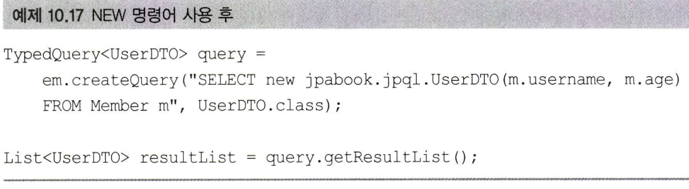
- SELECT 다음에 NEW 명령어를 사용하면 반환받을 클래스를 지정할 수 있다.
- 클래스으이 생성자에 JPQL 조회 결과를 넘겨줄 수 있다.
- NEW 명령어 사용한 클래스로 TypeQuery 사용할 수 있어서 지루한 객체 변환 작업을 줄 일 수 있다.
- NEW 명령어 사용시 주의해야할 점 2가지
  - 패키지 명을 포함한 전체 클래스 명을 입력해야한다.
    EX> jpabook.jpql.~
  - 순서와 타입이 일치하는 생서자가 필요하다. 
  
## 10.2.4 페이징 API 
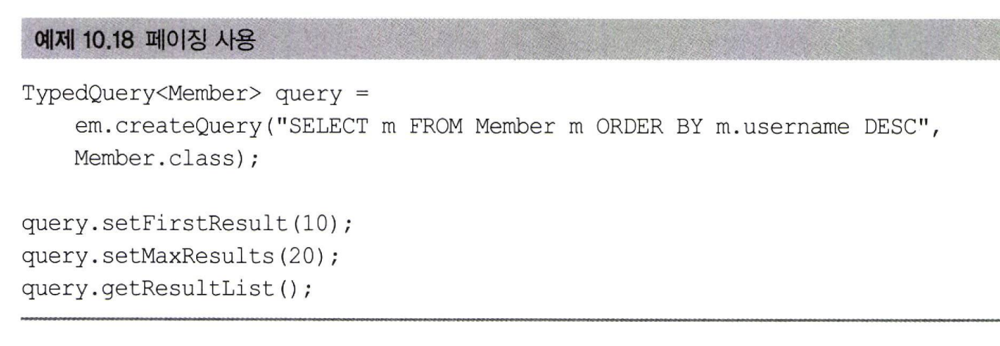
- 데이터베이스마다 페이징을 처리하는 SQL 문법이 다르다.
- JPA는 페이징을 두 API로 추상화했다.
  - setFirstResult(int startPosition) : 조회 시작 위치(0부터 시작한다.)
  - setMaxResult(int maxResult) : 조회할 데이터 수
- FirstResult 시작은 10이므로 11번째부터 시작해서 20건의 데이터를 조회한다. (11~30번)
  
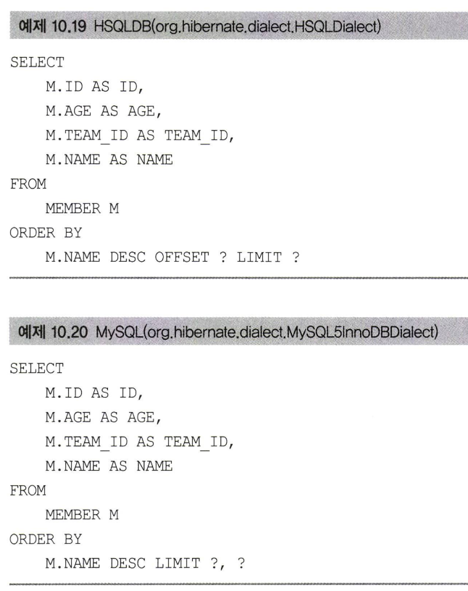 | 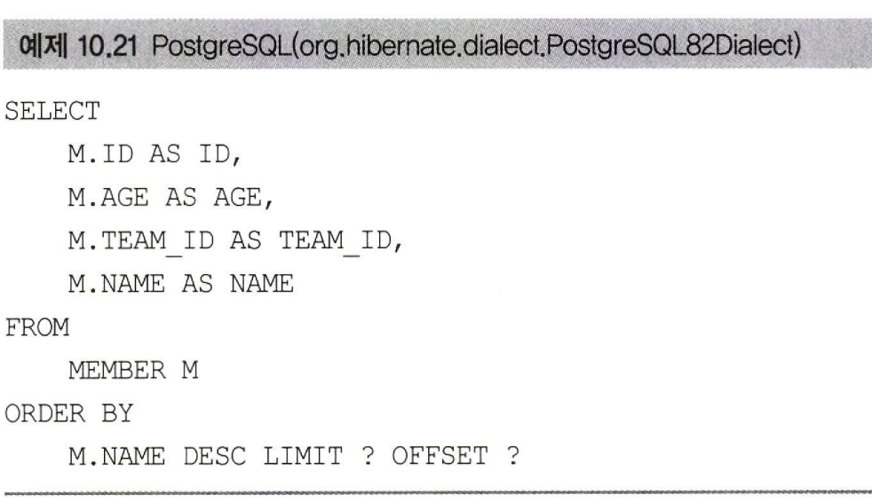
|----|----|

```XML
//제 10,22 오라클(org.hit>ernate.dialect.Oracte10gDiatect)
SELECT *
FROM
( SELECT ROW_.*, ROWNUM ROWNUM_
FROM ( SELECT M.ID AS ID,
              M.AGE AS AGE,
              M.TEAM_ID AS TEAM_ID,
              M.NAME AS NAME
              FROM MEMBER M
              ORDER BY M.NAME
      ) ROW_
WHERE ROWNUM <= ?
)
WHERE ROWNUM > ?
```
```XML
//SQLServer(org.hibernate.dialect.SQLServer2008Dialect)
WITH query AS (
  SELECT
  inner_query.
  ROW_NUMBER() OVER (ORDER BY CURRENT_TIMESTAMP) as
  _ hibernate_row_nr_
FROM
    ( select
          TOP (?) m.id as id,
          m.age as age,
          m.team_id as team_id,
          m.name as name
    from Member m
    order by m.name DESC
    ) inner_query
)
SELECT id, age, team_id, name
FROM query
WHERE hibernate row nr >= ? AND hibernate row nr < ?
```
- 데이터베이스마다 다른 페이징 처리를 같은 API로 처리할 수 있는 것은 데이터베이스 방언덕분이다. (JPA가 제공)
- 페이징 SQL을 더 최적화하고 싶다면 JPA가 제공하는 페이징 API가 아닌 네이티브 SQL을 직접 사용해야한다.
  
## 10.2.5 집합과 정렬
```XML
select  COUNT (m),    //회원수 
        SUM(m.age) ， // 나이합 
        AVG(m.age),   //평균나이 
        MAX (m.age),  //최대나이 
        MIN (m.age)   //최소나이 
from Member m
```
- 집합은 집합함수와 함께 통계 정보를 구할 때 사용한다.

### 집합 함수
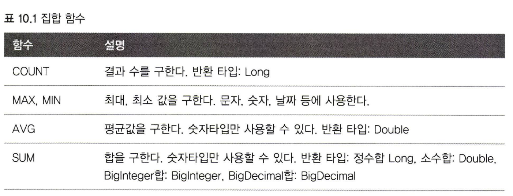

- 집합 함수 사용시 참고사항
  - NULL값은 무시하므로 통계에 잡히지 않는다.(DISTINCT가 정의되어 있어도 무시)
  - 만약 값이 없는데 SUM,AVG,MAX,MIN 함수를 사용하면 NULL값이 된다.
  - 단,COUNT는 값이 없으면 0이 된다.
  ```XML
  SELECT COUNT(DISTINCT m.age) FROM Member m
  ```
  - DISTINCT를 집합 함수 안에 사용해서 중복된 값을 제거하고 나서 집합을 구할 수 있다. 
  - DISTINCT를 COUNT에서 사용할 때 임베디드 타입은 지원하지 않는다.

### GROUP BY, HAVING
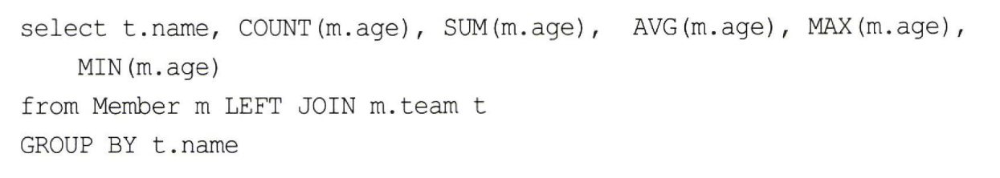 |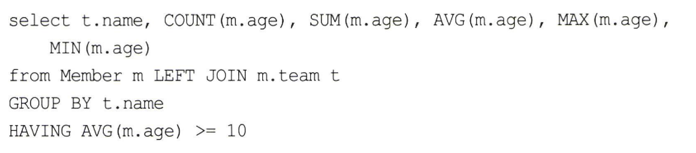
|----|----|

- GROUP BY 와 HAVING등 이런 쿼리들을 보통 리포팅 쿼리나 통계쿼리라 한다. 
- 통계 쿼리를 잘 활용하면 애플리케이션으로 수십 라인을 작성할 코드도 단 몇 줄이면 처리할 수 있지만
  통계 쿼리는 보통 전체 데이터를 기준으로 처리하므로 실시간으로 사용하기엔 부담이 많다.
- 결과가 아주 많다면 통계 결과만 저장하는 테이블을 별도로 만들어 두고 사용자가 적은 새벽에 통계 쿼리를 실행해서 그 결과를 보관하는 것이 좋다. 

### 정렬 ORDER BY

## 10.2.6 JPQL 조인
### 내부 조인
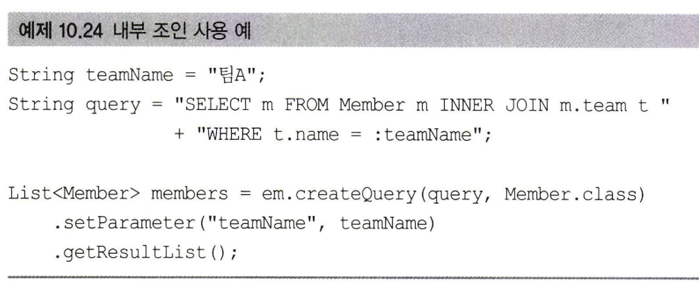
- 내부조인은 INNER JOIN을 사용한다.
  
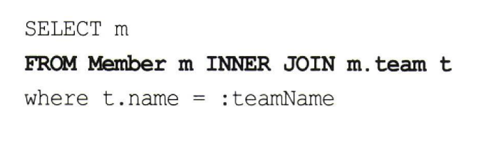 |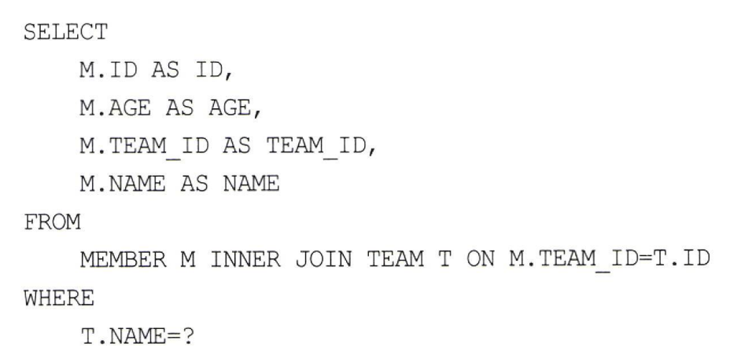
|----|----|

- JPQL 내부 조인 구문과 SQL의 조인은 약간 차이가 있다. (SQL과 똑같이 쓰면 문법 오류 발생)
- JPQL 조인의 특징은 연관 필드를 사용하는건데 여기서 m.team이 연관필드로 다른 엔티티와 연관관계를 가질 수 있게 해준다.
- 연관 필드는 다른 엔티티와 연관관계를 가지기 위해 사용하는 필드다.

```java
SELECT m.username, t.name
FROM Member m JOIN m.team t
WHERE t.name = '팀A'
ORDER BY m.age DESC
```
- 위 쿼리는 팀A 소속인 회원을 나이 내림차순으로 정렬하고 회원명과 팀명을 조회한다.
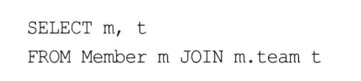 |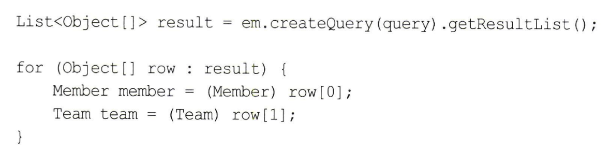
|----|----|

- 서로 다른 타입의 두 엔티티를 조회했으므로 TypeQuery를 사용할 수 없다.
- 그래서 Object[]사용해서 조회한다.

### 외부 조인

 |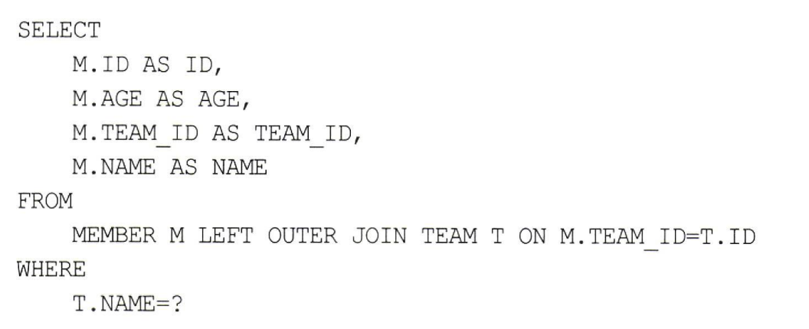
|----|----|
- 외부조인은 기능상 SQL 외부 조인과 같다.

### 컬렉션 조인
- 일대다 관계나 다대다 관계처럼 컬렉션을 사용하는 곳에 조인하는 것을 컬렉션 조인이라 한다.
- [회원 -> 팀] 다대일 조인이면서 __단일 값 연관 필드(m.team)을 사용한다.__
- [팀 -> 회원] 일대다 조인이면서 __컬렉션 값 연관 필드(m.members)를 사용한다.__
```java
SELECT t,m FROM Team t LEFT t.members m // Team -> members
```
-컬렉션 값 연관 필드로 외부 조인을 했다.

### 세타 조인
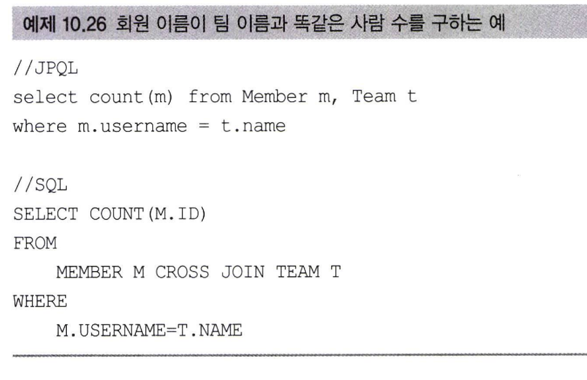
- WHERE 절을 사용해서 세타 조인을 할 수 있다.
- 세타 조인을 사용하면 외래키로 서로 연결되지 않아도 조인 가능하다.

### JOIN ON 절(JPA 2.1)
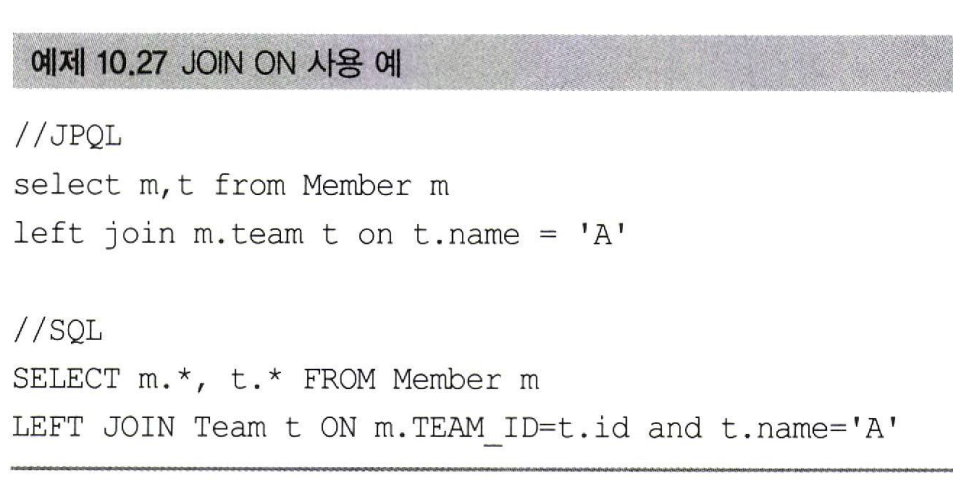
 - JPA 2.1부터 조인할 때 ON절 지원한다.
 - ON절을 사용하면 조인 대상을 필터링하고 조인할 수 있다. 
 - SQL 결과를 보면 and t .name= 'A'로 조인 시점에 조인 대상을 필터링한다.

## 10.2.7 패치 조인
- 페치조인은 SQL에서 이야기하는 조인의 종류는 아니고 JPQL에서 성능 최적화를 위해 제공하는 기능이다.
- 연관된 엔티티나 컬렉션을 한번에 같이 조회하는 기능이다.
- join fetch 명령어로 사용할 수 있다. 

### 엔티티 페치 조인 
```java
//JPQL
SELECT m FROM Member m join fetch m.team;
```
- 연관된 엔티티나 컬렉션을 함께 조회하는데 여기서 회원(m)과 팀(m.team)을 함께 조회한다. 
- 일반적인 JPQL 조인과는 m.team 다음에 별칭이 없는데 페치 조인은 별칭을 사용할 수 없다.
  (하이버네이트는 페치 조인에도 별칭을 허용한다.)
  
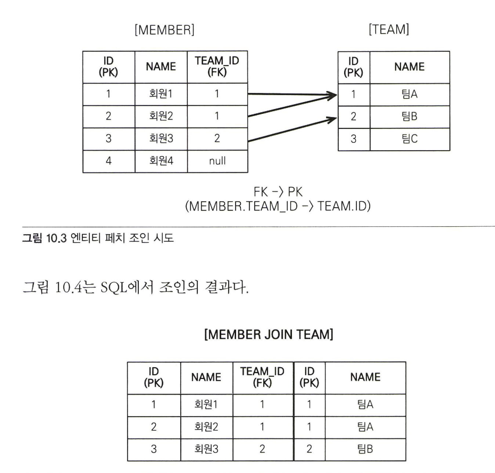 |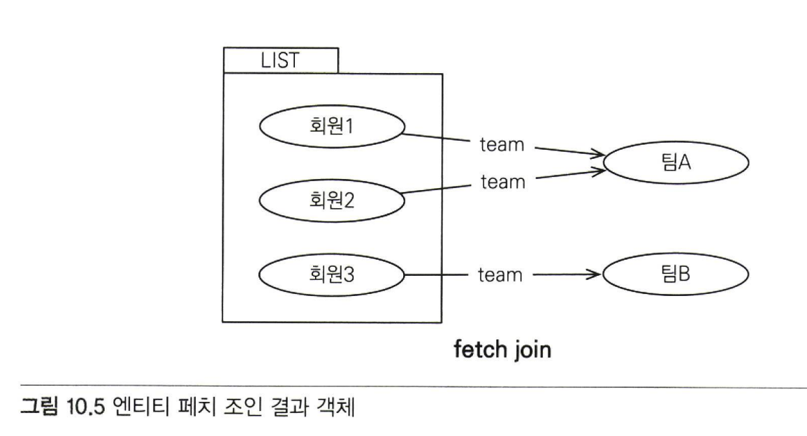
|----|----|  

- 엔티티 페치 조인 JPQL에서 SELECT m으로 회원 엔티티만 선택했는데 실행된 SQL을 보면 SELECT M.*,T.*로 회원과 연관된 팀도 함께 조회된 것을 확인할 수 있다.

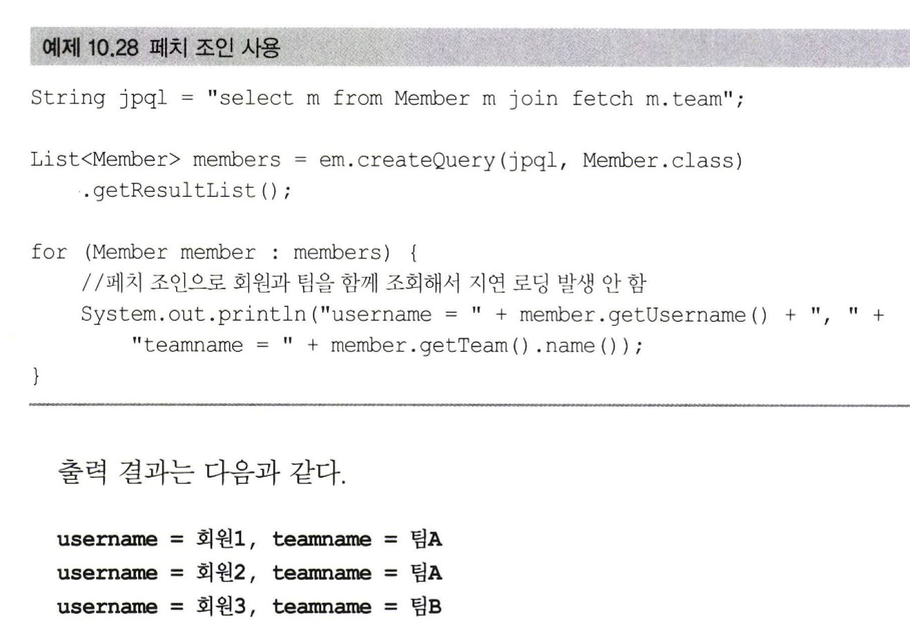
- 회원을 조회할 때 페치 조인을 사용해서 팀도 함께 조회했으므로 연관된 팀 엔티티는 프록시가 아닌 실제 엔티티다.
- 따라서 연관된 팀을 사용해도 지연 로딩이 일어나지 않는다.
- 프록시가 아닌 실제 엔티티이므로 회원 엔티티가 영속성 컨텍스트에서 분리되어 준영속 상태가 되어도 연관된 팀을 조회할 수 있다. 

### 컬렉션 페치 조인 

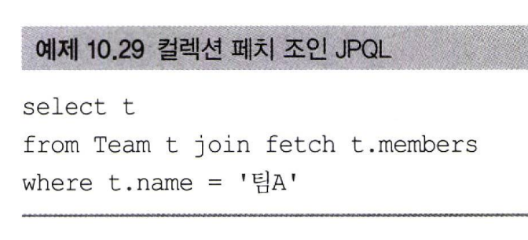 |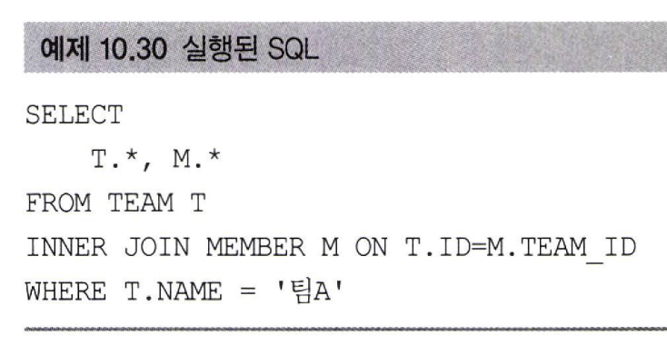
|----|----|  
- 팀(t)을 조회하면서 페치 조인을 사용해서 연관된 회원 컬렉션도 함께 조회한다.

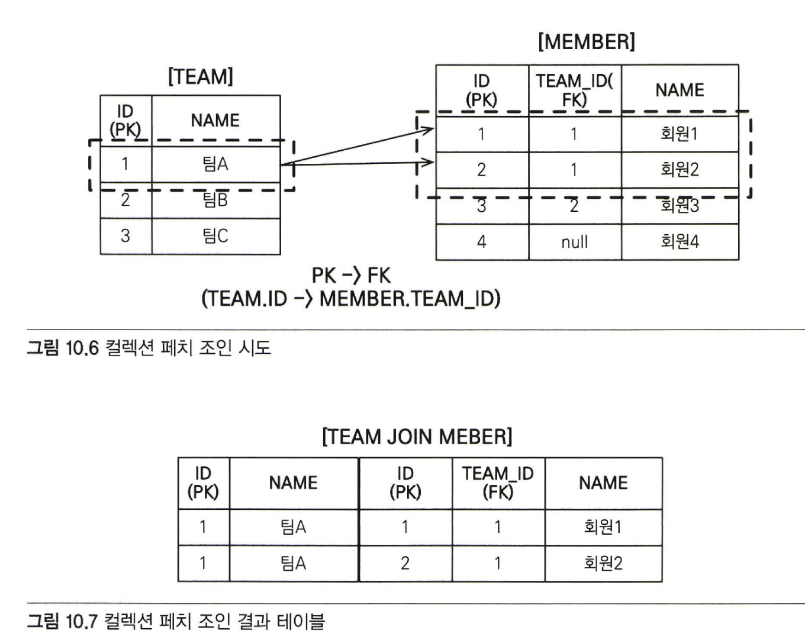 |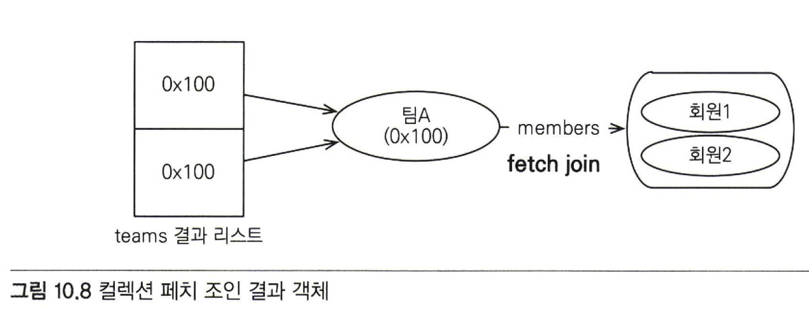
|----|----|  
- 컬렉션 페치 조인한 JPQL에서 SELECT t로 팀만 선택했는데 실행된 SQL보면 T.*,M.*로 팀과 연관된 회원도 함께 조회한 것을 확인할 수 있다.
- TEAM 테이블에서 팀A는 하나지만 MEMBER 테이블과 조인하면서 결과가 증가해서 팀A가 2건 조회되었다.
> 일대다 조인은 결과가 증가할 수 있지만 일대일,다대일 조인은 결과가 증가하지 않는다.

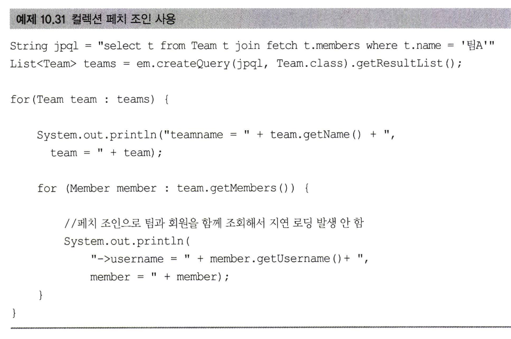
- 지연 로딩이 발생하지 않는 이유는 페치 조인(fetch join)을 사용했기 때문이다.
- 페치 조인을 사용하면 연관된 엔티티들을 즉시 로딩하는 것이기 때문에 추가적인 쿼리 실행이 발생하지 않는다.
- 일반적인 상황에서는 연관된 엔티티를 지연 로딩으로 가져오는데, 이는 필요할 때에만 데이터베이스에서 실제 데이터를 가져오도록 한다.
- 그러나 페치 조인을 사용하면 연관된 엔티티를 함께 로드하여 지연 로딩을 피할 수 있습니다.

<details>

    <summary>페치 조인 더 보기</summary>
    
    <!-- summary 아래 한칸 공백 두어야함 -->
    페치 조인을 사용하면 한 번의 쿼리로 필요한 모든 연관된 엔티티를 함께 로드할 수 있기 때문에 <br>
    n+1 문제가 발생하지 않는다. 따라서 페치 조인은 n+1 문제를 피하고 성능을 향상시키는 데 매우 유용하다.<br>
    따라서 다수의 연관된 엔티티를 함께 가져와야 하는 상황에서는 페치 조인(fetch join)을 고려하는 것이 좋다.<br>
    페치 조인을 사용하면 추가적인 쿼리를 보내지 않아도 연관된 엔티티를 함께 로드할 수 있으므로 성능이 향상된다.<br>
    그러나 페치 조인은 데이터베이스에서 많은 양의 데이터를 가져오므로 주의해야한다.
</details>
 
### 페치조인과 DISTINCT
- JPQL의 DISTINCT 명령어는 아래 2가지 작업을 해준다. 
  - SQL에서의 DISTINCT를 추가하는 것
  - 애플리케이션에서 한번 더 중복을 제거하는 것
  - 
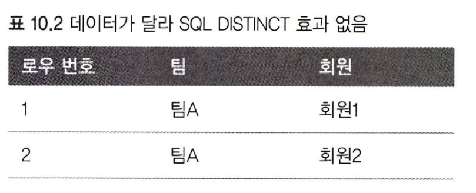 |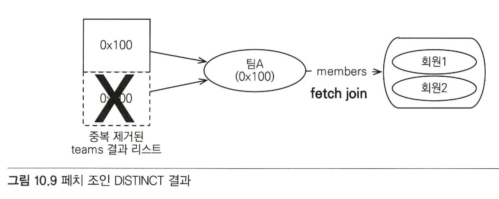
|----|----|    
- 데이터가 달라서 중복제거해도 달라지는게 없다.
- 애플리케이션에서 엔티티의 중복을 제거한다. 그러면 팀A의 객체는 하나만 남는다. 

### 페치조인과 일반 조인의 차이

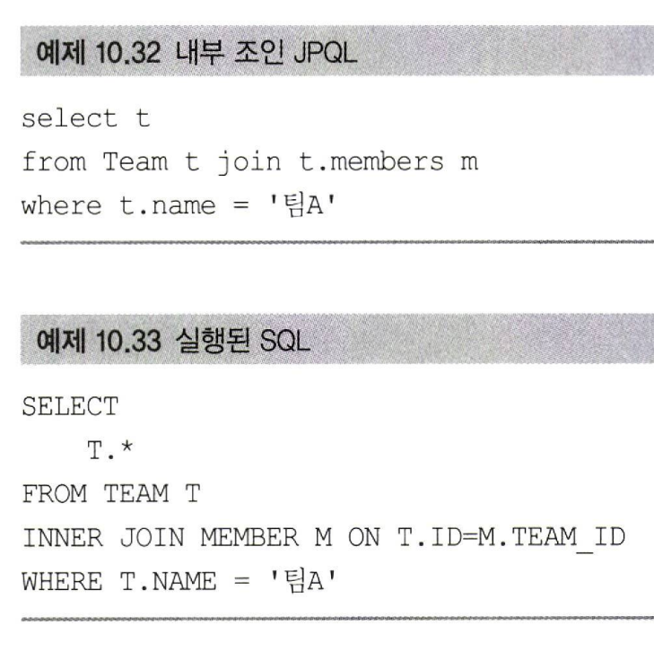
- JPQL은 결과를 반환할 때 연관관계까지 고려하지 않는다. 단지 SELECT 절에 지정한 엔티티만 조회할 뿐이다.
- 그래서 조인만한 회원도 무조건 함께 조회될거라고 기대해서는 안된다.
  
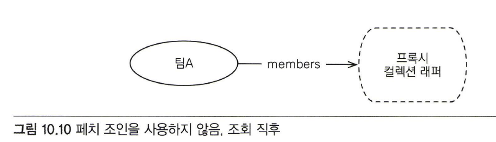
- 만약 회원 컬렉션을 지연 로딩을 설정하면 프록시나 아직 초기화하지 않은 컬렉션 래퍼를 반환한다.
- 즉시 로딩으로 설정하면 회원 컬렉션을 즉시 로딩하기 위해 쿼리를 한번 더 실행한다.

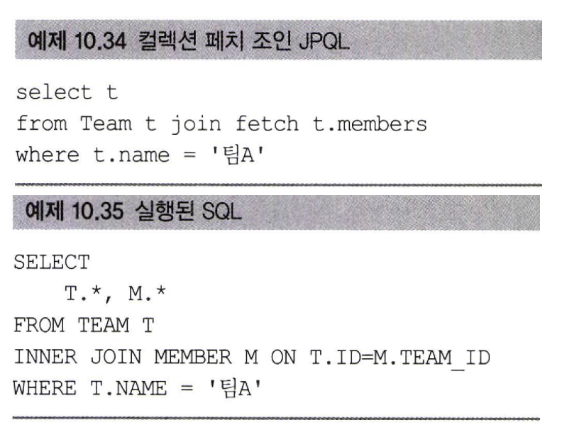
- 반면에 페치 조인을 사용하면 연관된 엔티티도 함께 조회한다.

### 페치조인 특징과 한계

#### 페치조인의 특징
- 페치조인을 사용하면 SQL 한번으로 연관된엔티티들을 함께 조회할 수 있어서 SQL 호출 횟수를 줄여 성능을 최적화할 수 있다.
- 엔티티에 직접 적용하는 로딩 전략은 애플리케이션 전체에 영향을 미치므로 글로벌 로딩 전략이라고 한다.

<details>
    <summary>글로벌 로딩 전략</summary>
    
    <!-- summary 아래 한칸 공백 두어야함 -->
    
    글로벌 로딩 전략은 주로 persistence.xml 파일이나 JPA 속성 설정을 통해 설정된다.
    예를 들어, persistence.xml 파일에서 default-lazy-loading 또는 default-fetch 속성을 사용하여 전체적인 로딩 전략을 설정할 수 있다.
</details>
- 페치 조인은 글로벌 로딩 전략보다 우선한다.
  EX) 글로벌 로딩 전략을 지연 로딩으로 설정해도 JPQL에서 페치 조인을 사용하면 페치 조인을 적용해서 함께 조회한다. 
- 최적화를 위해 글로벌 로딩 전략을 즉시 로딩으로 설정하면 애플리케이션 전체에서 항상 즉시 로딩이 일어난다. <br>
  일부는 빠를 수 있지만 전체로 보면 사용하지 않는 엔티티를 자주 로딩하므로 오히려 성능에 악영향을 미칠 수 있다. <br>
  
  __글로벌 로딩 전략은 될 수 있으면 지연 로딩을 사용하고 최적화가 필요하면 페치 조인을 적용하는 것이 효과적이다.__

- 페치 조인을 사용하면 연관된 엔티티를 쿼리 시점에 조회하므로 지연 로딩이 발생하지 않는다.
- 따라서 준영속 상태에서도 객체 그래프를 탐색할 수 있다.

#### 페치조인의 한계
- 폐치 조인 대상에는 별칭을 줄 수 없다.
  - SELECT,WHERE절,서브 쿼리에 페치 조인 대상을 사용할 수 없다.
  - JPA 표준에는 지원하지 않지만 하이버네이트를 포함한 몇몇 구현체들은 페치 조인에 별칭을 지원한다.
  - 하지만 별칭을 잘못 사용하면 연관된 데이터 수가 달라져서 데이터 무결성이 깨질 수 있으므로 조심해서 사용해야한다.
  - 특히 2차 캐시와 함께 사용할 때 조심해야하는데 연관된 데이터 수가 달라진 상태에서 2차 캐시에 저장되면 다른 곳에서 조회할 때도 연관된 데이터 수가 달라지는 문제가 발생할 수 있다.
- 둘 이상의 컬렉션을 페치할 수 없다.
  - 컬렉션 * 컬렉션의 카테시안 곱이 만들어지므로 주의해야한다. (예외 발생)
- 컬렉션을 페치 조인하면 페이징API를 사용할 수 없다.
  - 컬렉션(일대다)가 아닌 단일 값 연관 필드(일대일,다대일)들은 페치 조인을 사용해도 페이징 API를 사용할 수 있다.
  - 하이버네이트에서 컬렉션을 페치 조인하고 페이징 API를 사용하면 경고 로그를 남기면서 메모리에서 페이징 처리를 한다.
  - 데이터가 적으면 상관없지만 데이터가 많으면 성능 이슈와 메모리 초과 예외가 발생할 수 있어서 위험하다.

- 페치조인은 SQL 한번으로 연관된 여러 엔티티를 조회할 수 있어서 성능 최적화에 상당히 유용하다. 실무에서 자주 사용
- 모든 것을 페치 조인으로 해결할 수 없다. 페치 조인은 객체 그래프를 유지할 때 사용하면 효과적이다.
- 테이블을 조인해서 엔티티가 가진 모양이 아닌 전혀 다른 결과를 내야 한다면 억지로 페치 조인을 사용하기보다는 여러 테이블에서 필요한 필드만 조회해서 DTO로 반환하는 것이 더 효과적이다.
  
## 10.2.8 경로 표현식
### 경로 표현식
- 경로 표현식은 .(점)을 찍어 객체 그래프를 탐색하는 것이다.
- 경로 표현식 용어정리
  - 상태필드 : 단순히 값을 저장하기 위한 필드(필드 OR 프로퍼티)
  - 연관 필드 : 연관관계를 위한 필드, 임베디드 타입 포함(필드 OR 프로퍼티)
    - 단일 값 연관 필드 : @ManyToOne , @OneToOne 대상이 엔티티 
    - 컬렉션 값 연관 필드 : @OneToMany , @ManyToMany 대상이 컬렉션
  - 상태 필드는 단순히 값을 저장하는 필드고 연관 필드는 객체 사이의 연관관계를 맺기 위해 사용하는 필드다. 

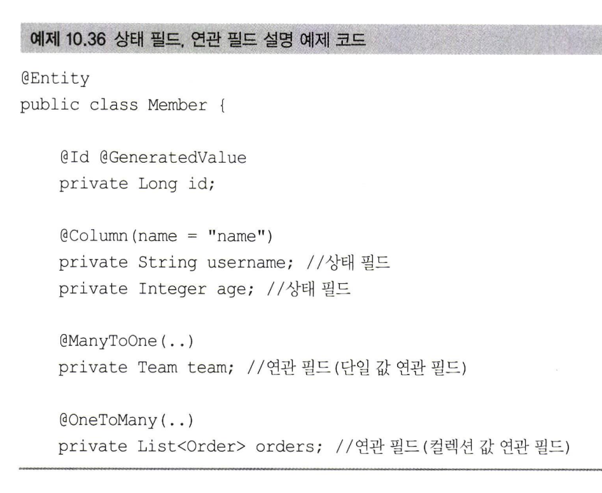
- 상태 필드 : t.username, t.age
- 단일 값 연관 필드 : m.team (@ManyToOne)
- 컬렉션 값 연관 필드 : m.orders (@OneToMany)

### 경로 표현식과 특징
- 경로 표현식을 사용해서 경로 탐색을 하려면 다음 3가지 경로에 따라 어떤 특징이 있는지 이해해야한다.
  - 상태 필드 경로 : 경로 탐색의 끝이다. 더는 탐색할 수 없다.
  - 단일 값 연관 경로 : __묵시적으로 내부 조인이 일어난다. 단일 값 연관 경로는 계속 탐색할 수 있다.__
  - 컬렉션 값 연관 경로 : __묵시적으로 내부 조인이 일어난다. 더는 탐색할 수 없다. 단 FROM 절에서 조인을 통해 별칭을 얻으면 별칭으로 탐색할 수 있다.__

### 상태 필드 경로 탐색
```xml
--JPQL
select m.username,m.age from Member m

--SQL
select m.name,m.age from Member m
```

### 단일 값 연관 경로 탐색
```xml
--JPQL
select o.member from Order o

--SQL
select m.*
from Orders o
inner join Member m on o.member_id = m.id
```
- JPQL을 보면 o.member를 통해 주문에서 회원으로 단일 값 연관 필드로 경로 탐색을 했다.
- 이때 단일 값 연관 필드로 경로 탐색을 하면 SQL에서 내부 조인이 일어난다.
- 이런걸  묵시적 조인이라 한다.
- 묵시적 조인은 모두 내부 조인이다.
- 외부 조인은 명시적으로 JOIN 키워드를 사용해야 한다.
- 단일 값 연관 경로 탐색시 조인
  - 명시적 조인 : JOIN을 직접 적어주는 것
  - 묵시적 조인 : 경로 표현식에 의해 묵시적으로 조인이 일어나는 것 (내부 조인 INNER JOIN만 할 수 있다. )

### 컬렉션 값 연관 경로 탐색

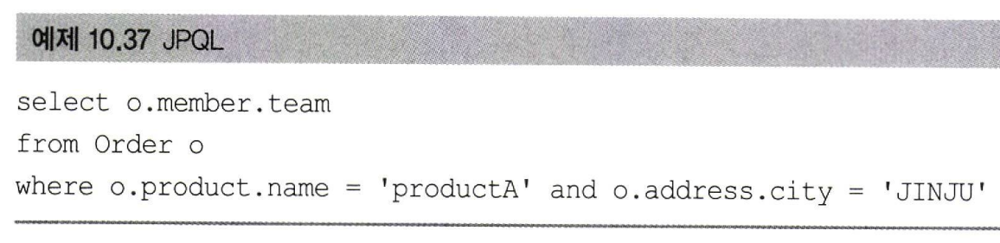 |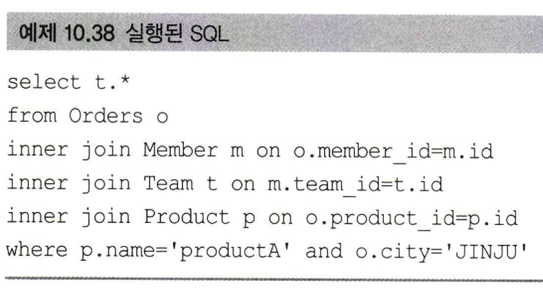
|----|----|  
- 실행된 SQL을 보면 총 3번의 조인이 발생했다.
- o.address처럼 임베디드 타입에 접근하는 것도 단일 값 연관 경로 탐색이지만 주문 테이블에 이미 포함되어 있으므로 조인이 발생하지 않는다. 
## 10.2.9
## 10.2.10
## 10.2.11
## 10.2.12
## 10.2.13
## 10.2.14
## 10.2.15 Named 쿼리 : 정적 쿼리


# 10.3 Criteria


```java
```

   
