# 10장_프록시와 연관관계 관리

<b>✨설명 전 Point 잡고 가기✨</b> 
1. JPA는 복잡한 검색조건을 사용해서 엔티티 객체를 조회할 수 있는 다양한 쿼리 기술을 지원한다.
2. 쿼리 기술
   * JPQL
   * Criteria
   * QueryDSI
3. JPQL은 가장 중요한 객체지향 쿼리 언어이고 Criteria나 QueryDSL은 결국 JPQL을 편리하게 사용하도록 도와주는 기술이다.
4. 이 장 마지막에는 객체지향 쿼리에 대한 심화 내용을 다룬다.

# 10.1 객체지향 쿼리 소개 
## 10.1.1 JPQL 소개
 - JPQL(Java Persistence Query Language)은 엔티티 객체를 조회하는 객체지향 쿼리다.
 - JPQL 특징으로
   - SQL 문법과 비슷하다.
   - ANSI 표준 SQL이 제공하는 기능을 유사하게 지원한다.
   - SQL을 추상화했기때문에 특정 데이터베이스에 의존하지 않는다.
      <details>
      <summary>JPQL은 SQL을 추상화한 것?</summary>
      
      <!-- summary 아래 한칸 공백 두어야함 -->
      - 추상화는 특정한 세부 사항을 숨기고 핵심 개념 또는 기능에만 집중할 수 있도록하는 것을 의미한다.
      - JPQL이 SQL을 추상화한다는 것은 JPQL이 데이터베이스의 상호 작용하는 방법을 추상화한다는 의미다.
      - 결국 개발자가 데이터베이스에 대해 구체적으로 알 필요없이도 더 높은 수준에서 작업을 할 수 있게 도와준다.
      - 즉, JPQL의 세부 사항을 숨기고 개발자가 보다 추상적인 수준에서 작업할 수 있도록 합니다. 
      </details>
   - 데이터베이스 방언만 변경하면 JPQL을 수정하지 않아도 자연스럽게 데이터베이스를 변경할 수 있다.
   - JPQL이 제공하는 표준화된 함수를 사용하면 선택한 방언에 따라 해당 데이터베이스에 맞춘 적절한 SQL 함수가 실행된다.
   - 엔티티 직접조회, 묵시적 조인, 다형성 지원 등 이러한 이유로 JPQL은 SQL보다 간결하다. 

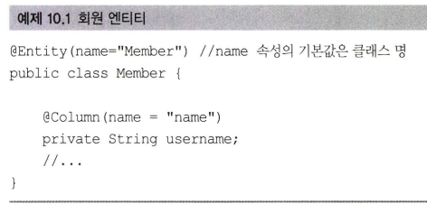 |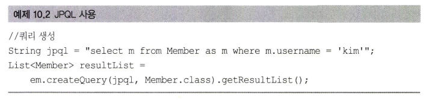
|----|----|

- JPQL에서 Member은 테이블 이름이 아니라 엔티티 이름이다.
- m.username은 테이블 컬럼명이 아니라 엔티티 객체의 필드다.
```java
em.CreateQuery(jpql,Member.class).getResultList()
```
- em.CreateQuery메소드에 실행할 JPQL과 반환할 엔티티 클래스 타입인 Member.class를 넘겨주고 getResultList() 메소드를 실행하면 JPA는 JPQL을 SQL로 변환해서 데이터베이스를 조회한다. 그리고  조회한 결과로 Member 엔티티를 생성해서 반환한다.

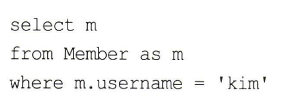 |
|----|----|

- JPQL을 실행하면 실제 SQL은 오른쪽과 같이 실행된다. 

## 10.1.2 Criteria 쿼리 소개
- Criteria는 JPQL을 생성하는 빌더 클래스다. 
  <details>

    <summary>빌더 패턴</summary>
    
    <!-- summary 아래 한칸 공백 두어야함 -->
    - 빌더 패턴은 객체를 생성하는 디자인 패턴 중 하나다.
    - 빌더 패턴은 객체의 생성과정을 단순화하고 유연하게 만든다.
    - 복잡한 객체를 생성할 때 사용되는 매개변수를 지정하거나 생햑할 수 있다. 
    객체의 생성 과정이 단계별로 나누어져있어 가독성 향상이되며 유지보수가 용이해진다. 
    - Critria와 QueryDSL에서 빌더 클래스라고 불리는 것은 이러한 빌더 패턴의 특징을 반영하기 위함이다.
    - 쿼리를 생성하는 과정을 객체의 생성과 유사하게 보기 때문에, 이를 표현하기 위해 "빌더"라는 용어를 사용한다.
      
  </details>
  query.select(m).where(...)
- Criteria의 장점은 문자가 아닌 프로그래밍 코드로 JQPL을 작성할 수 있다.
- Criteria는 문자가 아닌 코드로 JQPL을 작성해서 컴파일 시점에 오류를 발견할 수 있다. (컴파일시 오류 발견)
  (비교 : 문자기반 쿼리는 컴파일은 성공해서 서버에 배포했는데 해당 쿼리가 실행되는 런타임 시점에 오류가 발생한다는 단점이 있다.)
- Criteria의 장점은 아래와 같다. 
  - 컴파일 시점에 오류를 발견할 수 있다.
  - IDE 사용하면 코드 자동완성을 지원한다.
  - 동적 쿼리를 작성하기 편하다
  - JPA는 2.0부터 Criteria를 지원한다.  
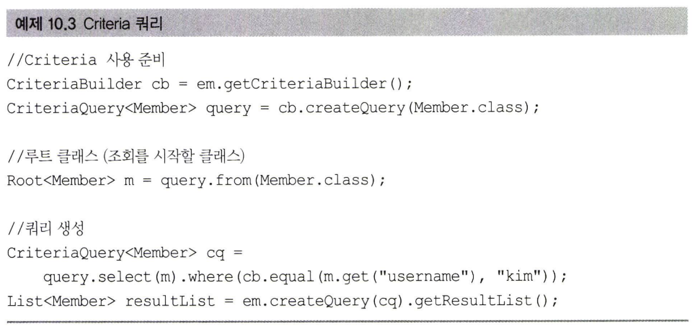
- 쿼리가 아닌 코드로 작성한 것을 볼 수 있다. (.where(~))
- Criteria가 가진 장점이 많지만 모든 장점을 상쇄할 정도로 복잡하고 장황하다.
- Criteria로 작성한 코드도 한눈에 들어오지 않는다는 단점이 있다.

## 10.1.3 QueryDSL 소개
- QueryDSL JPQL 빌더 역할을 한다.
- QueryDSL의 장점은 코드 기반이면서 단순하고 사용하기 쉽다.
> 참고로, QueryDSL은 JPA 표준은 아니고 오픈소스 프로젝트다.<br>
  JPA,JDO,몽고DB,Java Collection, Lucene, Hibernate Search도 거의 같은 문법으로 지원한다. 
  Criteria보다 QueryDSL을 선호한다.

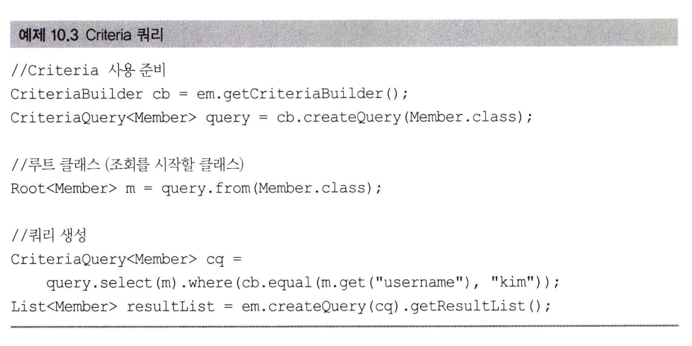

- QueryDSL도 어노테이션 프로세서를 사용해서 쿼리 전용 클래스를 만들어야한다.
- 이 소스에서 QueryDSL 쿼리 전용 클래스는 QMember다.
- QMember는 Member 엔티티 클래스를 기반으로 생성했다.

## 10.1.4 네이티브 SQL 소개
- JPA는 SQL을 직접 사용할 수 있는 기능을 지원하는데 이를 네이티브 SQL라 한다. 
- 특정 데이터베이스에 의존하는 기능을 사용해야할 때 네이티브 SQL을 사용한다. 
  - 오라클 데이터베이스만 사용하는 CONNECT BY 기능
  - 특정 데이터베이스에서만 동작하는 SQL 힌트
  - 위 기능들은 전혀 표준화되어 있지 않으므로 JPQL에서 사용할 수 없다.
- SQL은 지원하지만 JPQL이 지원하지 않는 기능도 있는데 이때도 네이티브 SQL을 사용한다.
- 네이티브 SQL의 단점은 특정 데이터베이스에 의존하는 SQL을 작성해야 한다는 점이다. 

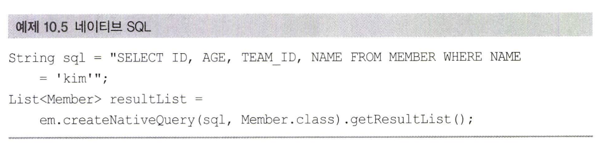

- 네이티브 SQL은 em.createNativeQuery()를 사용해서 직접 작성한 sql을 데이터베이스에 전달한다.

## 10.1.5 JDBC 직접 사용, 마이바티스 같은 SQL 매퍼 프레임워크 사용
- JPA는 JDBC 커넥션을 획득하는 API를 제공하지 않는다.
- JDBC 커넥션에 직접 접근하고 싶으면 JPA 구현체가 제공하는 방법을 사용해야 한다.
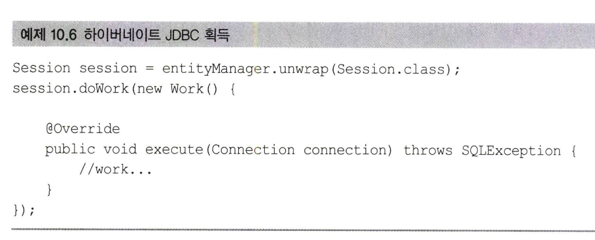

- JDBC Connection을 획득하는 방법
  - JPA EntityManager에서 하이버네이트 Session을 구하고 Session의 doWork() 메소드를 호출한다.
- JDBC나 마이바티스를 JPA와 함께 사용하면 영속성 컨텍스트를 적절한 시점에 강제로 프러시해야 한다.
  - JDBC를 직접 사용하거나 마이바티스 같은 SQL 매퍼와 사용하면 모두 JPA를 우회해서 데이터베이스에 접근한다. 이렇게 우회하는 SQL에 대해서는 JPA가 전혀 인식을 하지 못해서 문제가 된다. (무결성 훼손)
- 다시 강조하면, JPA를 우회해서 SQL을 실행하기 직전에 영속성 컨텍스트를 수동으로 플러시해서 데이터베이스와 영속성 컨텍스트를 동기화하면 된다.
- 참고로,스프링 프레임워크를 사용하면 JPA와 마이바티스를 손쉽게 통합할 수 있다.
- 스프링 프레임워크의 AOP를 적절히 활용해서 JPA를 우회하여 데이터베이스에 접근하는 메소드를 호출할 때마다 영속성 컨텍스트를 플러시하면 된다.
  <details>

    <summary>스프링 프레임워크 AOP 사용해서 플러시</summary>
    
    <!-- summary 아래 한칸 공백 두어야함 -->

    ```java 
    @Aspect
    @Component
    public class FlushPersistenceContextAspect {
    
        @PersistenceContext
        private EntityManager entityManager;
    
        @Before("execution(* com.example.service.*.*(..)) && !@annotation(Transactional)")
        public void beforeNonTransactionalServiceMethods() {
            // 트랜잭션 어노테이션이 없는 서비스 메소드가 호출될 때마다 영속성 컨텍스트를 플러시
            entityManager.flush();
        }
    }

    ```
    - AOP는 스프링 프레임워크에서 제공하는 기능 중 하나다.
    - AOP의 핵심 개념은 Advice(조언),Join Point(결합 지점), Pointcut(결합 지점 선정) , Aspect(관점)등이 있다.
    - AOP를 활용해서 영속성 컨텍스트를 플러시 하기위해 Aspect를 사용한다.
    - Aspect(관점)은 여러 결합 지점과 Advice의 조합을 의미한다. 예를 들어, 로깅과 트랜잭션 관리를 위한 Aspect를 정의할 수 있다.
    - FlushPersistenceContextAspect 클래스는 @Aspect 어노테이션을 사용하여 Aspect로 정의한다.
    - @Before 어노테이션을 사용하여 Advice를 정의한다.
    - Aspect는 execution(* com.example.service.*.*(..)) && !@annotation(Transactional) 포인트컷 표현식을 사용하여 com.example.service 패키지에 속한 모든 메소드 중 @Transactional 어노테이션이 없는 메소드를 대상으로 한다.
    - Advice 내에서 entityManager.flush()를 호출하여 영속성 컨텍스트를 플러시한다.
    - 이렇게 하면 JPA가 관리하는 엔티티의 상태가 데이터베이스와 동기화된다.
  </details>
  
# 10.2 JPQL

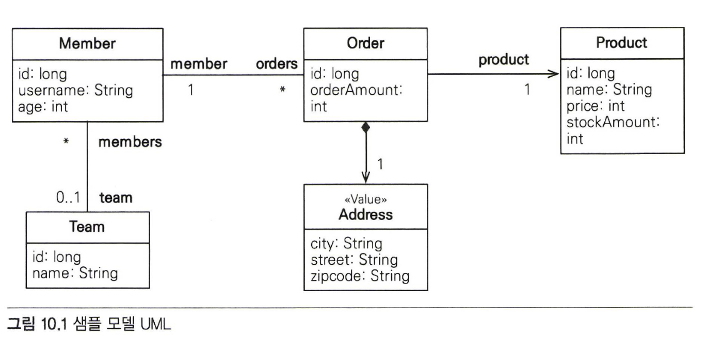 |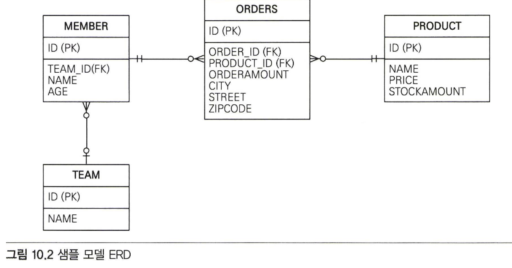
|----|----|

- 예제 사용할 도메인 모델은 위와 같다.
- 왼쪽이 샘플 모델 UML이고 오른쪽이 샘플 모델 ERD다.
- 회원이 상품을 주문하는 다대다 관계라는 것을 특히 주의해서 보자.
- Address는 임베디드 타입인데 이것은 값 타입으로 uml에서 스테레오 타입을 사용해서 <<value>>로 정의했다. 

## 10.2.1 기본 문법과 쿼리 API
- JPQL도 SQL과 비슷하게 SELECT,UPDATE,DELETE문을 사용할 수 있다. (em.persist()메소드 사용하면 되므로 INSERT는 따로 없다.)
  ### SELECT
  ```java
  SELECT m FROM Member AS m where m.username = 'Hello'
  ```
  - 대소문자 구분
    - 엔티티와 속성은 대소문자를 구분한다. (Member 엔티티, username 속성)
    - SELECT,FROM,AS 같은 JPQL 키워드는 대소문자를 구분하지 않는다. 
  - 엔티티 이름
    - JPQL에서 사용한 Member는 클래스 명이 아니라 엔티티명이다.
    - 엔티티 명은 @Entity(name="xxx")로 지정할 수 있다.
    - 기본값인 클래스 명을 엔티티명으로 사용하는 것을 추천한다.
  - 별칭은 필수
    
    - Member AS m 처럼 Member 에 m이라는 별칭을 줬다.
    - JPQL은 별칭을 필수로 사용해야 한다. (오류발생)
    - AS는 생략 가능하다.
  > 하이버네이트는 JPQL 표준도 지원하지만 더 많은 기능을 가진 HQL(Hibernate Query Language)를 제공한다.
    JPA 구현체로 하이버네이트를 사용하면 HQL도 사용할 수 있다.
    HQL 사용 : SELECT username FROM Member (username 처럼 별칭 없이 사용가능)
  
  > JPA 표준 명세는 별칭을 식별 변수라는 용어로 정의함

  ### TypeQuery,Query
  - 작성한 JPQL을 실행하려면 쿼리 객체를 만들어야 한다.
  - 쿼리 객체는 TypeQuery와 Query가 있다.
    - TypeQuery 선택 : 반환할 타입을 명확하게 지정
    - Query 선택 : 반환 타입을 명확하게 지정할 수 없음

  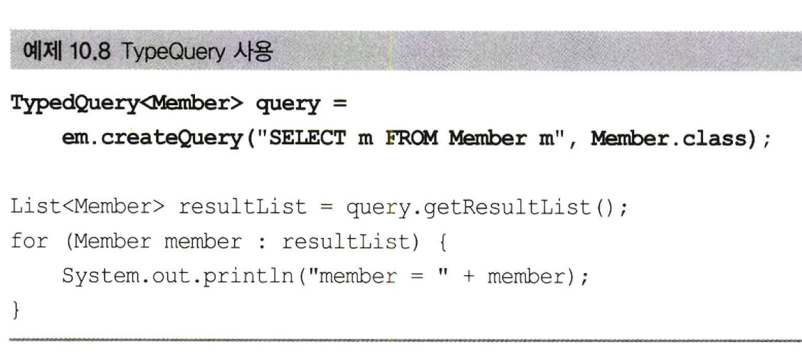

  - em.createQuery()에 반환타입 Member.class 지정한다.
  - TypeQuery를 반환한다.

  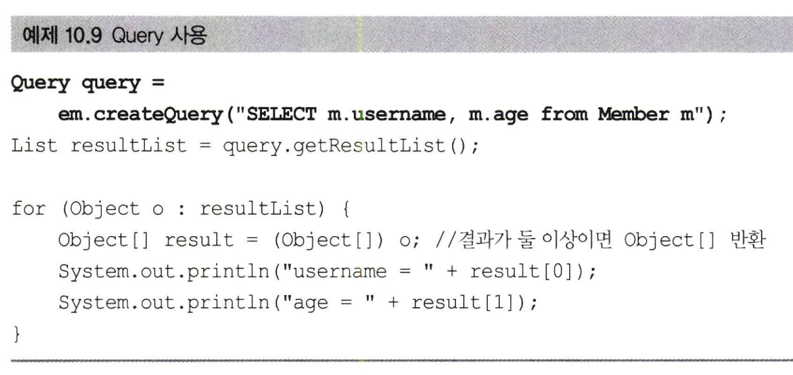
  ```java
  SELECT m.username from Member m;  
  ```
  - SELECT절에 여러 엔티티나 컬럼을 선택할 때는 반환할 타입이 명확하지 않으므로 Query객체를 사용해야한다.
  ```java
  SELECT m.username,m.age from Member m;
  ```
  - Query객체는 SELECT 절의 조회 대상이 하나면 Object 반환하고 둘 이상이면 Object[]를 반환한다.
  ### 결과 조회
  - 다음 메소드들을 호출하면 실제 쿼리를 실행해서 데이터베이스를 조회한다.
    - query.getResultList() : 결과를 예제로 반환한다. 만약 결과과 없으면 빈 컬렉션을 반환한다.
    - query.getSingleResult() : 결과가 정확히 하나일 때 사용한다. (정확히 1개가 아니면 예외발생)
      - 결과가 없으면 javax.persistence.NoResultException예외가 발생한다.
      - 결과가 1개보다 많으면 javax.persistence.NonUniqueResultException 예외가 발생한다.

## 10.2.2 파라미터 바인딩
  - JDBC는 위치 기준 파라미터 바인딩만 지원하지만 JPQL은 이름 기준 파라미터 바인딩도 지원한다.

    - 이름 기준 파라미터
    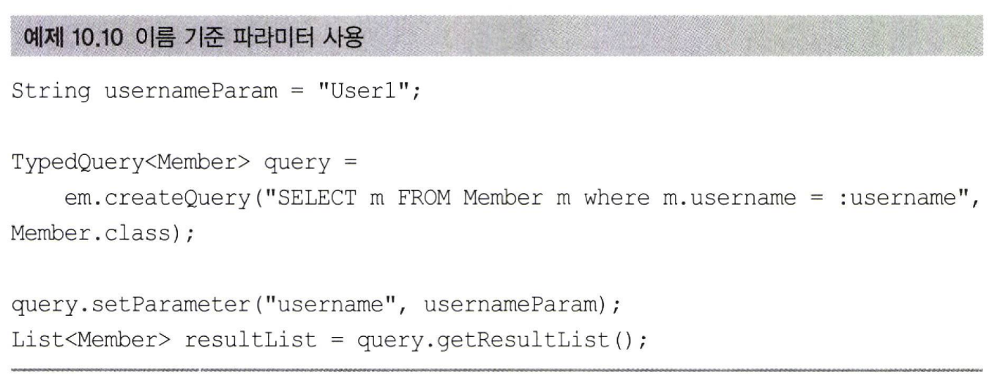

      - 이름 기준 파라미터는 파라미터 이름으로 구분하는 방법으로 앞에 : 를 사용한다.
      - JPQL을 보면 :username이라는 이름 기준 파라미터를 정의하고 query.setParameter()에서 username이라는 이름으로 파라미터를 바인딩한다.
      ```java
      List<Member> members = em.createQuery("SELECT m FROM Member m where m.username = :username", Member.class)
      .setParameter ("username", usernameParam).getResultList() ;
      ```
      - JPQL API는 대부분 메소드 체인 방식으로 설계되어 있어서 연속해서 작성할 수 있다.

    - 위치 기준 파라미터
    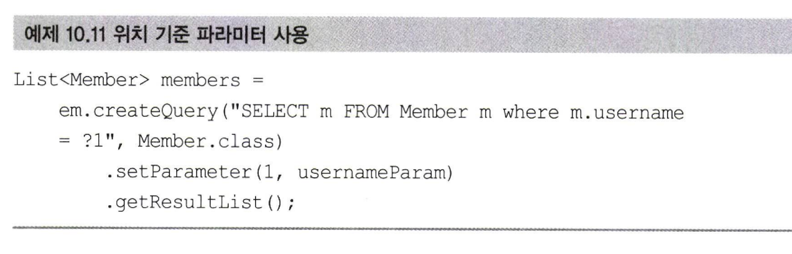
      - 위치 기준 파라미터를 사용하려면 ? 다음에 위치 값을 주면 된다.
      - 위치 기준 파라미터 방식보다는 이름 기준 파라미터 바인딩 방식을 사용하는 것이 더 명확하다.
  > 파라미터 바인딩 방식을 사용해야하는 이유 <br>
    1) 보안<br>
    JPQL을 수정해서 다음 코드처럼 파라미터 바인딩 방식을 사용하지 않고 직접 문자를 더해 만들어 넣으면 악의적인<br>
    사용자에 의해 SQL 인젝션 공격을 당할 수 있다.<br>
    (String username = "user123";<br>
    String jpqlQuery = "SELECT u FROM User u WHERE u.username = '" + username + "'";)<br>
    2) 성능<br>
    파라미터의 값이 달라도 같은 쿼리로 인식해서 JPA는 JPQL을 SQL로 파싱한 결과를 재사용할 수 있다.<br>
    데이터베이스도 내부에서 실행한 SQL을 파싱해서 사용하는데 같은 쿼리는 파싱한 결과를 재사용할 수 있다.<br>
    (애플리케이션과 데이터베이스 모두 해당 쿼리의 파싱 결과를 재사용할 수 있어서 전체 성능이 향상된다.)<br>
  파라미터 바인딩 방식은 선택이 아닌 필수다.

## 10.2.3 프로젝션
- SELECT 절에 조회할 대상을 지정하는 것을 프로젝션이라한다.
- SELECT {프로젝션 대상} FROM으로 대상을 선택한다.
- 프로젝션 대상은 아래 3가지가 있다. 
  - 엔티티
  - 임베디드 타입
  - 스칼라 타 (숫자,문자등 기본 데이터 타입)
### 엔티티 프로젝션
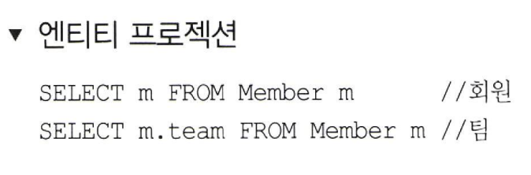

- 위 JPQL 둘 다 엔티티를 프로젝션 대상으로 사용했다.
- 엔티티를 프로젝션은 객체를 바로 조회하는 것이다.
- __조회한 엔티티는 영속성 컨텍스트에서 관리된다.__

### 임베디드 타입 프로젝션

- 임베디드 타입은 조회의 시작점이 될 수 없다는 제약이 있다. 
- 샘플 모델 Address는 UML에서 스테레오 타입을 사용해서 <<Value>>로 정의했다.
  ERD를 보면 ORDERS 테이블에 포함되어 있다.
    <details>

    <summary>스테레오 타입</summary>
    
    <!-- summary 아래 한칸 공백 두어야함 -->
    UML에서 스테레오 타입(Stereotype)은 일반적인 모델 요소에 대한 새로운 의미나 속성을 추가하는 데 사용됩니다.        <<VALUE>>는 UML에서 정의된 스테레오 타입 중 하나다.
    </details>
  
  ```java
  String query = "SELECT a FROM Address a";
  ```
  - 임베디드 타입은 조회의 시작점이 될 수 없다는 제약이 있다.
  - 위 쿼리처럼 임베디드 타입인 Address를 조회의 시작점으로 사용해서 잘못된 쿼리다.

  ```java
  String query = "SELECT o.address FROM Order o";
  List<Address> addresses = em.createQuery(query, Address.class).getResultList();
  ```
  - Order 엔티티가 시작점이다. 엔티티를 통해서 임베디드 타입을 조회할 수 있다.

  ```xml
  select order.city,
         order.street,
         order.zipcode
  from
    Orders order
  ```
  - 위와 같은 쿼리가 실행된다.
  - 임베디드 타입은 엔티티 타입이 아닌 값 타입이다.
  - 따라서 이렇게 __직접 조회한 임베디드 타입은 영속성 컨텍스트에서 관리 되지 않는다.__

### 스칼라 타입 프로젝션
```java
List<String> usernames =
em.createQuery("SELECT username FROM Member m", String.class).getResultList();
```
- 숫자,문자,날짜와 같은 기본 데이터 타입들을 스칼라 타입이라 한다. 

### 여러 값 조회
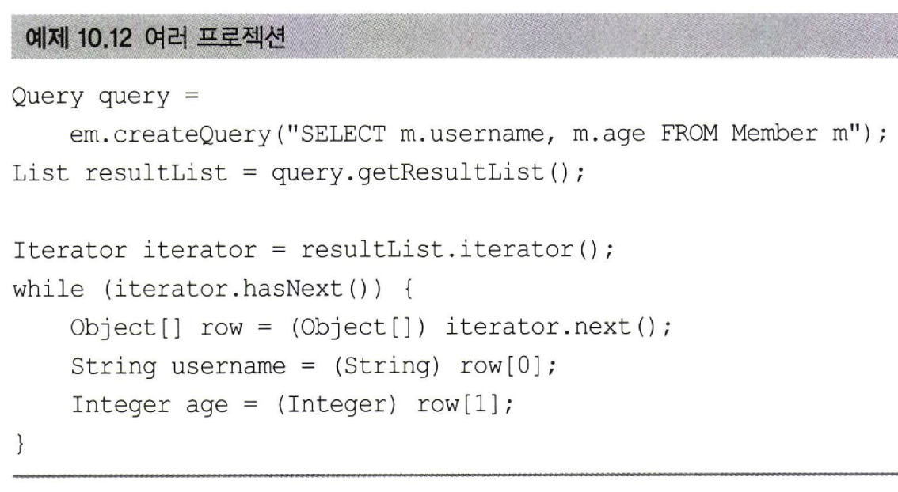
- 엔티티를 대상으로 조회하면 편하겠지만 꼭 필요한 데이터들만 선택해서 조회해야 할 때도 있다.
- 프로젝션에 여러 값을 선택하면 TypeQuery는 사용할 수 없고 대신에 Query를 사용해야한다.

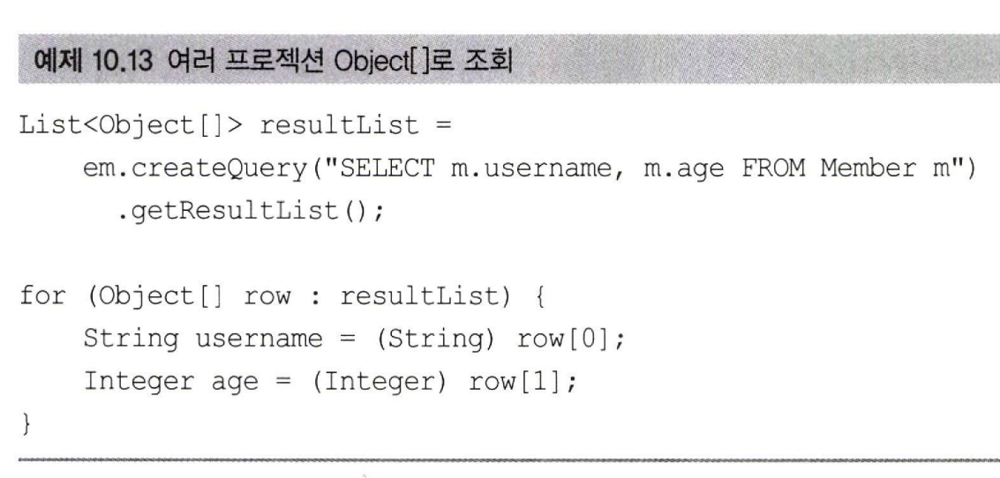
- 제너릭에 Object[]를 사용하면 위 코드처럼 조금 더 간결하게 개발할 수 있다.

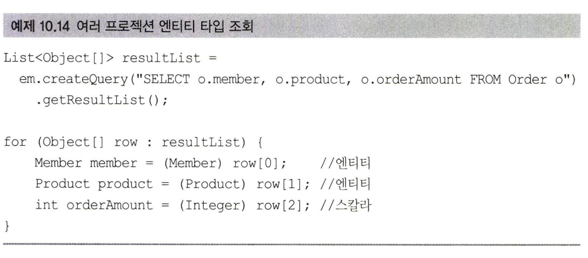
- 엔티티 타입도 여러 값을 함께 조회할 수 있다.

### New 
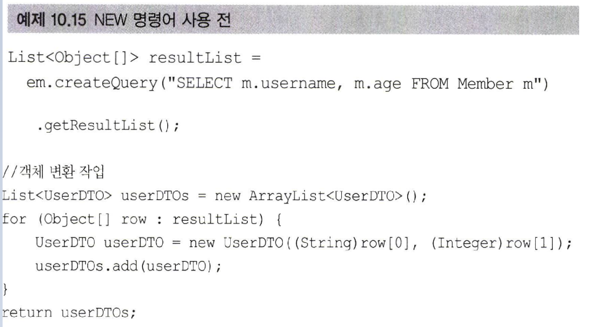 |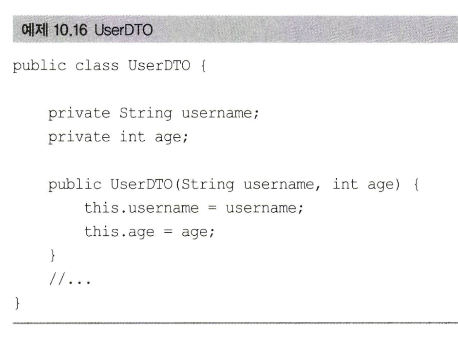
|----|----|
- username과 age 두 필드를 프로젝션해서 타입을 지정할 수 없어서 TypeQuery를 사용할 수 없다. 그래서 Object[]를 반환받받았다.
- 개발시 Object[]를 직접 사용하지 않고 UserDTO처럼 의미 있는 객체로 변환해서 사용할거다.
- 객체 변환 작업은 지루하다. NEW 명령어를 사용하자!

  
## 10.2.15 Named 쿼리 : 정적 쿼리
## 10.2.15 Named 쿼리 : 정적 쿼리
## 10.2.15 Named 쿼리 : 정적 쿼리
## 10.2.15 Named 쿼리 : 정적 쿼리


# 10.3 Criteria


```java
```

   
