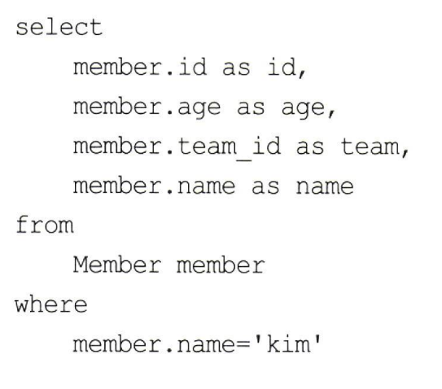

# 10장_프록시와 연관관계 관리

<b>✨설명 전 Point 잡고 가기✨</b> 
1. JPA는 복잡한 검색조건을 사용해서 엔티티 객체를 조회할 수 있는 다양한 쿼리 기술을 지원한다.
2. 쿼리 기술
   * JPQL
   * Criteria
   * QueryDSI
3. JPQL은 가장 중요한 객체지향 쿼리 언어이고 Criteria나 QueryDSL은 결국 JPQL을 편리하게 사용하도록 도와주는 기술이다.
4. 이 장 마지막에는 객체지향 쿼리에 대한 심화 내용을 다룬다.

# 10.1 객체지향 쿼리 소개 
## 10.1.1 JPQL 소개
 - JPQL(Java Persistence Query Language)은 엔티티 객체를 조회하는 객체지향 쿼리다.
 - JPQL 특징으로
   - SQL 문법과 비슷하다.
   - ANSI 표준 SQL이 제공하는 기능을 유사하게 지원한다.
   - SQL을 추상화했기때문에 특정 데이터베이스에 의존하지 않는다.
      <details>
      <summary>JPQL은 SQL을 추상화한 것?</summary>
      
      <!-- summary 아래 한칸 공백 두어야함 -->
      - 추상화는 특정한 세부 사항을 숨기고 핵심 개념 또는 기능에만 집중할 수 있도록하는 것을 의미한다.
      - JPQL이 SQL을 추상화한다는 것은 JPQL이 데이터베이스의 상호 작용하는 방법을 추상화한다는 의미다.
      - 결국 개발자가 데이터베이스에 대해 구체적으로 알 필요없이도 더 높은 수준에서 작업을 할 수 있게 도와준다.
      - 즉, JPQL의 세부 사항을 숨기고 개발자가 보다 추상적인 수준에서 작업할 수 있도록 합니다. 
      </details>
   - 데이터베이스 방언만 변경하면 JPQL을 수정하지 않아도 자연스럽게 데이터베이스를 변경할 수 있다.
   - JPQL이 제공하는 표준화된 함수를 사용하면 선택한 방언에 따라 해당 데이터베이스에 맞춘 적절한 SQL 함수가 실행된다.
   - 엔티티 직접조회, 묵시적 조인, 다형성 지원 등 이러한 이유로 JPQL은 SQL보다 간결하다. 

 |
|----|----|

- JPQL에서 Member은 테이블 이름이 아니라 엔티티 이름이다.
- m.username은 테이블 컬럼명이 아니라 엔티티 객체의 필드다.
```java
em.CreateQuery(jpql,Member.class).getResultList()
```
- em.CreateQuery메소드에 실행할 JPQL과 반환할 엔티티 클래스 타입인 Member.class를 넘겨주고 getResultList() 메소드를 실행하면 JPA는 JPQL을 SQL로 변환해서 데이터베이스를 조회한다. 그리고  조회한 결과로 Member 엔티티를 생성해서 반환한다.

 |
|----|----|

- JPQL을 실행하면 실제 SQL은 오른쪽과 같이 실행된다. 

## 10.1.2 Criteria 쿼리 소개
- Criteria는 JPQL을 생성하는 빌더 클래스다. 
  <details>

    <summary>빌더 패턴</summary>
    
    <!-- summary 아래 한칸 공백 두어야함 -->
    - 빌더 패턴은 객체를 생성하는 디자인 패턴 중 하나다.
    - 빌더 패턴은 객체의 생성과정을 단순화하고 유연하게 만든다.
    - 복잡한 객체를 생성할 때 사용되는 매개변수를 지정하거나 생햑할 수 있다. 
    객체의 생성 과정이 단계별로 나누어져있어 가독성 향상이되며 유지보수가 용이해진다. 
    - Critria와 QueryDSL에서 빌더 클래스라고 불리는 것은 이러한 빌더 패턴의 특징을 반영하기 위함이다.
    - 쿼리를 생성하는 과정을 객체의 생성과 유사하게 보기 때문에, 이를 표현하기 위해 "빌더"라는 용어를 사용한다.
      
  </details>
  query.select(m).where(...)
- Criteria의 장점은 문자가 아닌 프로그래밍 코드로 JQPL을 작성할 수 있다.
- Criteria는 문자가 아닌 코드로 JQPL을 작성해서 컴파일 시점에 오류를 발견할 수 있다. (컴파일시 오류 발견)
  (비교 : 문자기반 쿼리는 컴파일은 성공해서 서버에 배포했는데 해당 쿼리가 실행되는 런타임 시점에 오류가 발생한다는 단점이 있다.)
- Criteria의 장점은 아래와 같다. 
  - 컴파일 시점에 오류를 발견할 수 있다.
  - IDE 사용하면 코드 자동완성을 지원한다.
  - 동적 쿼리를 작성하기 편하다
  - JPA는 2.0부터 Criteria를 지원한다.  

- 쿼리가 아닌 코드로 작성한 것을 볼 수 있다. (.where(~))
- Criteria가 가진 장점이 많지만 모든 장점을 상쇄할 정도로 복잡하고 장황하다.
- Criteria로 작성한 코드도 한눈에 들어오지 않는다는 단점이 있다.

## 10.1.3 QueryDSL 소개
- QueryDSL JPQL 빌더 역할을 한다.
- QueryDSL의 장점은 코드 기반이면서 단순하고 사용하기 쉽다.
> 참고로, QueryDSL은 JPA 표준은 아니고 오픈소스 프로젝트다.<br>
  JPA,JDO,몽고DB,Java Collection, Lucene, Hibernate Search도 거의 같은 문법으로 지원한다. 
  Criteria보다 QueryDSL을 선호한다.


- QueryDSL도 어노테이션 프로세서를 사용해서 쿼리 전용 클래스를 만들어야한다.
- 이 소스에서 QueryDSL 쿼리 전용 클래스는 QMember다.
- QMember는 Member 엔티티 클래스를 기반으로 생성했다.

## 10.1.4 네이티브 SQL 소개
- JPA는 SQL을 직접 사용할 수 있는 기능을 지원하는데 이를 네이티브 SQL라 한다. 
- 특정 데이터베이스에 의존하는 기능을 사용해야할 때 네이티브 SQL을 사용한다. 
  - 오라클 데이터베이스만 사용하는 CONNECT BY 기능
  - 특정 데이터베이스에서만 동작하는 SQL 힌트
  - 위 기능들은 전혀 표준화되어 있지 않으므로 JPQL에서 사용할 수 없다.
- SQL은 지원하지만 JPQL이 지원하지 않는 기능도 있는데 이때도 네이티브 SQL을 사용한다.
- 네이티브 SQL의 단점은 특정 데이터베이스에 의존하는 SQL을 작성해야 한다는 점이다. 


- 네이티브 SQL은 em.createNativeQuery()를 사용해서 직접 작성한 sql을 데이터베이스에 전달한다.

## 10.1.5 JDBC 직접 사용, 마이바티스 같은 SQL 매퍼 프레임워크 사용
- JPA는 JDBC 커넥션을 획득하는 API를 제공하지 않는다.
- JDBC 커넥션에 직접 접근하고 싶으면 JPA 구현체가 제공하는 방법을 사용해야 한다.


- JDBC Connection을 획득하는 방법
  - JPA EntityManager에서 하이버네이트 Session을 구하고 Session의 doWork() 메소드를 호출한다.
- JDBC나 마이바티스를 JPA와 함께 사용하면 영속성 컨텍스트를 적절한 시점에 강제로 프러시해야 한다.
  - JDBC를 직접 사용하거나 마이바티스 같은 SQL 매퍼와 사용하면 모두 JPA를 우회해서 데이터베이스에 접근한다. 이렇게 우회하는 SQL에 대해서는 JPA가 전혀 인식을 하지 못해서 문제가 된다. (무결성 훼손)
- 다시 강조하면, JPA를 우회해서 SQL을 실행하기 직전에 영속성 컨텍스트를 수동으로 플러시해서 데이터베이스와 영속성 컨텍스트를 동기화하면 된다.
- 참고로,스프링 프레임워크를 사용하면 JPA와 마이바티스를 손쉽게 통합할 수 있다.
- 
  
# 10.2 JPQL
# 10.3 Criteria

```java

  }
```
   
