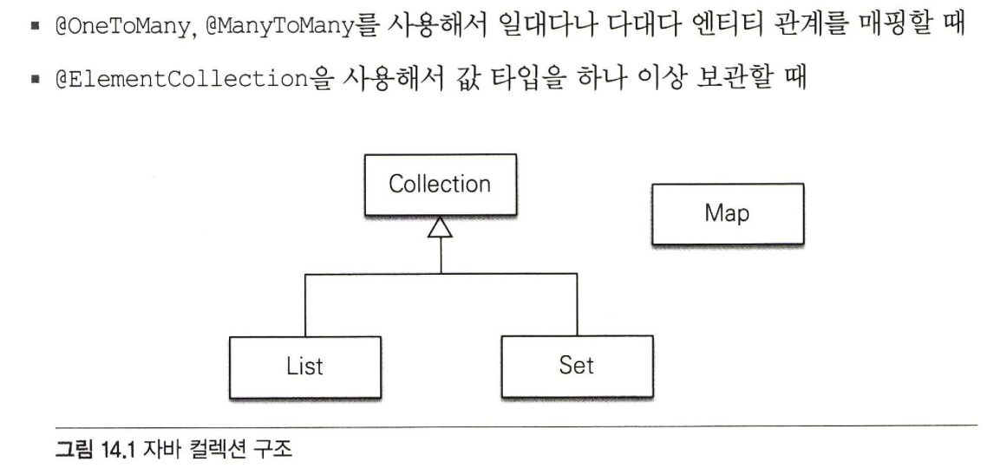
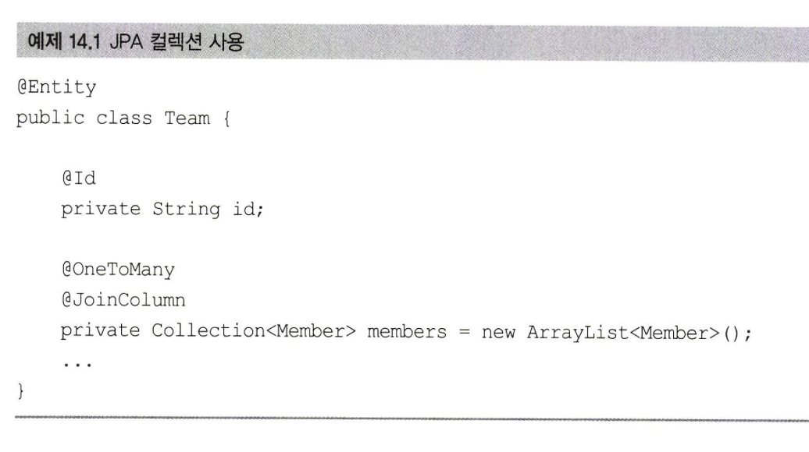
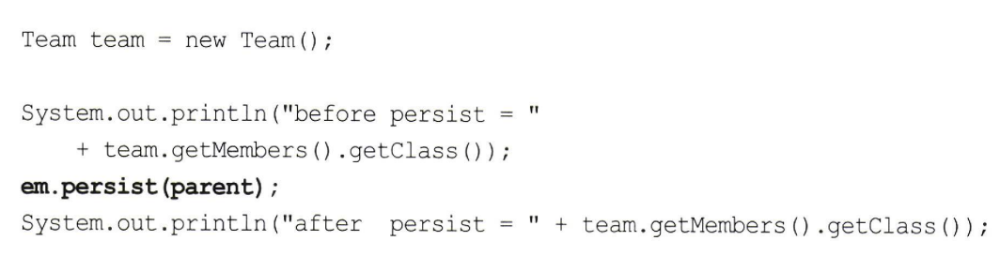
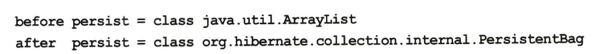
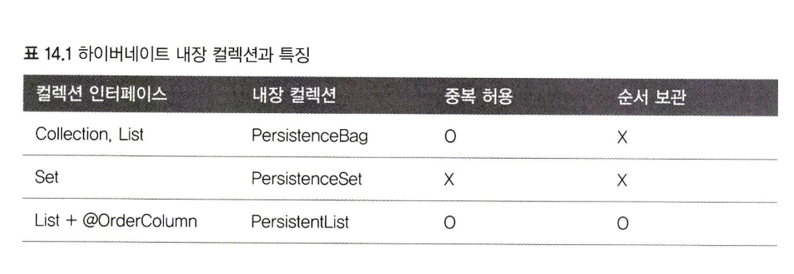
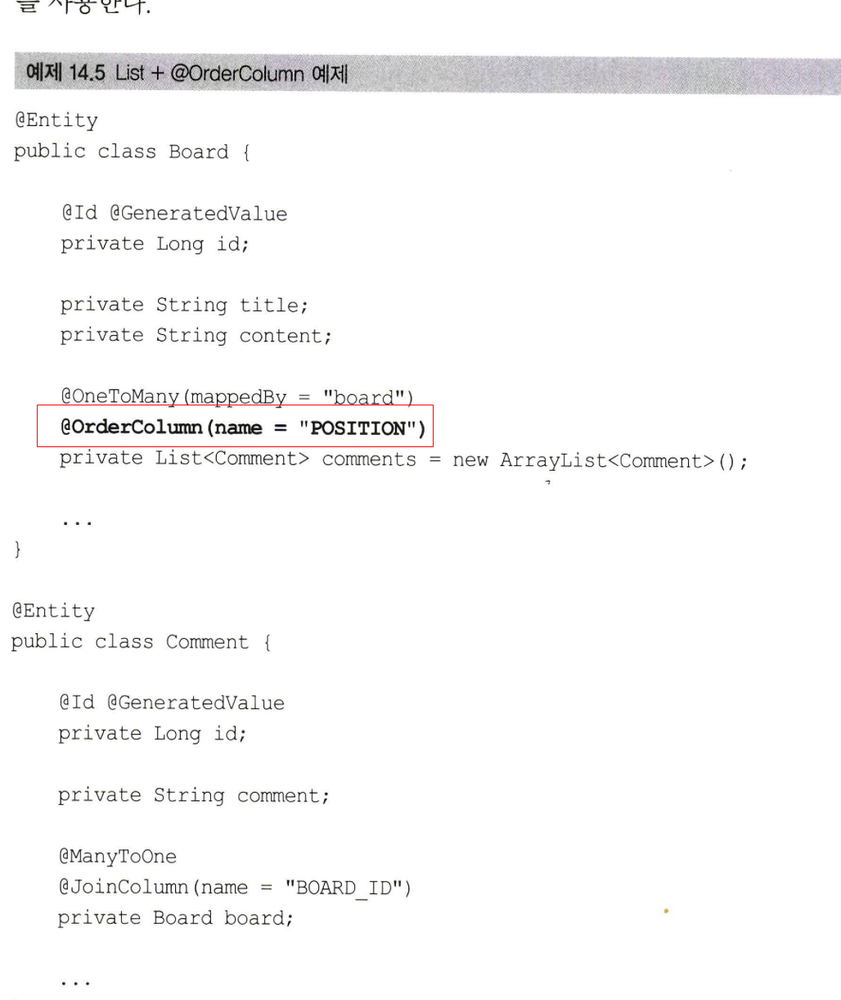
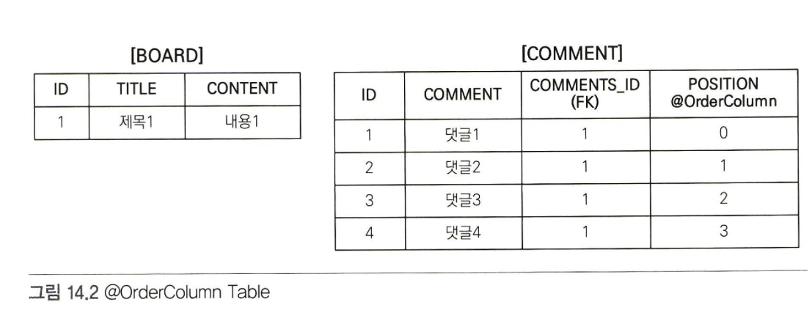
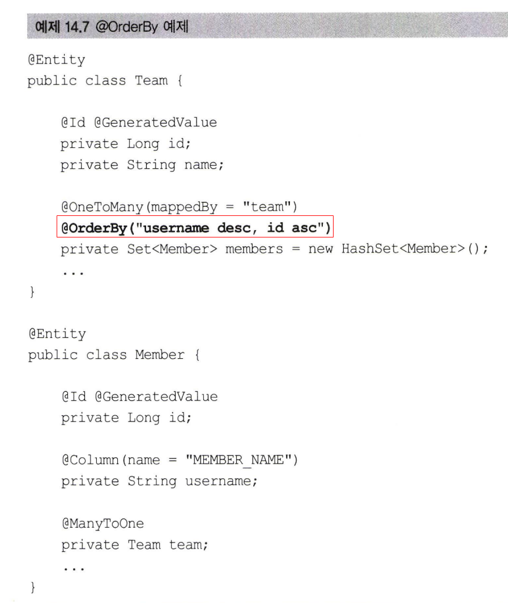

# 14장 컬렉션과 부가 기능

## @Converter
## 리스너
## 엔티티 그래프

## 14.1 컬렉션

- JPA는 자바에서 기본으로 제공하는 Collection, List, Set, Map 컬렉션을 지원한다.

- Collection： 자바가 제공하는 최상위 컬렉션이다. 하이버네이트는 중복을 허용하고 순서를 보장하지 않는다고 가정한다.
- Set： 중복을 허용하지 않는 컬렉션이다. 순서를 보장하지 않는다.
- List： 순서가 있는 컬렉션이다. 순서를 보장하고 중복을 허용한다.
- Map： Key, Value 구조로 되어 있는 특수한 컬렉션이다.

### 14.1.1 JPA와 컬렉션

- 하이버네이트는 엔티티를 영속 상태로 만들 때 컬렉션 필드를 하이버네이트에서 준비 한 컬렉션으로 감싸서 사용한다.
- 하이버네이트는 컬렉션을 효율적으로 관리하기 위해 엔티티를 영속 상태로 만들 때 원본 컬렉션을 감싸고 있는 내장 컬렉션을 생성해서 이 내장 컬렉션을 사용하도록 참 
조를 변경한다
- 래퍼 컬렉션으로도 부른다.

### 14.1.2  Collection, 니st

- Collection, List는 중복을 허용한다고 가정하므로 객체를 추가하는 add() 메소드는 내부에서 어떤 비교도 하지 않고 항상 true를 반환한다.
- 같은 엔티티가 있는지 찾거나 삭제할 때는 equals() 메소드를 사용한다.

### 14.1.3 Set

- Set은 중복을 허용하지 않는 컬렉션이다.
- 하이버네이트는 PersistentSet을 컬렉션 래퍼로 사용한다. 이 인터페이스는 HashSet으로 초기화하면 된다.
- HashSet은 중복을 허용하지 않으므로 add() 메소드로 객체를 추가할 때 마다 equals () 메소드로 같은 객체가 있는지 비교한다.
- Set은 엔티티를 추가할 때 중복된 엔티티가 있는지 비교해야 한다. 따라서 엔티티를 추가할 때 지연 로딩된 컬렉션을 초기화한다

### 14.1.4 List + @OrderColumn

- 이 List 인터페이스에 @rderColumn을 추가하면 순서가 있는 특수한 컬렉션으로 인식한다.
- 순서가 있다는 의미는 데이터베이스에 순서 값을 저장해서 조회할 때 사용한다는 의미다.
-  Board.comment크는 순서가 있는 컬렉션으로 인식된다.자바가 제공하는 List 컬렉션은 내부에 위치 값을 가지고 있다. 따라서 다음 코드처 럼 List의 위치 값을 활용할 수 있다

순서가 있는 컬렉션은 데이터베이스에 순서 값도 함께 관리한다.
@OrderColumn의 name 속성에 POSITION이라는 값을 주었다. JPA는 List의 위치 값을 테이블의 POSITION 컬럼에 보관한다.
- 특성상 위치 값은 다 쪽에 저장해야 한다
- 실무에서 사용하기에는 단점이 많다.
- 따라서 @OrderColumn을 매핑하지 말고 개발자가 직접 POSITION 값을 관리하거나 다음에 설명하는 @OrderBy를 사용하길 권장한다.
  
### 14.1.5 OrderBy 

-  @orderBy 는 데이터베이스의 ORDER BY절을 사용해서 컬렉션을 정렬한다
