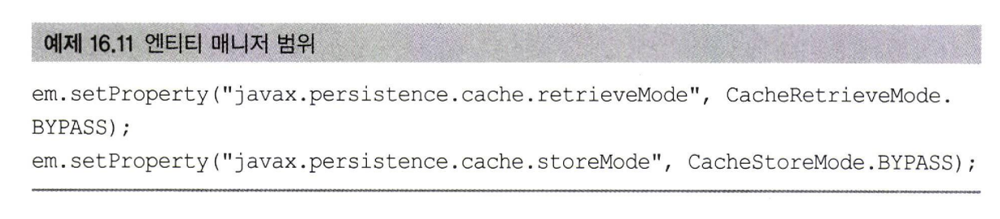
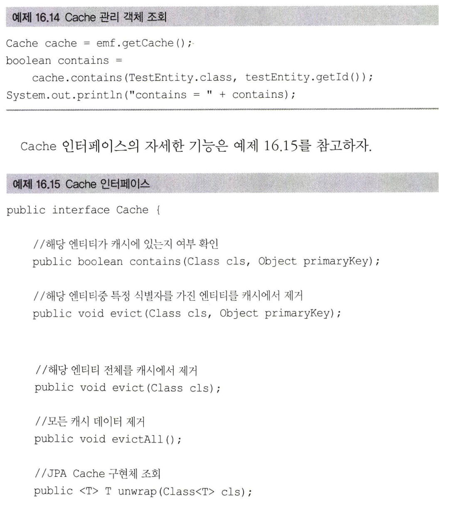
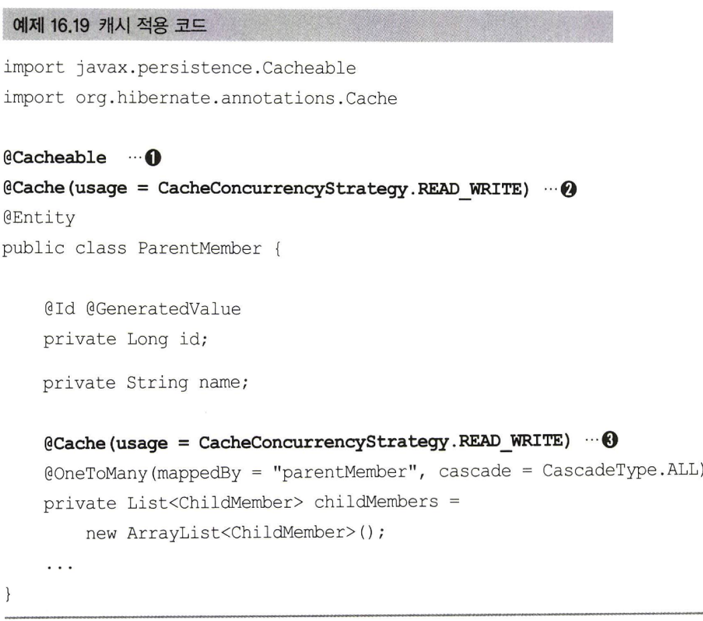

# 16장_트랜잭션과 락,2차 캐시

<b>✨설명 전 Point 잡고 가기✨</b> 
- JPA가 제공하는 __트랜잭션과 락 기능__ 을 다룬다.
- JPA가 제공하는 __애플리케이션 범위의 캐시(2차캐시)__ 를 다룬다.

## 16.1 트랜잭션과 락

### 16.1.1 트랜잭션과 격리 수준

- 트랜잭션은 ACID라는 원자성,일관성,격리성,지속성을 보장해야한다.
  - 원자성 : 트랜잭션 내에서 실행한 작업들은 마치 하나의 작업인 것처럼 __모두__ 성공하든가 __모두__ 실패해야 한다.
  - 일관성 : 모든 트랜잭션은 __일관성 있는 데이터베이스 상태__ 를 유지해야 한다.
  - 격리성 : 동시에 실행되는 트랜잭션들이 __서로에게 영향을 미치지 않도록__ 격리한다.
    (격리성은 동시성과 관련된 성능 이슈로 인해 격리 수준을 선택할 수 있다.)
  - 지속성 : 트랜잭션을 __성공적__ 으로 끝내면 그 결과가 항상 기록되어야 한다.
 
- 트랜잭션은 원자성,일관성,격리성,지속성을 보장해야한다고 했는데 그중 문제가 되는게 __격리성__ 이다.
- 트랜잭션 간에 격리성을 완벽히 보장하려면 트랜잭션을 거의 __차례대로 실행__ 해야한다.
- 근데 이렇게 하면 __동시성 처리 성능이 매우 나빠진다.__

- 트랜잭션 격리 수준 4가지
  ■ READ UNCOMMITED(커밋되지 않은 읽기)
  ■ READ COMMITTED(커밋된 읽기)
  ■ REPEATABLE READ(반복 가능한읽기)
  ■ SERIALIZABLE (직렬화가능)

- 트랜잭션 격리 수준에 따른 문제점들도 있다.

   

- 3가지 문제점
  - DIRTY READ
  - NON-REPEATABLE READ (반복 불가능한 읽기 )
  - PHANTOM READ

- 격리 수준에 따라 나타나는 문제점을 보자.
  - READ UNCOMMITTED：커밋하지 않은 데이터를 읽을 수 있다. DIRTY READ를 허용한다.
    * 트랜잭션 2가 DIRTY READ한 데이터를 사용하는데 트랜잭션 1을 롤백하면 데이터 정합성에 심각한 문제가 발생할 수 있다
    * DIRTY READ 예시 : 트랜잭션1이 데이터를 수정하고 있는데 __커밋하지 않아도 트랜잭션 2가 수정 중인 데이터를 조회__ 할 수 있다
  - READ COMMITTED : 격리 수준이 가장 낮음, serializable의 격리 수준이 가장 높다. 대신 NON-REPEATABLE READ는 발생할 수 있다.
    * 반복해서 같은 데이터를 읽을 수 없는 상태가 될 수 있다. 
    * NON-REPEATABLE READ 예시 : 트랜잭션 1 이 회원 A를 조회 중인데 갑자기 트랜잭션 2가 회원 A를 수정하고 커밋하면 트랜잭션 1 이 __다시 회원 A를 조회했을 때 수정된 데이터가 조회__ 된다.
    * . DIRTY READ는 허용하지 않지만, NON-REPEATABLE READ는 허용하는 격리 수준을 READ COMMITTED라 한다.
  -  REPEATABLE READ: 한 번 조회한 데이터를 __반복해서 조회해도 같은 데이터가 조회__ 된다.
      * NON-REPEATABLE READ 는 허용하지 않지만 PHANTOM READ는 발생할 수 있다.
      * __반복 조회 시 결과 집합이 달라질 수 있다.__ 
      * PHANTOM READ 예시 : 트랜잭션1이 10살 이하의 회원을 조회했는데 트랜잭션 2가 5살 회원을 추가하고 커밋하면 트랜잭션1이 다시 10 살 이하의 회원을 조회했을 때 __회원 하나가 추가된 상태__ 로 조회된다.
  - SERIALIZABLE : 가장 엄격한 트랜잭션 격리 수준이다. 여기서는 PHANTOM READ가 발생하지 않는다.
    * 동시성 처리 성능이 급격히 떨어질 수 있다.
   
- 애플리케이션 대부분은 동시성 처리가 중요하므로 데이터베이스들은 보통 READ COMMITTED 격리 수준을 기본으로 사용한다. 
- 일부 중요한 비즈니스 로직에 더 높은 격리 수준이 필요하면 데이터베이스 트랜잭션이 제공하는 잠금 기능을 사용하면 된다.

> 트랜잭션 격리 수준에 따른 동작 방식은 데이터베이스마다 조금씩 다르다.
> 최근에는 데이터베이스들이 더 많은 동시성 처리를 위해 락보다는 MVCC(http：//e n .w ik ip e d ia.o rg /w iki/Multiversion_concurrency_control)를 사용하므로 락을 사용하는 데이터베이스와 약간 다른 특성을 지닌다

### 16.1.2 낙관적 락과 비관적 락 

#### JPA 기본 격리수준 및 사용 
- __JPA의 영속성 컨텍스트(1차 캐시)를 적절히 활용__ 하면 데이터베이스 트랜잭션이 
__READ COMMITTED(커밋된 읽기) 격리 수준__ 이어도 애플리케이션 레벨에서 __반복 가능한 읽기 
REPEATABLEREAD__ 가 가능하다.
- __스칼라 값을 직접 조회하면 영속성 컨텍스트의 관리를 받지 못하므로 반복 가능한 읽기를 할 수 없다.__ (조회할때마다 값변경 가능성 있음)
- JPA는 데이터베이스 트랜잭션 격리 수준을 READ COMMITTED 정도로 가정한다.
  만약 일부 로직에 더 높은 격리 수준이 필요하면 낙관적 락과 비관적 락 중 하나를 사용하면 된다

- 낙관적 락
  - 데이터베이스가 제공하는 락 기능을 사용하는 것이 아니라 __JPA가 제공하는 버전 관리 기능을 사용__ 한다
  - __낙과적 락을 사용하면 트랜잭션 대부분은 충돌이 발생하지 않는다__
  - 낙관적 락은 트랜잭션을 __커밋하기 전까지는__ 트랜잭션의 __충돌을 알 수 없다__는 특징이 있다

- 비관적 락
  - __트랜잭션의 충돌이 발생한다고 가정하고 우선 락을 걸고 보는 방법이다.__
  - __데이터베이스가 제공하는 락 기능__을 사용한다.
  - 여기에 추가로 데이터베이스 트랜잭션 범위를 넘어서는 문제도 있다

- 트랜잭션 범위를 넘어서는 문제
  - 두 번의 갱신 분실 문제는 데이터베이스 트랜잭션의 범위를 넘어선다.
  - 예시) 사용자 A와 B가 동시에 제목이 같은 공지사항을 수정한다고 생각해보자.
    둘이 동시에 수정 화면을 열어서 내용을 수정하는 중에 사용자 A가 먼저 수정완료 버튼을 
    눌렀다. 잠시 후에 사용자 묘가 수정완료 버튼을 눌렀다. 결과적으로 먼저 완료한 사용자
    A의 수정사항은 사라지고 나중에 완료한 사용자 B의 수정사항만 남게 된다.
  - 두번의 갱신으로 첫번째 데이터가 분실됬다.
    
- 두 번의 갱신 분실 문제를 해결하데  3가지 선택 방법 있다.
  - 마지막 커밋만 인정하기: 사용자 A의 내용은 무시하고 마지막에 커밋한 사용자 B의 내용만 인정한다
  - 최초 커밋만 인정하기: 사용자 A가 이미 수정을 완료했으므로 사용자 요가 수정을 완료할 때 오류가 발생한다.
  - 충돌하는 갱신 내용 병합하기: 사용자 A와 사용자 B의 수정사항을 병합한다.

- __기본은 마지막 커밋만 인정하기가 사용된다.__ 하지만 상황에 따라 최초 커밋만 인정하기가 더 합리적 일 수 있다.
- JPA가 제공하는 버전 관리 기능을 사용하면 손쉽게 최초 커밋만 인정하기를 구현할 수 있다.
- 충돌하는 갱신 내용 병합하기는 최초 커밋만 인정하기를 조금 더 우아하게 처리하는 방법인데 애플리케이션 개발자가 직접 사용자를 위해 병합 방법을 제공해야 한다

### 6.1.3 ©Version

- JPA가 제공하는 낙관적 락을 사용하려면 @version 어노테이션을 사용해서 버전 관리 기능을 추가해야 한다.

- @Version 적용 가능 타입
  ■ Long (long)
  ■ Integer (int)
  ■ Short (short)
  ■ Timestamp

   

-  엔티티에 버전 관리용 필드를 하나 추가하고 @Version을 붙이면 된다.
- 엔티티를 __수정할 때 마다 버전이 하나씩 자동으로 증가__ 한다.
- 엔티티를 __수정할 때 조회 시점의 버전__과 __수정 시점의 버전__이 __다르면 예외__ 가 발생한다.

   

- 트랜잭션 1 이 조회한 엔티티를 수정하고 있는데 트랜잭션 2에서 같은 엔티티를 수정하고 커밋해서 버전이 증가해버리면 
 트랜잭션 1 이 커밋할 때 버전 정보가 다르므로 예외가 발생한다.
- __조회할 때 버전과 데이터베이스의 현재 버전 정보가 다르므로 예외가 발생한다.__
- 따라서 __버전 정보를 사용하면 최초 커밋만 인정__ 하기가 적용된다.

#### 버전 정보 비교 방법
- __데이터베이스 버전__과 __엔티티 버전__이 같으면 데이터를 __수정하면서 동시에 버전도 하나 증가__ 시킨다.
- 만약 데이터베이스에 버전이 이미 증가해서 수정 중인 엔티티의 버전과 다르면 UPDATE 쿼리의 WHERE 문에서 VERSION 값이 다르므로 수정할 대상이 없다. 이때는 __버전이 이미 증가한 것으로 판단해서 JPA가 예외를 발생__ 시킨다
- 버전은 엔티티의 값을 변경하면 증가한다.
- 그리고 값 타입인 임베디드 타입과 값 타입 컬렉션은 논리적인 개념상 해당 엔티티의 값이므로 수정하면 엔티티의 버전이 증가한다.
- 단 __연관관계 필드는__ 외래키를 관리하는 연관관계의 __주인 필드를 수정할 때만 버전이 증가__ 한다.
- __@Version으로 추가한 버전 관리 필드는 JPA가 직접 관리하므로 개발자가 임의로 수정하면 안 된다(벌크 연산 제외)____
- 만약 버전 값을 강제로 증가하려면 __특별한 락 옵션__ 을 선택하면 된다

   

### 16.1.4 JPA 락 사용 (락 옵션)

   

- 위 위치에 적용할 수 있다. 
- Board board = em.find(Board.class, id, LockModeType.OPTIMISTIC);로 조회하면서 즉시락을 걸 수 있고
- em.lock(board, LockModeType.OPTIMISTIC);처럼 필요할 때 락을 걸 수 있다.

 

- JPA가 제공하는 락 옵션은 javax.persistence.LockModeType에 정의되어 있다.
- LockModeType의 자세한 속성은 위와 같다.

### 16.1.5  JPA 낙관적 락
- JPA가 제공하는 낙관적 락은 버전(@Version)을 사용한다. 따라서 낙관적 락을 사용하려면 버전이 있어야 한다.
- 낙관적 락은 트랜잭션을 커밋하는 시점에 충돌을 알 수 있다는 특징이 있다.

 

- 낙관적 락에서 발생하는 예외는 다음과 같다
- 참고로 락 옵션 없이 @ Version만 있어도 낙관적 락이 적용된다.
- 그러나 락 옵션을 사용하면 락을 더 세밀하게 제어할 수 있다.

#### 낙관적 락의 옵션에 따른 효과를 하나씩 알아보자.

1. NONE
   - 락 옵션을 적용하지 않아도 엔티티에 @Version이 적용된 필드만 있으면 낙관적 락이 적용된다.
   -  용도: 조회한 엔티티를 수정할 때 다른 트랜잭션에 의해 변경(삭제)되지 않아야 한다. 조회 시점부터 수정 시점까지를 보장한다.
   -  동작 : 엔티티를 수정할 때 __버전을 체크하면서 버전을 증가__ 한다( UPDATE 쿼리 사용).
             __이때 데이터베이스의 버전 값이 현재 버전이 아니면 예외가 발생한다.__
   -  이점: __두 번의 갱신 분실 문제를 예방한다.__
  
2. OPTIMISTIC
   - @Version 만 적용했을 때는 엔티티를 수정해야 버전을 체크하지만 이 옵션을 추가하면 __엔티티를 조회만 해도 버전을 체크__ 한다.
   - 쉽게 이야기해서 한 번 조회한 엔티티는 트랜잭션을 종료할 때까지 다른 트랜잭션에서 변경하지 않음을 보장한다.
   - 용도 : 조회한 엔티티는 트랜잭션이 끝날 때까지 다른 트랜잭션에 의해 변경되지 않아야 한다.
           __조회 시점부터 트랜잭션이 끝날 때까지 조회한 엔티티가 변경되지않음을 보장한다.__
   -  동작: __트랜잭션을 커밋할 때 버전 정보를 조회해서(SELECT 쿼리 사용) 현재 엔티티의 버전과 같은지 검증한다.__
            만약 같지 않으면 __예외__ 가 발생한다.
   -  이점 : OPTIMISTIC 옵션은 DIRTY READ와 NON-REPEATABLE READ를 방지한다

 

- 트랜잭션 1은 OPTIMISTIC 락으로 버전이 1인 데이터를 조회했다. 이후에 트랜잭션 2가 데이터를 수정해버렸고 버전은 2로 증가했다.
- 트랜잭션 1은 엔티티를 OPTIMISTIC 락으로 조회했으므로 트랜잭션을 커밋할 때 데이터베이스에 있는 버전 정보를 SELECT 쿼리로 조회해서 처음에 조회한 엔티티의 버전 정
보와 비교한다. 이때 버전 정보가 다르면 예외가 발생한다.
- 락 옵션을 걸지 않고 @ Version 만 사용하면 엔티티를 수정해야 버전 정보를 확인하지만 OPTIMISTIC 옵션을 사용하면 엔티티를 수정하지 않고 단순히 조회만 해도 버전을 확인한다.
    
3. OPTIMISTIC_FORCE_INCREMENT
    -  낙관적 락을 사용하면서 버전 정보를 강제로 증가한다.
    - 용도 : __논리적인 단위의 엔티티 묶음을 관리__ 할 수 있다.
              예를 들어 게시물과 첨부파일이 일대다，다대일의 양방향 연관관계이고 첨부파일이 __연관관계의 주인__ 이다.
              게시물을 수정하는 데 단순히 첨부파일만 추가하면 게시물의 버전은 증가하지 않는다.
              해당 게시물은 __물리적으로는 변경되지 않았지만，논리적으로는 변경되었다.__
              이때 게시물의 __버전도 강제로 증가하려면 OPTIMISTIC_FORCE_INCREMENT 사용__ 한다.
    - 동작 : 엔티티를 수정하지 않아도 트랜잭션을 커밋할 때 UPDATE 쿼리를 사용해서 버전 정보를 강제로 증가시킨다.
             이때 데이터베이스의 버전이 엔티티의 버전과 다르면 예외가 발생한다.
             추가로 엔티티를 수정하면 수정 시 버전 UPDATE가 발생한다. 따라서 총 2번의 버전 증가가 나타날 수 있다.
    - 이점 : 강제로 버전을 증가해서 논리적인 단위의 엔티티 묶음을 버전 관리할 수 있다.

- __데이터를 수정하지 않아도 트랜잭션을 커밋할 때 버전 정보가 증가한다__

### 16.1.6  JPA 비관적 락
- JPA가 제공하는 비관적 락은 데이터베이스 트랜잭션 락 메커니즘에 의존하는 방법 이다.
- 주로 SQL 쿼리에 select for update 구문을 사용하면서 시작하고 __버전 정보는 사용하지 않는다.__
- 비관적 락은 주로 PESSIMISTIC_WRITE 모드를 사용한다.
- 비관적 락은 다음과 같은 특징 이 있다.
  - 엔티티가 아닌 스칼라 타입을 조회할 때도 사용할 수 있다.
  - 데이터를 __수정하는 즉시 트랜잭션 충돌을 감지__ 할 수 있다.

- 비관적 락에서 발생하는 예외는 다음과 같다

#### 비관적 락 옵션 
1. PESSIMISTIC_WRITE 모드(옵션)
   - 비관적 락이라 하면 일반적으로 이 옵션을 뜻한다. 데이터베이스에 쓰기 락을 걸 때 사용한다.
   - 용도: 데이터베이스에 쓰기 락을 건다.
   - 동작: 데이터베이스 select for update를 사용해서 락을 건다.
   - 이점: NON-REPEATABLE READ를 방지한다. 락이 걸린 __로우는 다른 트랜잭션이 수정할 수 없다__
2. PESSIMISTIC_READ
   - 데이터를 반복 읽기만 하고 수정하지 않는 용도로 락을 걸 때 사용한다.
   - 일반적으로 잘 사용하지 않는다.
   - 데이터베이스 대부분은 방언에 의해 PESSIMISTIC_WRITE 로 동작한다.
3. PESSIMISTIC_FORCE_INCREMENT
   - 비관적 락중 __유일하게 버전 정보를 사용__ 한다. __비관적 락이지만 버전 정보를 강제로 증가시킨다.__
   - 하이버네이트는 nowait를 지원하는 데이터베이스에 대해서 for update nowait 옵션을 적용한다.
   - nowait를 지원하지 않으면 for update가 사용된다.

### 16.1.7 비관적 락과 타임아웃
- 비관적 락을 사용하면 __락을 획득할 때까지 트랜잭션이 대기__ 한다.
- 무한정 기다릴 수는 없으므로 타임아웃 시간을 줄 수 있다.

- 다음 예제는 10초간 대기해서 응답이 없으면 javax.persistence.LockTimeoutException 예외가 발생한다.
- 타임아웃은 데이터베이스 특성에 따라 동작하지 않을 수 있다.
  
## 16.2 2차 캐시

- JPA가 제공하는 애플리케이션 범위의 캐시에 대해 알아보고 하이버네이트와 EHCACHE를 사용해서 실제 캐시를 적용해보자.

### 16.2.1 1차 캐시와 2차 캐시

- 네트워크를 통해 데이터베이스에 접근하는 시간 비용은 애플리케이션 서버에서 내부 메모리에 접근하는 시간 비용보다 수만에서 수십만 배 이상 비싸다.
- 따라서 조회한 데이터를 메모리에 캐시해서 데이터베이스 접근 횟수를 줄이면 애플리케이션 성능을 획기적으로 개선할 수 있다.
- 이것으로 얻을 수 있는 이점이 많지만，일반적인 웹 애플리케이션 환경은 트랜잭션을 시작하고 종료할 때까지만 1차 캐시가 유효하다
  
- OSIV를 사용해도 클라이언트의 요청이 들어올 때부터 끝날 때까지만 1차 캐시가 유효하다.
- 따라서 애플리케이션 전체로 보면 데이터베이스 접근 횟수를 획기적으로 줄이지는 못한다.
- 하이버네이트를 포함한 대부분의 JPA 구현체들은 애플리케이션 범위의 캐시를 지원하는데 이것을 공유 캐시 또는 2차 캐시라 한다
-  2차 캐시를 활용하면 애플리케이션 조회 성능을 향상할 수 있다

> OSIV(Open Session In View)는 영속성 컨텍스트를 뷰까지 열어두는 기능이다.
> 영속성 컨텍스트가 유지되면 엔티티도 영속 상태로 유지된다. 뷰까지 영속성 컨텍스트가 살아있다면 뷰에서도 지연 로딩을 사용할 수가 있다.
> JPA에서는 OEIV(Open EntityManager In View), 하이버네이트에선 OSIV(Open Session In View)라고 한다. 하지만 관례상 둘 다 OSIV로 사용한다.

- 하이버네이트를 포함한 대부분의 JPA 구현체들은 애플리케이션 범위의 캐시를 지원하는데 이것을 공유 캐시 또는 2차 캐시라 한다. 

#### 1차 캐시 
- 1차 캐시는 영속성 컨텍스트 내부에 있다.
- 엔티티 매니저로 조회하거나 변경하는 모든 엔티티는 1차 캐시에 저장된다.
- 트랜잭션을 커밋하거나 플러시를 호출하면 1차 캐시에 있는 엔티티의 변경 내역을 데이터베이스에 동기화 한다.
- JPA를 J2EE나 스프링 프레임워크 같은 컨테이너 위에서 실행하면 트랜잭션을 시작할 때 영속성 컨텍스트를 생성하고
- 트랜잭션을 종료할 때 영속성 컨텍스트도 종료한다.
- 물론 OSIV를 사용하면 요청 (예를 들어 H T T P 요청)의 시작부터 끝까지 같은 영속성 컨텍스트를 유지한다
- 1차 캐시는 끄고 켤 수 있는 옵션이 아니다. 영속성 컨텍스트 자체가 사실상 1차 캐시다

- 1차 캐시 특징
  - 1차 캐시는 같은 엔티티가 있으면 해당 엔티티를 그대로 반환한다. 따라서 1차 캐시는 객체 동일성(a == b) 을 보장한다
  - 1차 캐시는 기본적으로 영속성컨텍스트 범위의 캐시다(컨테이너 환경에서는 트랜잭션 범위의 캐시, OSIV를 적용하면 요청 범위의 캐시다)
 
#### 2차 캐시 
- 애플리케이션에서 공유하는 캐시를 JPA는 공유 캐시라 하는데 일반적으로 2차 캐시라 부른다.
- 2차 캐시는 애플리케이션 범위의 캐시다.
- 따라서 애플리케이션을 종료할 때까지 캐시가 유지된다.
- 분산 캐시나 클러스터링 환경의 캐시는 애플리케이션보다 더 오래 유지될 수도 있다.
- 2차 캐시를 적용하면 엔티티 매니저를 통해 데이터를 조회할 때 우선 2차 캐시에서 찾고 없으면 데이터베이스에서 찾는다.
- 2차 캐시를 적절히 활용하면 데이터베이스 조회 횟수를 획기적으로 줄일 수 있다.

- 2차 캐시는 동시성을 극대화하려고 캐시한 객체를 직접 반환하지 않고 복사본을 만들어서 반환한다.
- 2차 캐시는 원본 대신에 복사본을 반환한다.

- 2차 캐시 특징
  - 2차 캐시는 영속성 유닛 범위의 캐시다.
  - 2차 캐시는 조회한 객체를 그대로 반환하는 것이 아니라 복사본을 만들어서 반환한다.
  - 2차 캐시는 데이터베이스 기본 키를 기준으로 캐시하지만 영속성 컨텍스트가 다르면 객체 동일성(a == b)을 보장하지 않는다.

### 16.2.2 JPA 2차 캐시 기능
- JPA 구현체 대부분은 캐시 기능을 각자 지원했는데 JPA는 2.0에 와서야 캐시 표준을 정의했다
- JPA 캐시 표준은 여러 구현체가 공통으로 사용하는 부분만 표준화해서 세밀한 설정을 하려면 구현체에 의존적인 기능을 사용해야 한다.
- JPA 캐시 표준 기능을 알아보자

#### JPA 캐시 표준 기능

1. 캐시 모드 설정

   
   
  - 2차 캐시를 사용하려면  엔티티에 javax .persistence.Cacheable 어노테이션을 사용하면 된다
  -  @Cacheable은 @Cacheable (true)，@Cacheable (false) 를 설정할 수 있는데 기본값은 true다.

  

  - persistence.xml에 shard-cache-mode를 설정해서 애플리케이션 전체에(정확히는 영속성 유닛 단 위 ) 캐시를 어떻게 적용할지 옵션을 설정해야 한다.

  

  - 스프링 프레임워크를 사용할 때 설정하는 방법이다.

  
  
  - 캐시 모드는 javax.persistence.SharedCacheMode에 정의되어 있다.
  - 자세한 내용은 위 사진을 참고하자. 보통 ENABLE_SELECTIVE를 사용한다.
    
2. 캐시 조회, 저장 방식 설정
   - 1)캐시를 무시하고 데이터베이스를 직접 조회하거나 2)캐시를 갱신하려면 캐시 조회 모드와 캐시 보관모드를 사용하면 된다.
   - 캐시 조회 모드나 보관 모드에 따라 사용할 프로퍼 티와 옵션이 다르다.

  ##### 프로퍼티 이름 
  

  ##### 프로퍼티 옵션
  

  ##### 캐시 조회 모드 
  
  - USE： 캐시에서 조회한다. 기본값이다.
  - BYPASS： 캐시를 무시하고 데이터베이스에 직접 접근한다.

  ##### 캐시 보관 모드
  

  - USE： 조회한 데이터를 캐시에 저장한다. 조회한 데이터가 이미 캐시에 있으면 캐시 데이터를 최신 상태로 갱신하지는 않는다.
          트랜잭션을 커밋하면 등록 수정한 엔티티도 캐시에 저장한다. 기본값이다.
  - BYPASS： 캐시에 저장하지 않는다.
  - REFRESH： USE 전략에 추가로 데이터베이스에서 조회한 엔티티를 최신 상태로 다시 캐시한다

  
  
  - EntityManager. setProperty()로 엔티티 매니저 단위로 설정가능하다.

  
  
  - 더 세밀하게 EntityManager.find().EntityManager.refresh () 에 설정가능하다.

  
  
  -  Query.setHint () (TypeQuery 포함)에 사용할 수 있다.

3. JPA 캐시 관리 API

- JPA 는 캐시를 관리하기 위한 javax .persistence. Cache 인터페이스를 제공한다.

#### 마무리
- 실제 캐시를 적용하려면 구현체의 설명서를 읽어보아야 한다.
- 하이버네이트와 EHCACHE를 사용해서 실제 2차 캐시를 적용해보자

### 16.2.3 하이버네이트와 EHCACHE 적용
- 하이버네이트와 EHCACHE(ehcache.org)를 사용해서 2차 캐시를 적용해보자.
- 하이버네이트가 지원하는 캐시는 크게 3가지가 있다

#### 하이버네이트가 지원하는 캐시

#### 환경설정

- 하이버네이트에서 E H C A C H E를 사용하려면 예제 16.16과 같이 hibernateehcache 라이브러리를 pom.xml에 추가하자.
- hibernate-ehcache를 추가하면 net.sf .ehcache-core 라이브러리도 주가된다.

- ehcache.xml을 설정 파일로 사용한다.
- 이 설정파일은 캐시를 얼마만큼 보관할지얼마 동안 보관할지와 같은 캐시 정책을 정의하는 설정 파일이다.
- 자세한 내용은 EHCACHE 공식 문서를 참고하자. 이 파일을 클래스패스 루트인 src/main/resources에 두자.

- hibernate.cache.use_second_level_cache： 2차 캐시를 활성화한다. 엔티티 캐시와 컬렉션 캐시를 사용할 수 있다.
- hibernate.cache.use_ query_ cache： 쿼리 캐시를 활성화한다.
- hibernate. cache.region.factory_ class： 2차 캐시를 처리할 클래스를 지정한다.
                                          여기서는 EHCACHE를 사용하므로 org.hibernate. cache. ehcache.EhCacheRegionFactory를 적용한다.
- hibernate. generate_ statistics： 이 속성을 true로 설정하면 하이버네이트가 여러 통계정보를 출력해주는데 캐시 적용 여부를 확인할 수 있다
                                    (성능에 영향을 주므로 개발 환경에서 만 적용하는 것 이 좋 다).
- 2차 캐시를 사용할 준비를 완료했다. 이제 캐시를 사용해보자.

#### 엔티티 캐시와 컬렉션 캐시

- javax.persistence.Cacheable: 엔티티를 캐시하려면 1번처럼 이 어노테이션을 적용하면 된다.
- org.hibernate. annotations. Cache：이 어노테이 션은 하이버네이트 전용이다.
- 2번처럼 캐시와 관련된 더 세밀한 설정을 할 때 사용한다.
- 또한 3번처 럼 컬렉션 캐시를 적용할 때도 사용한다.
- 여기서 ParentMember는 엔티티 캐시 가 적용되고 ParentMember.childMembers는 컬렉션 캐시가 적용된다.

1. Cache

   
   
   - 하이버네이트 전용인 org.hibernate.annotations.Cache 어노테이션을 사용하면 세밀한 캐시 설정이 가능하다. 
   - 중요한 것은 캐시 동시성 전략을 설정할 수 있는 usage 속성이다
  
    

   - og.hibernate.annotations.CacheConcurrencyStrategy를 살펴 볼 수 있다. 

    
   - 캐시 종류에 따른 동시성 전략 지원 여부는 하이버네이트 공식 문서를 봐야한다.
   - ConcurrentHashMap은 개발 시에만 사용해야 한다.

2. 캐시 영역

   
   
   - 위에서 캐시를 적용한 코드는 다음 캐시 영역CacheRegion에 저장된다.
   - 엔티티 캐시 영역은 기본값으로 [패키지 명 + 클래스 명]을 사용하고 ，컬렉션 캐시 영역은 엔티티 캐시 영역 이름에 캐시한 컬렉션의 필드 명이 추가된다.
   - 필요하다면 @Cache (region = "customRegion", ...) 처럼 region 속성을 사용해서 캐시 영역을 직접 지정할 수 있다
   - 캐시 영역을 위한 접두사를 설정하려면 persistence.xml 설정에 hibernate, cache. region_prefix를 사용하면 된다

  

  - 캐시 영역이 정해져 있으므로 영역별로 세부 설정을 할 수 있다.
  - 만약 ParentMember를 600초 마다 캐시에서 제거하고 싶으면 EHCACHE를 예제와 같이 설정하면 된다.
  
3. 쿼리캐시
4. 쿼리 캐시 영역
5. 쿼리 캐시와 컬렉션 캐시의 주의점

