# 2장 JPA 시작

## 2.1 이클립스 설치와 프로젝트 불러오기

### 서론
  -  JPA를 사용하기 위한 기본 준비한다.
  -  이클립스 IDE 설치, H2 데이터베이스 설치, 라이브러리 설치한다.

### 이클립스 설치와 프로젝트 불러오기
  -  메이븐이 내장된 LUNA 버전의 이클립스 설치한다.
  -  Eclipse IDE for Java EE Developers 패키지 다운로드 한다. (JPA로 개발할 때 편리한 도구들 지원)
  >  메이븐(Maven)은 자바 기반 프로젝트의 라이프사이클 관리와 빌드 자동화를 지원하는 도구
 
  #### 예제 프로젝트 불러오기
  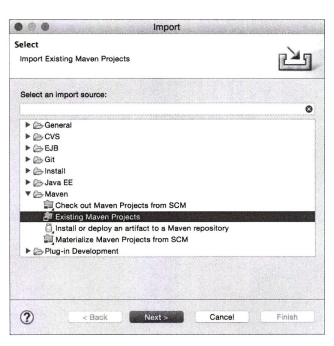
  
  -  File > import.. 

  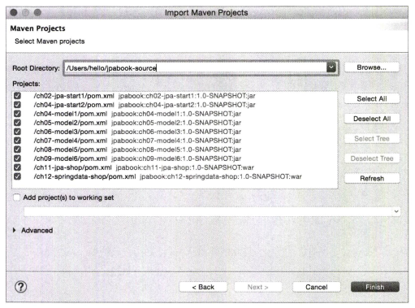
  
  - Maven > Existing Maven Projects를 선택하고 Next 버튼을 누르면 메이븐 프로젝트를 불러올 수 있는 위 화면이 뜬다.
  - Browse..버튼을 눌러서 예제가 있는 경로 선택한다.

  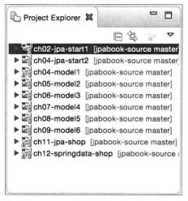
  
  -  경로를 선택하면 모든 프로젝트에 대한 /pom.xml이 나타난다.
  -  Finish 버튼을 선택해서 모든 예제 프로젝트을 불러온다.

  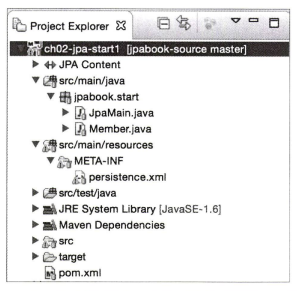

  - 예제 프로젝트를 처음 불러오면 메이븐 저장소에 라이브러리를 내려받기 때문에 1~10분 정도 기다려야 한다.


  #### 메이븐 오류 해결
  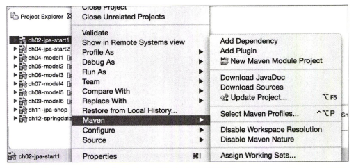
  
  - 메이븐 관련 오류가 발생하면 Maven > Update Project.. 선택한다.
  - 메이블 프로젝트의 설정 정보를 다시 업데이트할 수 있는 화면이 나온다.

  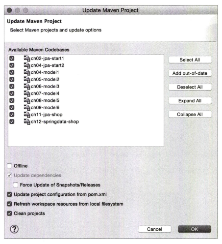
  
  - 문제가 발생한 프로젝트 선택한 다음 Ok버튼을 누르면 메이븐 프로젝트를 초기화하고 다시 환경을 구성한다.
  - 문제가 해결되지 않으면 이 과정을 2~3번 정도 반복한다.
  - 만약 그래도 문제가 해결되지 않으면 Force Update of Snapshots/Release를 추가로 체크하고 Ok버튼을 누른다.

  
## 2.2 H2 데이터 베이스 설치

  ### 서론
  - MySQL이나 오라클 데이터베이스를 사용해도 되지만 설치하는 부담이 크다.
  - 설치가 필요없고 용량도 가벼눙 H2 데이터베이스를 사용한다.
  - H2 데이터베이스는 자바가 설치되어 있어야 동작한다.

    #### H2 데이터베이스 설치 방법
    - http://www.h2database.com에 들어가서 All Platforms 또는 Platform-Independent Zip을 내려받아서 압축을 푼다.
    - 압축을 푼 곳에서 bin/h2.sh를 실행하면 H2 데이터베이스를 서버 모드로 실행한다.
    - H2 데이터베이스는 JVM 메모리 안에서 실행되는 임베디드 모드와 실제 데이터베이스처럼 별도의 서버를 띄워서 동작하는 서버모드가 있다.
      
    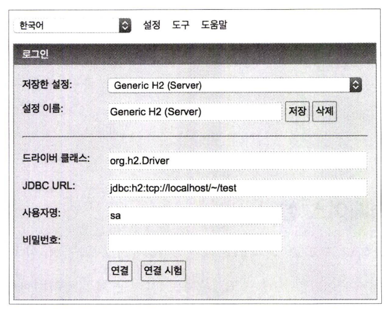
    
    - H2 데이터베이스를 서버 모드로 실행한 후에 웹 브라우저에서 http ://localhost:8082를 입력하면 H2 데이터베이스에 접속할 수 있는 화면이 뜬다.

    ■ 드라이버 클래스: org.h2.Driver
    ■ JDBC URL: jdbc：h2：tcp：//localhost/~/test
    ■ 사용자명 : sa
    ■  비밀번호: 입력하지 않는다

    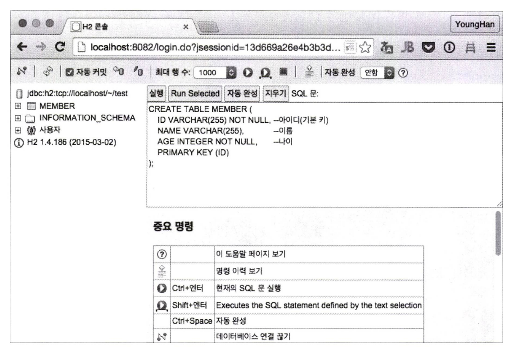

    - test라는 이름의 데이터베이스에 서버 모드로 접근할 수 있다.

    #### 예제 테이블 생성
    ```sql
    CREATE TABLE MEMBER (
      ID VARCHAR(255) NOT NULL, -- 아이디 (기본키) 
      NAME VARCHAR(255) , -- 이름
      AGE INTEGER NOT NULL, -- 나이
      PRIMARY KEY (ID)
    )
    ```
    
## 2.3 라이브러리와 프로젝트 구조
  ### 서론
  - 필요한 모든 라이브러리를 직접 내려받아서 관리하기는 어렵다.
  - 메이븐은 중앙저장소에서 의존성을 다운로드하고 빌드 결과물을 배포하는 등의 작업을 자동화하여 개발자들의 프로젝트의 복잡성을 간소화할 수 있게 한다.(+)
  - 이 프로젝트에서도 메이븐이라는 도구를 사용한다.
  - 이클립스 LUNA버전에는 메이븐이 내장되어있다.
  - JPA 구현체로 하이버네이트를 사용하기 위한 핵심 드라이버가 있다.
    - hibernate-core : 하이버네이트 라이브러리
    - hibernate-entitymanager : 하이버네이트가 JPA 구현체로 동작하도록 JPA 표준을 구현한 라이브러리
    - hibernate-jpa-2.1-api : JPA 2.1 표준 API를 모아둔 라이브러리
   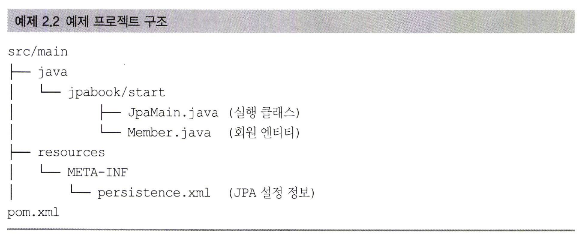
  - 프로젝트 구조는 위와 같다. 
  
  ### 2.3.1 메이븐과 사용 라이브러리 관리
  - 메이븐은 간단히 이야기하면 라이브러리를 관리하는 도구다.
  - pom.xml에 사용할 라이브러리를 적어두면 라이브러리를 자동으로 내려받아서 관리해준다.
  - 최근 자바 애플리케이션은 메이븐 같은 도구를 사용해서 라이브러리를 관리하고 빌드한다.
  - 자바 애플리케이션을 개발하려면 jar 파일로 된 여러 라이브러리가 필요한데 과거에는 이런 라이브러리를 직접 내려받아 사용했다.
  - 메이븐은 사용할 라이브러리 이름과 버전만 명시하면 라이브러리를 자동으로 내려받고 관리해준다.(라이브러리 관리기능)
  - 메이븐은 애플리케이션을 빌드하는 표준화된 방법을 제공한다.(빌드 기능)

  ```xml
  <?xml version="1.0" encoding=nUTF-8M?>
  <project xmlns=?,http: //maven. apache. org/POM/4.0.0” 
  xmlns:xsi=nhttp://www.w3.org/2001/XMLSchema-instanceM
  xsi: schemaLocation=,fhttp: / /maven. apache. org/POM/4.0.0 http: / /maven. 
  apache.org/xsd/maven-4.0.0.xsd">

    <modelVersion>4.0.0</m delVers on〉
    <groupId>jpabook</groupId>
    <artifactld>jpa-start</artifactld>
    <version〉l .0-NAPSHOT</version>

    <dependencies>
      <!-- JPA, 하이버네이트 一 〉
      〈dependency〉
      <groupId>org.hibernate</groupId> 
      <artifactld>hibernate-entitymanager</artifactld>
      <version>4.3.10.Final</version>
      </dependency〉
      <!— H2 데이터베이스 — 〉
      〈dependency〉
      <groupId>com.h2database</groupId>
      <artifactld>h2</artifactld>
      <version>l.4.187</version>
      </dependency〉
    </dependencies>
  </project>
  ```
- dependencies 에 사용할 라이브러리를 지정한다.
- groupId + artifactId + version만 적어주면 라이브러리를 메이븐 공식 저장소에서 내려받아 라이브러리에 추가해준다.
- JPA에 하이버네이트 구현체를 사용하려면 많은 라이브러리가 필요하지만 핵심 라이브러리는 2가지다.
  - JPA, 하이버네이트(hibernate-entitymanager)는 JPA 표준과 하이버네이트를 포함하는 라이브러리로 핵심 라이브러리 2가지를 함께 내려받는다.
  - JPA, 하이버네이트(hibernate-entitymanager)를 라이브러리에 지정하면 hibernate-core.jar 와 hibernate-jpa-2.1-api.jar가 내려받아진다.
- H2 데이터베이스에 접속해야 하므로 H2 라이브러리도 지정한다.

## 2.4 객체 매핑 시작
  ### 회원 테이블 생성
  ```sql
    CREATE TABLE MEMBER (
      ID VARCHAR(255) NOT NULL, -- 아이디 (기본키) 
      NAME VARCHAR(255) , -- 이름
      AGE INTEGER NOT NULL, -- 나이
      PRIMARY KEY (ID)
    )
  ```
  - 회원 정보를 저장할 수 있는 MEMBER 테이블을 H2 데이터베이스에 생성한다.
  
  ### 회원 클래스 생성
  ```java
  package jpabook.start;

  public class Member {
  
    private String id; // 아 이 디
    private String username; //이름
    private Integer age; //나이

    //Getter, Setter
    public String getld() {return id;}
    public void setld(String id) {this.id = id;}
    public String getUsername() {return username;} 
    public void setUsername(String username) {this.username = username;}
    public Integer getAge() {return age;}
    public void setAge(Integer age) {this.age = age;
  }
  ```
 - 애플리케이션에서 사용할 회원 클래스를 만든다.

  ### 매핑 작업

  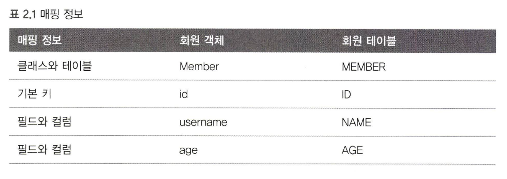
  
  - 매핑 정보를 보고 실제 매핑을 하자.

  ### 매핑 정보가 포함된 회원 클래스
  
  ```java
  package jpabook.start;
  import javax.persistence.*;

  @Entity
  @Table(name="MEMBER") 
  public class Member {

    @Id
    @Column(name = "ID")
    private String id;
  
    @Column (name = "NAME")
    private String username;
  
    //매핑 정보가 없는 필드 
    private Integer age;
    ...
  }
  ```

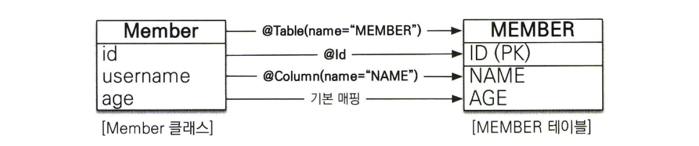

- @Entity,@Table,@Column,@Id가 매핑 정보다.
- JPA는 매핑 어노테이션을 분석해서 어떤 객체가 어떤 테이블과 관계가 있는지 알아낸다.

  #### @Entity
  - 클래스를 테이블과 매핑한다고 JPA에게 알려준다.
  - Member 클래스를 MEMBER 테이블과 매핑한다는걸 JPA에게 알려주는거다.
  - @Entity가 사용된 클래스를 엔티티 클래스라고 한다.

  #### @Table    
  - 엔티티 클래스에 매핑할 테이블 정보를 알려준다.
  - name 속성을 사용해서 Member 엔티티를 MEMBER테이블에 매핑한다.
  - @Table 어노테이션을 생략하면 클래스 이름을 테이블 이름으로 매핑한다.

  #### @Id
  - 엔티티 클래스의 필드를 테이블의 기본키에 매핑해준다.
  - 엔티티의 id 필드를 테이블 ID 기본키 컬럼에 매핑한다.
  - @id가 사용된 필드를 식별자 필드라고 한다.

  #### @Column
  - 필드를 컬럼에 매핑한다.
  - name 속성을 사용해서 Member 엔티티의 username 필드를 테이블 NAME 컬럼에 매핑했다.
  - 필드와 컬럼명이 달라도 하나의 의미로 사용할 수 있게 해준다.

  #### @매핑 정보가 없는 필드
  - 매핑 어노테이션을 생략하면 필드명을 사용해서 컬럼명으로 매핑한다. (@Column)
  - 필드명이 age이므로 AGE 컬럼으로 매핑하는거다.
  - 대소문자를 구분하는 데이터베이스를 사용하면 @Column(name = "AGE")처럼 명시적으로 매핑한다.
- 매핑 정보 덕분에 JPA는 어떤 엔티티를 어떤 테이블에 저장해야 하는지 알 수 있다.
- JPA를 실행하기 위한 기본설정파일인 persistence.xml을 알아보자.
> 참고 : JPA 어노테이션의 패키지는 javax.persistence

## 2.5 persistence.xml 설정
  ### 서론
  - JPA는 persistence.xml을 사용해서 필요한 설정 정보를 관리한다.
  - META-INF/persistence.xml 클래스 패스 경로에 있으면 별도의 설정없이 JPA가 인식할 수 있다.
  (^^ ㅇㄹㅅㅈ)
  ```xml
  <?xml version="l. Ofl encoding="UTF-8" ?>
  <persistence xmlns="http: //xmlns. j c p .org/xml/ns/persistence" version=n2 .1"〉
  <persistence-xinit name= " jpabook n >
  <properties>
  < ! - - 필수 속성 一 >
  〈property name=n javax .persistence. jdbc. driver'1
  value=norg.h2. Driver’’/ 〉
  〈property name=njavax.persistence. jdbc.userM value=nsalf/>
  〈property name="j avax. persistence. j dbc .password" value=!,,l/>
  <property name=" j avax. persistence. j dbc. urlf,
  value="jdbc:h2:tcp://localhost/〜/test" /〉
  〈property name=Mhibernate.dialect"
  value=,lorg.hibernate.dialect ■ H2Dialectn / >
  <!-- 옵션 --〉
  〈property name="hibernate. show_sql" value=f,trueM />
  〈property name="hibernate.format_sqlM value=MtrueM />
  〈property name="hibernate.use_sql_commentsn value=ntruen />
  〈property name="hibernate. id.new_generator_mappingsIT value=f,truen />
  </properties>
  </persistence-unit>
  </persistence>
  ```

  ```xml
  <persistence xmlns = "http://xmlns.jcp.org/xml/ns/persistence" version ="2.1">
  ```
  - 설정파일은 <persistence>로 시작한다.
  - XML 네임스페이스와 사용할 버전을 지정한다.
  - JPA 2.1을 사용하려면 xmlns와 version을 명시하면된다.

  ```xml
  <persistence-unit name = "jpabook">
  ```
  - JPA 설정은 영속성 유닛이라는 것부터 시작한다.
  - 일반적으로 연결할 데이터베이스당 하나의 영속성 유닛을 등록한다.
  - 영속성 유닛에는 고유한 이름을 부여해야 한다. (이 프로젝트에서는 jpabook이라는 이름을 사용)

  ```xml
  <properties>
    <property name = "javax.persistence.jdbc.driver"
    value = "org.h2.Driver"
    ...
  ```
  - JPA 표준 속성 설정
    - javax.persistenc.jdbc.driver : JDBC 드라이버
    - javax.persistenc.jdbc.user : 데이터베이스 접속 아이디
    - javax.persistenc.jdbc.password : 데이터베이스 접속 비밀번호
    - javax.persistenc.jdbc.url : 데이터베이스 접속 URL
  
  - 하이버네이트 속성 설정
    - hibernate.dialect : 데이터베이스 방언 설정

  - javax.persistence로 시작하는 속성은 JPA 표준 속성으로 특정 구현체에 종속되지 않는다.
  - 반면 hibernate로 시작하는 속성은 하이버네이트 전용 속성이므로 하이버네이트에서만 사용할 수 있다.
    
  ### 2.5.1 데이터베이스 방언
  
  - JPA는 특정 데이터베이스에 종속되지 않은 기술이다. 
  - 다른 데이터베이스로 손쉽게 교체가 가능하다.(종속X)
  - 각 데이터베이스가 제공하는 SQL 문법과 함수가 조금씩 다르다.
    - 데이터 타입 : VARCHAR(MySQL) , VARCHAR2(ORACLE)
    - 다른 함수명 : SUBSTRING()-표준, SUBSTR()-ORACLE
    - 페이징 처리 : LIMIT(MySQL) , ROWNUM(ORACLE)
  - SQL 표준을 지키지 않거나 특정 데이터베이스만의 고유한 기능을 JPA서는 방언이라고 한다.
  - 특정 데이터베이스에 종속되는 기능을 사용하면 나중에 데이터베이스를 교체하기 어렵다.
  - JPA 구현체들은 이런 문제를 해결하려고 다양한 데이터베이스 방언 클래스를 제공한다.

  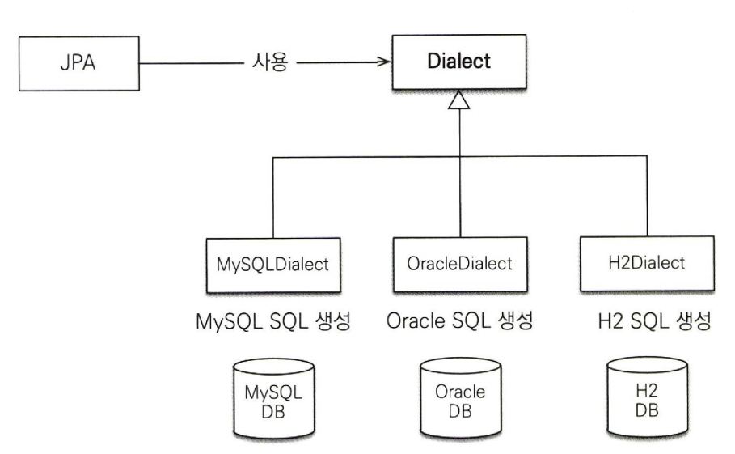

  - 개발자는 JPA가 제공하는 표준 문법에 맞추어 JPA를 사용하면된다.
  - 특정 데이터베이스에 의존적인 SQL은 데이터베이스 방언이 처리해준다.
  - 데이터베이스가 변경되어도 애플리케이션 코드를 변경할 필요없이 데이터베이스 방언만 교체하면된다.
  - 하이버네이트는 다양한 데이터베이스 방언을 제공한다. (아래 대표 3가지)
    - H2 : org.hibernate.dialect.H2Dialect
    - 오라클 10g : org.hibernate.dialect.Oracle10gDialect
    - MySQL : org.hibernate.dialect.MySQL5InnoDBDialect
  - 하이버네이트는 현재 45개의 데이터베이스 방언을 지원한다.


    > 하이버네이트 전용 속성
    > hibernate.show_sql   : 하이버네이트가 실행한 SQL을 출력한다.
    > hibernate.format_sql : 하이버네이트가 실행한 SQL을 출력할 때 보기 쉽게 정렬한다.
    > hibernate.use_sql_comments : 쿼리를 출력할 때 주석도 함께 출력한다.
    > hibernate.id.new_generator_mappings : JPA 표준에 맞춘 새로운 키 생성 전략을 사용한다.

    > JPA 구현체들은 보통 엔티티 클래스를 자동으로 인식하지만 환경에 따라 인식 못할 때도 있다.
    > 그때는 persistence.xml에  <class>를 사용해서 JPA에서 사용할 엔티티 클래스를 지정하면된다.
    > 스프링 프레임워크나 J2EE 환경에서는 엔티티를 탐색하는 기능을 제공하므로 이런 문제는 발생하지 않는다.
    
## 2.6 애플리케이션 개발
  ### 서론
  - 객체 매핑을 완료하고 psersistence.xml로 JPA 설정도 완료했다.
  ```java
  package jpabook.start;
  import javax.persistence.* ;
  import java.util.List;

  public class JpaMain {
    public static void main(String[] args) {
      / / [엔티티 매니저 팩토리] - 생성 
      EntityManagerFactory emf = Persistence.createEntityManagerFactory(njpabook");
      / / [엔티티 매니제 - 생성
      EntityManager em = emf.createEntityManager();
      // [트랜잭션] - 획득
      EntityTransaction tx = em.getTransaction();

      try {
        tx.begin () ; // [트랜잭션] - 시작
        logic (em); //비즈니스 로직 실행
        tx.commit (); // [트랜잭션] - 커밋
      } catch (Exception e) {
        tx. rollback () ; // [트랜잭션] - 롤백
      } finally {
        em. close () ; / / [엔티티 매니제 - 종료
      }
      emf.close (); / / [엔티티 매니저 팩토리] - 종료
    }

    // 비즈니스로직
    private static void logic(EntityManager em) {...}
  }
  ```
  - 코드는 1) 엔티티 매니저 설정 2) 트랜잭션 관리 3) 비즈니스 로직 크게 3부분으로 나뉘어 있다.
  
  ### 2.6.1 엔티티 매니저 설정
  
  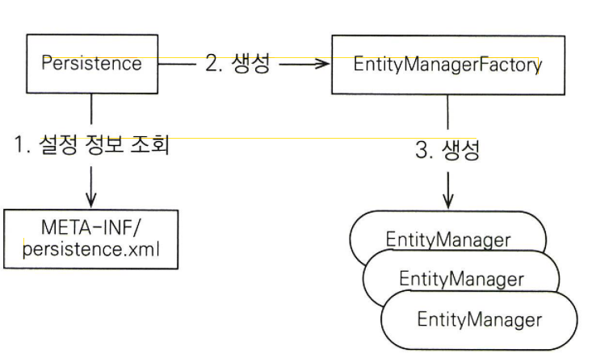

  #### 엔티티 매니저 팩토리 생성
   
  - persistance.xml에는 공장을 어떻게 만들어야하는지 설정되어있다.
  - persistance.xml의 설정 정보를 사용해서 엔티티 매니저 팩토리를 생성한다.
  - Persistance 클래스를 사용해서 엔티티 매니저 팩토리를 생성한다.
  - 엔티티 매니저 팩토리를 생성하게 되면 JPA를 사용하기 위한 준비가 된거다.

  ```java
    EntityManagerFactory emf = Persistence.createEntityManagerFactory("jpabook");
  ```
  - META-INF/persistence.xml에서 이름이 jpabook인 영속성 유닛을 찾아서 엔티티 매니저 팩토리를 생성한다.
  - persistence.xml의 설정 정보를 읽어서 JPA를 동작시키기 위한 기반 객체를 만든다.
  - JPA구현체에 따라서 데이터베이스 커넥션 풀도 생성하므로 엔티티 매니저 팩토리를 생성하는 비용은 아주 크다.
  - 엔티티 매니저 팩토리는 애플리케이션 전체에서 딱 한번만 생성하고 공유해서 사용해야한다.

  #### 엔티티 매니저 생성

  ```java
    EntityManger em = emf.createEntityManager();
  ```
  - 엔티티 매니저 팩토리에서 엔티티 매니저를 생성한다.
  - JPA의 기능은 대부분 엔티티 매니저가 제공한다.
  - 엔티티 매니저를 사용해서 엔티티를 데이터베이스에 등록/수정/삭제/조회할 수 있다.
  - 엔티티 매니저는 내부에 데이터소스(데이터베이스 커넥션)를 유지하면서 데이터베이스와 통신한다.
  - 엔티티 매니저는 데이터베이스 커넥션과 밀접한 관계가 있으므로 스레드 간에 공유하거나 재사용하면 안된다.

  #### 종료
  
  ```java
    em.close(); //엔티티 매니저 종료
  ```

  - 마지막으로 사용이 끝난 엔티티 매니저는 다음처럼 반드시 종료해야한다.
    
  ### 2.6.2 트랜잭션 관리
  
  ```java
  EntityTransaction tx = em.getTransaction () ; // 트랜잭션 API 
  try {
    tx.begin () ; //트 랜 잭 션 시작 
    logic (em) ; //비 즈 니 스 로직 실행
    tx.commit ; //트 랜 잭 션 커밋
  } catch (Exception e) {
    tx.rollback();   //예외 발생 시 트랜잭션 롤백
  }
  ```
  - JPA를 사용하면 항상 트랜잭션 안에서 데이터를 변경해야한다.
  - 트랜잭션 없이 데이터를 변경하면 예외가 발생한다.
  - 트랜잭션을 시작하려면 엔티티 매니저(em)에서 트랜잭션 API를 받아와야 한다.
  - 트랜잭션 API를 사용해서 비즈니스 로직이 정상 동작하면 트랜잭션을 커밋하고 예외가 발생하면 트랜잭션을 롤백한다.

  ### 2.6.3 비즈니스 로직
  ```java
  public static void logic(EntityManager em) {

    String id = "id1";
    Member member = new Member(); 
    member.setld(id); 
    member. setUsername ( "지한" ) ; 
    member.setAge(2);

    //등록
    em.persist (member);

    //수정
    member.setAge(20);

    //한건조회
    Member findMember = em. find (Member. class, id);
    System, out .printIn (nfindMember=n + findMember. getUsername () 
    + ", age=" + findMember.getAge ()) ;

    //목록조회
    List<Member> members = em.createQuery("select m from Member m ", Member.class).getResultList();
    System.out.println("members.size=n + members.size());

    //삭제
    em. remove (member)
  }
  ```
  - 비즈니스 로직을 보면 등록,수정,삭제,조회 작업이 엔티티 매니저(em)을 통해서 수행된다.
  - 엔티티 매니저는 객체를 저장하는 가상의 데이터베이스 처럼보인다. (persist() = INSERT)
  
    #### 등록
  
    ```java
    String id = "id1";
    Member member = new Member(); 
    member.setld(id); 
    member. setUsername ( "지한" ) ; 
    member.setAge(2);
  
    //등록
    em.persist (member);
    ```
    - 엔티티 저장하려면 엔티티 매니저의 persist() 메소드에 저장할 엔티티를 넘겨주면된다.
    - JPA는 회원 엔티티의 매핑정보(어노테이션)를 분석해서 INSERT SQL문을 만들어 데이터베이스에 전달한다.
    
    #### 수정
    ```java
    //수정
    member.setAge(20);
    ```
    - JPA는 어떤 엔티티가 변경되었는지 추적하는 기능을 갖추고 있다.
    - 엔티티의 값만 변경하면 다음과 같은 UPDATE SQL을 생성해서 데이터베이스에 값을 변경한다.
    - 변경추적기능이 있어 우리는 em.update()라는 메소드 같은걸 사용할 일이 없다.
  
    #### 삭제
    
    ```java
    em.remove(member);
    ```
    - 엔티티 매니저의 remove() 메소드에 삭제하려는 엔티티티를 넘겨준다.
    - DELETE SQL을 생성해서 실행한다.
  
    #### 한 건 조회
    ```java
    //한 건 조회
    Member findMember = em.find(Member.class,id);
    ```
    - find() 메소드는 조회할 엔티티 타입과 @Id로 데이터베이스 테이블의 기본키와 매핑한 식별자 값으로 엔티티 하나를 조회한다.
    - SELECT SQL을 생성해서 데이터베이스에 결과를 조회한다.
    - 결과 값으로 엔티티를 생성해서 반환한다.
  ### 2.6.3 JPQL
  ```java
  // 목록 조회
  TypedQuery query = em.createQuery("select m from Member m" , Member.class);
  List<Member> members = query.getResultList();
  ```
  - 등록,수정,삭제,한건 조회는 SQL을 전혀 사용하지 않았다.
  - JPA는 엔티티 객체를 중심으로 개발하므로 검색을 할 때도 테이블이 아닌 엔티티 객체를 대상으로 검색해야한다.
  - 애플리케이션이 필요한 데이터만 데이터베이스에 불러오려면 결국 검색 조건이 포함된 SQL을 사용해야한다.
  - JPA는 JPQL이라는 쿼리 언어로 이런문제들을 해결한다.
  - JPA는 SQL을 추상화한 JPQL이라는 객체지향 쿼리 언어를 제공한다.
  - JPQL과 SQL
    - 공통점 : SELECT,FROM,GROUP BY, HAVING,JOIN 등 문법이 거의 유사하다.
    - 차이점 : JPQL은 엔티티 객체를 대상으로 쿼리를 생성한다.(클래스와 필드를 대상으로 쿼리)
               SQL은 데이터베이스 테이블을 대상으로 쿼리한다.
  - select m 에서 m은 회원 엔티티 객체를 말하는 것이지 MEMBER 테이블이 아니다.
  - 문법만 SQL과 비슷해서 그렇지 JPQL은 데이터베이스 테이블을 전혀 알지 못한다.
  - JPQL을 사용하려면 먼저 em.createQuery(JPQL,반환타입) 메소드를 실행해서 쿼리 객체를 생성한 후 쿼리 객체의 getResultList()메소드를 호출한다.
  - JPA는 JPQL을 분석해서 적절한 SQL을 만들어 데이터베이스에 데이터를 조회한다.

> JPQL은 대소문자를 명확하게 구분하지만 SQL은 관례상 대소문자를 구분하지 않고 사용하는 경우가 많다.

## 2.7 정리
- JPA가 반복적인 JDBC API와 결과 값 매핑을 처리해준 덕분에 코드량이 상당히 많이 줄어든 것은 물론이고 심지어 SQL도 작성할 필요가 없었다.
- 코드량을 줄이고 SQL을 자동 생성하는 것은 JPA가 제공하는 전체 기능 중 일부에 불과하니 계속 알아가자.

