# 3장 영속성관리

## 서론
  - JPA가 제공하는 기능은 크게 엔티티와 테이블을 매핑하는 [실제부분]과 매핑한 앤티티를 [실제사용하는 부분]으로 나눌 수 있다.
  - 엔티티 매니저는 엔티티와 관련된 모든 일을 처리한다.
  - 엔티티를 저장하는 가상의 데이터베이스로 생각하면된다.

## 3.1 엔티티 매니저 팩토리와 엔티티 매니저
```java
  //공장 만들기,비용이 아주 많이 든다.
  EntityManagerFactory emf = Persistence.createEntityManagerFactory(njpabook”);
```
- META-INF /persistence.xml에 있는 정보를 바탕으로 EntityManagerFactory를 생성한다.
- 데이터베이스를 하나만 사용하는 애플리케이션은 일반적으로 EntityManager Factory를 하나만 생성한다.
- 엔티티메니저팩토리를 만들 때 비용이 많이 든다.

```java
  //공장에서 엔티티 매니저 생성, 비용이 거의 안 든 다 .
  EntityManager em = emf.createEnt tyManager ;
```
- 엔티티 매니저 팩토리는 생성시 비용이 많이 들기 때문에 한 개만 만들어서 애플리케이션 전체에서 공유하도록 설계되어 있다.(공장은 공유하자~)
- 엔티티 매니저 팩토리는 여러 스레드가 동시에 접근해도 안전하므로 서로 다른 스레드 간에 공유해도 되지만 엔티티 매니저는 여러 스레드가 동시에 접근하면 동시성 문제가 발생하므로 스레드 간에 절대 공유하면 안된다.
  
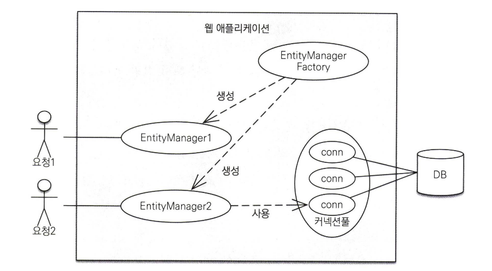

- 엔티티 매니저는 데이터베이스 연결이 꼭 필요한 시점까지 커넥션을 얻지 않는다.
- 트랜잭션을 시작할 때 커넥션을 획득한다.
- 하이버네이트를 포함한 JPA 구현체들은 EntityManagerFactory를 생성할 때 커넥션풀도 만든다.

## 3.2 영속성 컨텍스트란?
- 영속성 컨텍스트는 JPA가 작업하는 공간으로 엔티티를 영구 저장하는 환경이다.
- 엔티티 매니저로 엔티티를 저장하거나 조회하면 엔티티 메니저는 영속성 컨텍스트에 엔티티를 보관하고 관리한다.
- 엔티티 매니저를 통해서 영속성 컨텍스트에 접근할 수 있고 영속성 컨텍스트를 관리할 수 있다.

## 3.3 엔티티의 생명주기
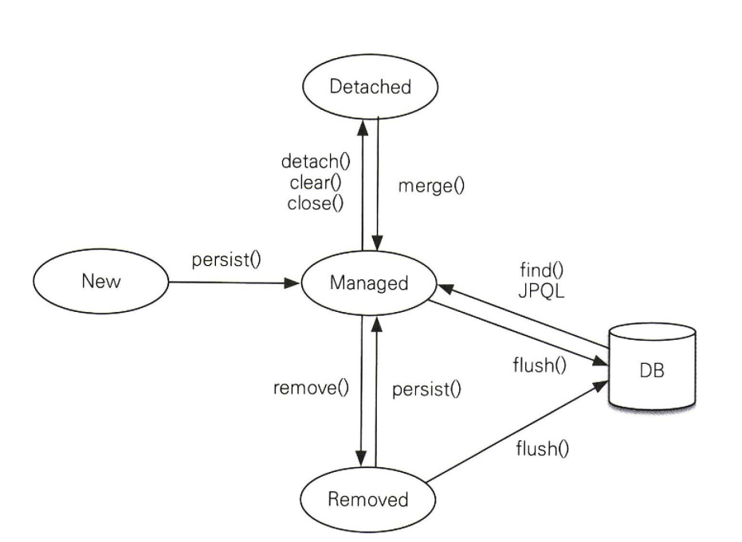

- 엔티에는 4가지 상태가 존재한다.
  - 비영속 : 영속성 컨텍스트와 전혀 관계가 없는 상태
  - 영속 : 영속성 컨텍스트에 저장된 상태
  - 준영속 : 영속성 컨텍스트에 저장되었다가 분리된 상태
  - 삭제  : 삭제된 상태
    
### 비영속
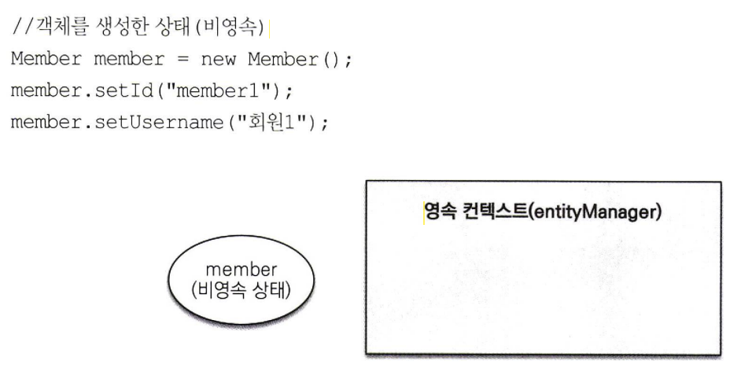
 - 엔티티 객체를 생성했으면 영속성 컨텍스트나 데이터베이스에 전혀 관련이 없는 순수한 객체 상태다.
 - 컨텍스트와 연관이 전혀 없는 상태를 비영속 상태라고 한다.
### 영속
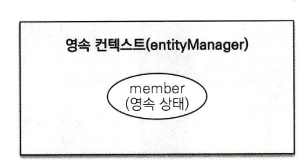
- 영속성 컨텍스트가 관리하는 엔티티를 영속 상태라고 한다.
- persist,find,JPQL을 사용해서 조회한 엔티티도 영속성 컨텍스트가 관리하는 영속 상태이다. 
### 준영속
- 영속성 컨텍스트가 관리하던 영속 상태의 엔티티를 영속성 컨텍스트가 관리하지 않으면 준영속 상태가 된다.
- 특정 엔티티를 준영속 상태로 만들려면 em.detach()를 호출하면 된다.
- em.close()를 호출해서 영속성 컨텍스트를 닫으면 준영속 상태가된다.
- em.clear()를 호출해서 영속성 컨텍스트를 초기화하면 준영속 상태가 된다.
### 삭제
```java
//객체를 삭제한 상태(삭제)
em.remove(member);
```
- 엔티티를 영속성 컨텍스트와 데이터베이스에서 삭제한다.

### 3.4 영속성 컨텍스트의 특징
 ## 서론
 - 영속성 컨텍스트의 특징
  - 영속성 컨텍스트와 식별자 값
     - 영속성 컨텍스트는 엔티티를 식별자 값으로 구분한다.
     - 영속 상태 식별자 값이 반드시 있어야 한다.
     - 식별자 값이 없으면 예외가 발생한다.
       
  - 영속성 컨텍스트와 데이터베이스 저장
     - JPA는 보통 트랜잭션을 커밋하는 순간 영속성 컨텍스트에 새로 저장된 엔티티를 데이터베이스에 반영하는데 이것을 플러시라 한다.

  - 영속성 컨텍스트가 엔티티를 관리하면 좋은 점
    - 1차 캐시
    - 동일성 보장
    - 트랜잭션을 지원하는 쓰기 지연
    - 변경 감지
    - 지연 로딩
## 3.4.1 엔티티 조회 
  - 영속성 컨텍스트는 내부에 캐시를 가지고 있는데 이것을 1차 캐시라고 한다.
  - 영속 상태의 엔티티는 모두 이곳에 저장된다.
  - 영속성 컨텍스트 내부에 Map이 하나 있는데 키는 @Id로 매핑한 [식별자]고 값은 [인스턴스]다.
  
  ```java
  // 엔티티를 생성한 상태 (비영속)
  Member member = new Member();
  member.setld("member1");
  member. setUsername ("회원1") ;
  / / 엔티티를 영속
  em.persist(member);
  ```
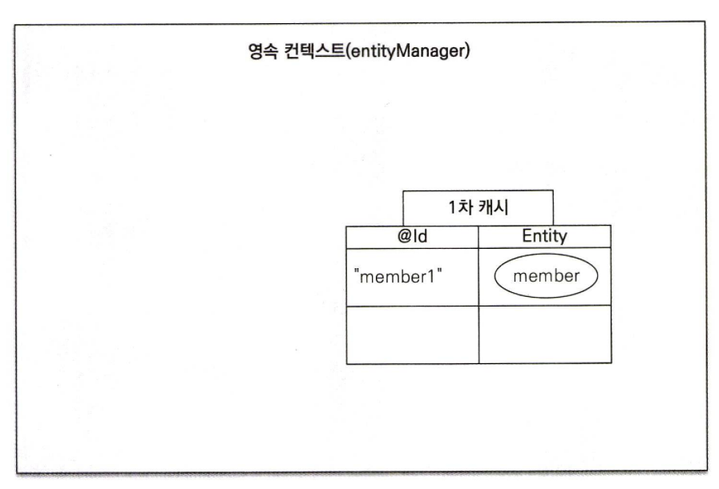

- 1차 캐시의 키는 식별자 값이다.
- 식별자 값은 데이터베이스 기본 키와 매핑되어있다.
- 영속성 컨텍스트에 데이터를 저장하고 조회하는 모든 기준은 데이터베이스의 기본키 값이다.

```java
Member member = em.find (Member. class, "memberl") ; 
```
- em.find()를 호출하면 먼저 1차 캐시에서 엔티티를 찾고 만약 찾는 엔티티가 1차 캐시에 없으면 데이터베이스에서 조회한다.

### 1차 캐시에서 조회
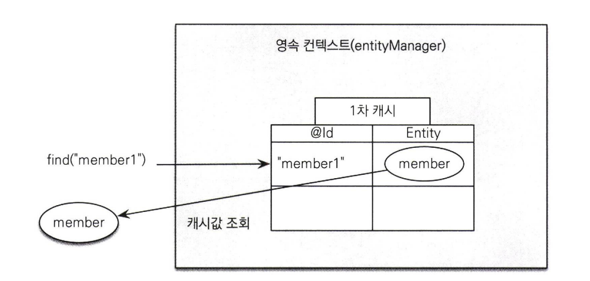

- 1차 캐시에서 식별자 값으로 엔티티를 찾는다.
- 찾는 엔티티가 있으면 데이터베이스를 조회하지 않고 메모리에 있는 1차 캐시에서 엔티티를 조회한다.
- persist()로 저장시켰을 때도 1차 캐시에 저장한 것으로 이후 find()를 해서 값을 가져올 때도 1차 캐시에서 값을 가져올 수 있다.

### 데이터베이스에서 조회
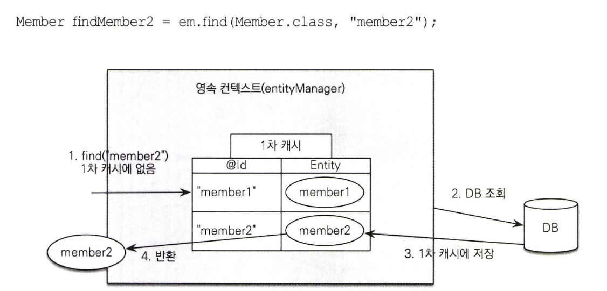
- 엔티티가 1차 캐시에 없으면 엔티티 매니저는 데이터베이스를 조회해서 엔티티를 생성한다.
- 1차 캐시에 저장한 후 영속 상태의 엔티티를 반환한다.
- 메모리에 있는 1차 캐시에서 바로 불러오면 성능상의 이점을 누릴 수 있다.

### 영속 엔티티의 동일성 보장
```java
Member a = em.find(Member.class, "memberl”) ;
Member b = em.find (Member. class, "member1") ;
System.out .println (a == b) ; / / 동일성 비교
```
 - 영속성 컨텍스트는 1차 캐시에 있는 같은 엔티티 인스턴스를 반환한다.
 - 둘은 같은 인스턴스고 결과는 당연히 참이다.
 - 영속성 컨텍스트는 성능상 이점과 엔티티의 동일성을 보장한다.

> 동일성과 동등성
> 동일성은 실제 인스턴스가 같다. == 비교값이 같다.
> 동등성은 실제 인스턴스는 다를 수 있지만 인스턴스가 가지고 있는 값이 같다. equals() 비교값이 같다.

## 3.4.2 엔티티 등록
```java
EntityManager em = emf.createEntityManager();
EntityTransaction transaction = em.getTransaction();
// 엔티티 매니저는 데이터 변경 시 트랜잭션을 시작해야 한다.
transaction.begin() ; // [트랜잭션] 시작

em.persist(memberA);
em.persist(memberB);

//여기까지 INSERT SQL을 데이터베이스에 보내지 않는다.
//커밋하는 순간 데이터베이스에 INSERT SQL을 보낸다.
transaction. commit () ; // [트랜잭션] 커밋
```
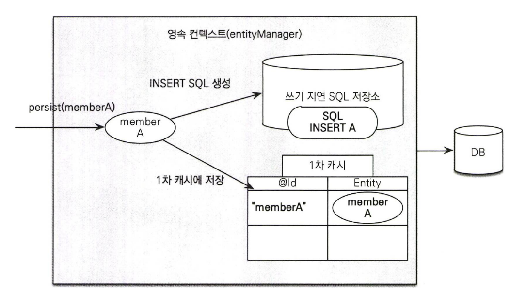

- 엔티티 매니저는 트랜잭션을 커밋하기 직전까지 데이터베이스에 엔티티를 저장하지 않고 내부쿼리 저장소에 INSERT을 차곡차곡 모아둔다.
- 트랜잭션을 커밋할 때 모아둔 쿼리를 데이터베이스에 보낸다.
- 이런 기능을 쓰기 지연이라고 한다.
- 그림을 보면 영속성 컨텍스트는 1차 캐시에 회원 엔티티를 저장하면서 동시에 회원 엔티티 정보로 등록 쿼리를 만든다.
- 만들어진 등록 쿼리를 쓰기 지연 SQL 저장소에 보관한다.
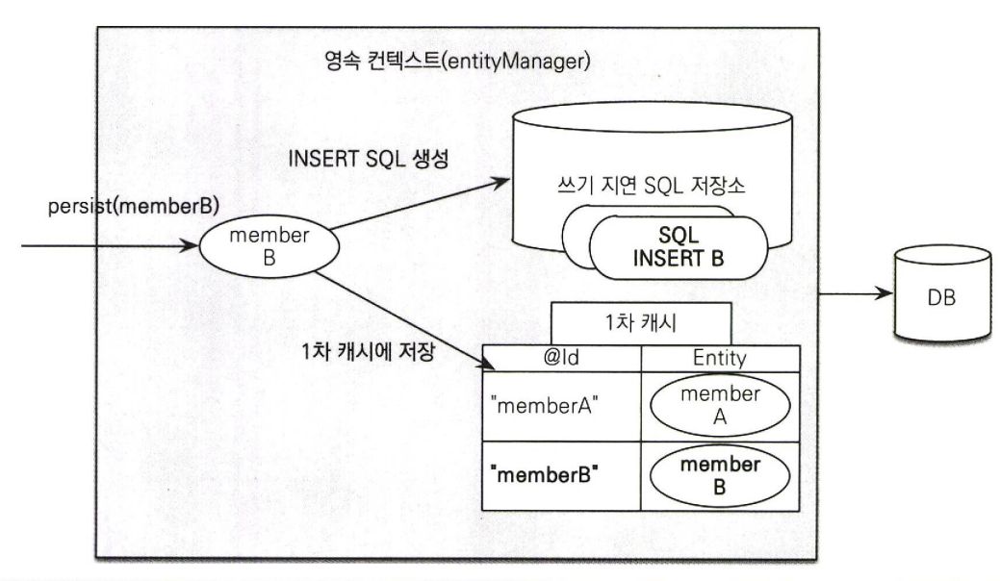
- commit을 하기 전까지 1차 캐시와 쓰기지연 SQL 저장소에 쿼리가 쌓인다.
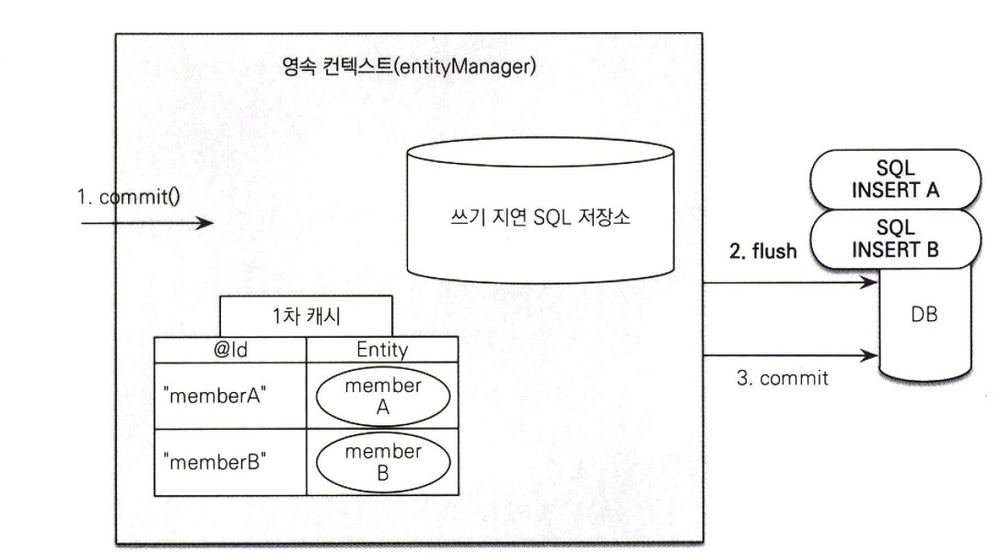
- 트랜잭션을 커밋하면 엔티티 매니저는 플러시해서 쓰기 지연 SQL 저장소에 모인 쿼리를 데이터베이스에 보낸다.
- 영속성 컨텍스트의 변경 내용이 데이터베이스에 동기화한 후에 실제 데이터베이스 트랜잭션을 커밋한다.
> 플러시는 영속성 컨텍스트의 변경 내용을 데이터베이스에 동기화하는 작업이다.

### 트랜잭션을 지원하는 쓰기 지연이 가능한 이유
- 메모리에 모아두고 트랜잭션을 커밋할 때 모아둔 등록 쿼리를 데이터베이스에 보낸 후에 커밋한다.
- 어떻게든 커밋 직전에만 데이터베이스에 SQL 을 전달하면 된다.
- 트랜잭션을 지원하는 쓰기 지연이 가능한 이유다.
- 이 기능을 잘 활용하면 모아둔 등록 쿼리를 데이터베이스에 한번에 전달해서 성능을 최적화ㅏ할 수 있다.

## 3.4.3 엔티티 수정
- 요구사항이 많아지면 수정쿼리가 추가되는 것은 물론이고 비즈니스 로직을 분석하기 위해 SQL을 계속 확인해야한다.
- 직접적이든 간접적이든 비즈니스 로직이 SQL에 의존하게 된다.
- SQL 수정 쿼리의 문제점을 JPA가 해결해준다.
### 변경감지
```java
EntityManager em = emf.createEntityManager(); 
EntityTransaction transaction = em.getTransaction(); 
transaction.begin (); // [트랜잭션] 시작

//영속엔티티 조회
Member member A = em.find (Member. class, MmemberA,T);

//영속 엔티티 데이터 수정
meniberA. setUsername ("hi") ;
meniberA.setAige(10);

//em. update (member) 이런코드가 있어야하지 않을까?
transaction. commit (); " [트랜잭션] 커밋
```
- JPA로 엔티티를 수정할 때는 단순히 엔티티를 조회해서 데이터만 변경하면 된다.
- 엔티티의 변경사항을 데이터베이스에 자동으로 반영하는 기능을 변경 감지한다.
  
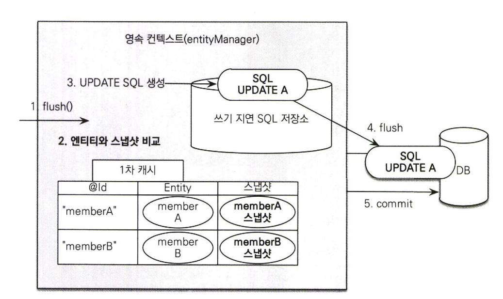
- JPA는 엔티티를 영속성 컨텍스트에 보관할 때 최초 상태를 복사해서 저장해두는데 이것을 스냅샷이라 한다.
- 플러시 시점에 스냅샷과 엔티티를 비교해서 변경된 엔티티를 찾는다.
- 과정
  1) 트랜잭션을 커밋하면 엔티티 매니저 내부에서 먼저 플러시가 호출된다.
  2) 엔티티와 스냅샷을 비교해서 변경된 엔티티를 찾는다.
  3) 변경된 엔티티가 있으면 수정 쿼리를 생성해서 쓰기 지연 SQL 저장소에 보낸다.
  4) 쓰기 지연 저장소의 SQL을 데이터베이스에 보낸다.
  5) 데이터베이스 트랜잭션을 커밋한다.
- 변경 감지는 영속성 컨텍스트가 관리하는 영속 상태의 엔티티에만 적용된다.
- 비영속,준영속처럼 영속성 컨텍스트의 관리를 받지 못하는 엔티티는 값을 변경해도 데이터베이스에 반영되지 않는다.

### 수정 쿼리 전략
- JPA의 기본전략은 엔티티의 모든 필드를 업데이트한다.
- 모든 필드를 사용하면 데이터베이스에 보내는 데이터 전송량이 증가하는 단점이 있지만 장점으로 인해 모든 필드를 업데이트 해야한다.
- 장점
  - 애플리케이션 로딩 시점에 수정 쿼리를 미리 생성해두고 재사용할 수 있다.
  - 이전에 한번 파싱된 쿼리를 재사용할 수 있다.
- 필드가 많아지거나 저장되는 내용이 너무 크면 수정된 데이터만 사용해서 도적으로 UPDATE SQL을 생성하는 전략을 선택하면된다.
- 단, 이때는 하이버네이트 확장 기능을 사용해야 한다.

```java
@Entity
@org. hibernate. annotations. DynamicUpdate
@Table(name = "Membern)
public class Member {...}
```
- @org. hibernate. annotations. DynamicUpdate 어노테이션을 사용하면 수정된 데이터만 사용해서 동적으로 UPDATE SQL을 생성한다.
- 데이터를 저장할 때 데이터가 존재하는(NULL이 아닌) 필드만으로 INSERT SQL을 동적으로 생성하는 @DynamicInssert도 있다.

> 상황에 따라서 다르지만 컬럼이 대략 30개 이상이 되면 기본 방법인 정적 수정 쿼리보다 @DynamicUpdate를 사용한 동적 수정 쿼리가 빠르다고 한다.
> 추천하는 방법은 기본 전략을 사용하고 최적화가 필요할 정도로 느리면 그때 전략을 수정하면 된다.
> 한 테이블에 컬럼이 30개 이상 된다는 것은 테이블 설계상 책임이 적절히 분리되지 않았을 가능성이 높다.

  ### 3.4.4 엔티티 삭제
  - 엔티티를 삭제하려면 먼저 삭제 대상을 조회해야 한다.
  ```java
    Member memberA = em.社nd(Member .class, "memberA") ; / / 삭제 대상 엔티티 조회 
    em. remove (memberA); / / 엔티 티 삭제
  ```
  - em.remove()에 삭제 대상 엔티티를 넘겨주면 엔티티를 삭제한다.
  - 엔티티를 즉시 삭제하는 것이 아니라 엔티티 등록과 비슷하게 삭제 쿼리를 쓰기 지연 SQL 저장소에 등록한다.
  - 트랜잭션이 을 커밋해서 플러시를 호출하면 실제 데이터베이스에 삭제쿼리가 전달 된다.
  - em.remove(memberA)를 호출하는 순간 memberA는 영속성 컨텍스트에서 제거된다.
  - 삭데죈 엔티티는 재사용하지 말고 자연스럽게 가비지 컬렉션의 대상이 되지 않도록 두는게 좋다.(재조회x)

## 3.5 플러시
  ### 서론
  - 플러시는 영속성 컨텍스트의 변경 내용을 데이터베이스에 반영한다.
  - 영속성 컨텍스트를 플러시하는 방법은 3가지다.
    1. em.flush()를 직접 호출한다.
       - 영속성 컨텍스트를 강제로 플러시한다.
       - 테스트나 다른 프레임워크와 JPA를 함께 사용할 때를 제외하고는 거의 사용하지 않는다.
    2. 트랜잭션 커밋 시 플러시가 자동 호출된다.
       - 데이터베이스에 변경 내용을 SQL로 전달하지 않고 트랜잭션만 커밋하면 어떤 데이터도 데이터베이스에 반영되지 않는다.
       - 트랜잭션을 커밋하기 전에 꼭 플러시를 호출해서 영속성 컨텍스트의 변경 내용을 데이터베이스에 반영해야한다.
       - JPA는 이런 문제를 해결하기 위해 트랜잭션을 커밋할 때 플러시를 자동으로 호출한다. 
    3. JPQL 쿼리 실행시 플러시가 자동 호출된다.
      - JPQL이나 같은 객체지향 쿼리를 호출해도 플러시가 실행된다.
      ```java
        em.persist (memberA) ;
        em.persist(memberB);
        em.persist(memberC);
        //중간에 JPQL 실행
        query = em. createQuery (T, select m from Member m", Member .class);
        List<Member> members= query.getResultList();
      ```
      - 영속성 컨텍스트에만 있는 내용을 플러시해서 변경 내용을 데이터베이스에 반영해야 한다.
      - JPQL을 실행할 때 변경된 내용도 같이 조회가 된다.
      - JPA는 이러한 문제를 해결하기 위해 플러시를 자동 호출한다.
   
   ### 3.5.1 플러시 모드 옵션
   - 엔티티 매니저에 플러시 모드를 직접 지정하려면 javax.persistence.FlushModeType을 사용한다.
     - FlushModeType.AUTO : 커밋이나 쿼리를 실행할 때 플러시(기본값)
     - FlushModeType.COMMIT; : 커밋할 때만 플러시
   - 플러시 모드를 별도로 설정하지 않으면 AUTO로 동작한다.
   - 플러시는 다시한번 강조하지만 영속성 컨텍스트의 변경 내용을 데이터베이스에 동기화하는 것이다.
   - 데이터베이스와 동기화를 최대한 늦추는 것이 가능한 이유는 트랜잭션이라는 작업단위가 있기 때문이다.
   - 트랜잭션 커밋 직전에만 변경 내용을 데이터베이스에 보내 동기화 하면된다.

  ## 3.6 준영속
  - 영속성 컨텍스트가 관리하는 영속 상태의 엔티티가 영속성 컨텍스트에서 분리된 것을 준영속 상태라고 한다.
  - 준영속 상태의 엔티티는 영속성 컨텍스트가 제공하는 기능을 사용할 수 없다.
  - 엔티티를 준영속 상태로 만드는 방법은 3가지다.
    1. em.detach(entity); : 특정 엔티티만 준영속 상태로 전환한다.
    2. em.clear(); : 영속성 컨텍스트를 완전히 초기화한다.
    3. em.close(); : 영속성 컨텍스트를 종료한다.
       
  ### 3.6.1 엔티티를 준영속 상태로 전환 : detach()

   ```java
   public void testDetachedO {
    //회원 엔티티 생성, 비영속 상태 
    Member member = new Member(); 
    member.setld("memberA"); 
    member.setUsername ("회원A") ;
    //회원 엔티티 영속 상태 
    em.persist(member);
    //회원 엔티티를 영속성 컨텍스트에서 분리, 준영속 상태 
    em, detach (member) ;
    transaction. commit () ; //트랜잭션 커밋
  }
   ```
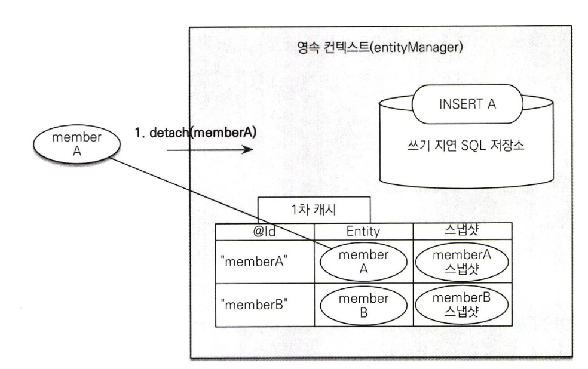
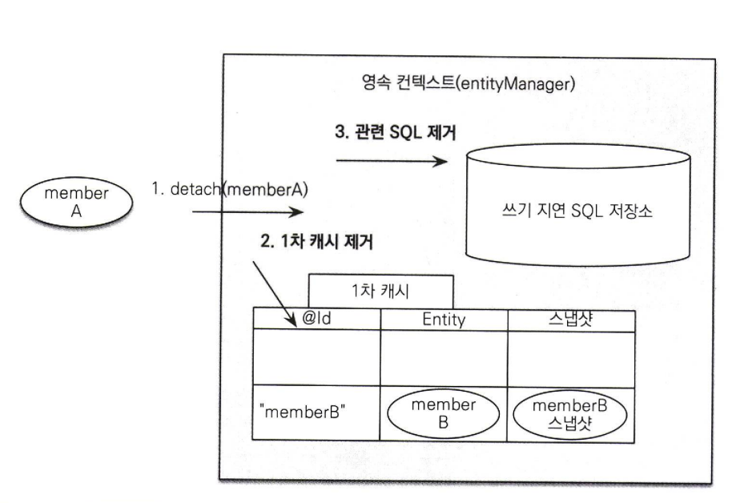
- detach()는 특정 엔티티를 준영속 상태로 만든다.
- 영속성 컨텍스트에게 더는 해당 엔티티를 관리하지 말라는 것이다.
- 1차 캐시부터 쓰기 지연 SQL 저장소까지 해당 엔티티를 관리하기 위한 모든 정보가 제거된다.
- detach로 준영속 상태가 된 객체는 준영속 상태이므로 영속성 컨텍스트가 지원하는 어떤 기능도 동작하지 않는다.
### 3.6.2 영속성 컨텍스트 초기화 : clear()
```java
// 엔티티 조회, 영속 상태
Member member = em.find (Member .class, "memberA") ; 
em.clear (》; //영속성 컨텍스트 초기화 
// 준영속 상태
member.setUsername ("changeName") ;
```
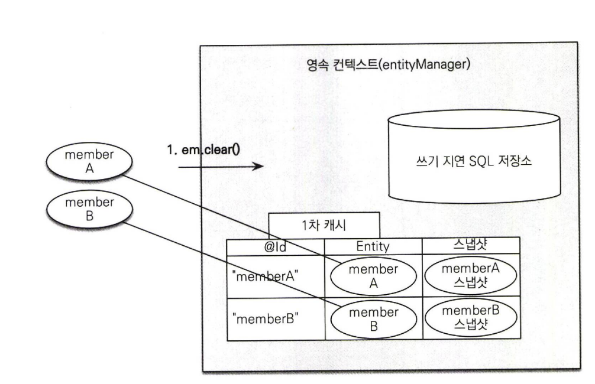

- em.clear()는 영속성 컨텍스트를 초기화해서 해당 영속성 컨텍스트의 모든 엔티티를 준영속 상태로 만든다.
- changeName는 준영속 상태이므로 영속성 컨텍스트가 지원하는 변경 감지는 동작하지 않는다.

### 3.6.3 영속성 컨텍스트 종료 : close()

```java
public void closeEntityManager() {
  EntityManagerFactory emf = Persistence.createEntityManagerFactory("jpabook");
  EntityManager em = emf.createEntityManager();
  EntityTransaction transaction = em.getTransaction();
  transaction.begin (); // [트랜잭션] 시작

  Member member A = em.find (Member. class, MmemberA");
  Member memberB = em.find (Member. class, "memberB") ;

  transaction. commit () ; //[트랜잭션] - 커밋
  em. close () ; //영속성 컨텍스트닫기 (종료)
}
```
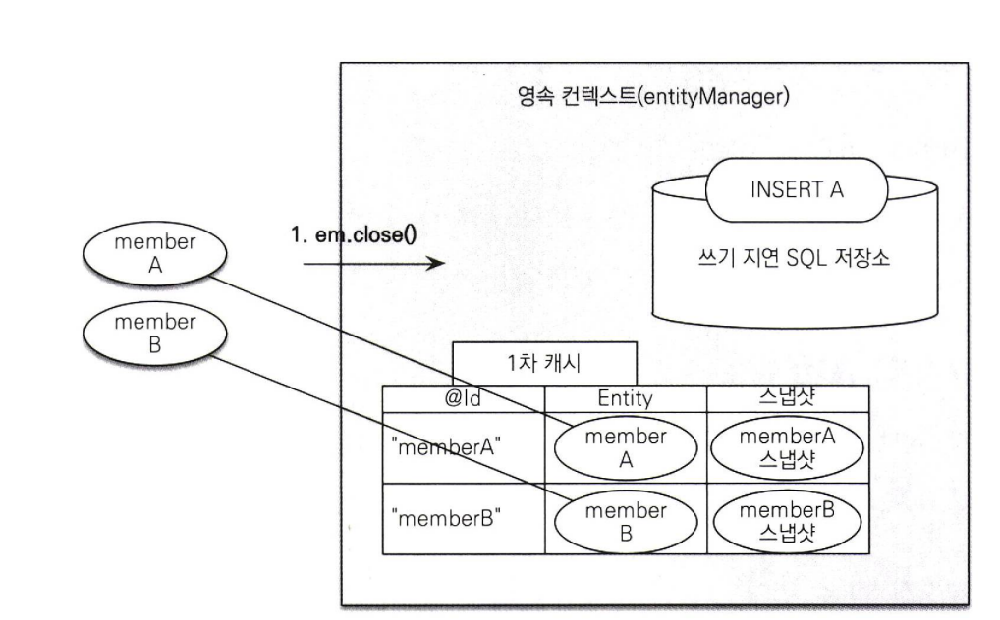
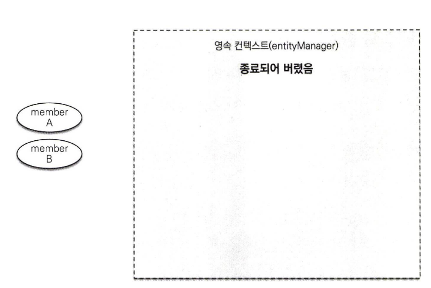
- 영속성 컨텍스트를 종료하면 해당 영속성 컨텍스트가 관리하던 영속 상태의 엔티티가 모두 준영속 상태가 된다.
- 영속성 컨텍스트가 종료되어 더는 관리되지 않는다.
- 개발자가 직접 준영속 상태로 만드는 일은 드물다.

### 3.6.4 준영속 상태의 특징 
  - 준영속 상태인 회원 엔티티는 어떻게 되는건지 보자.
    - 거의 비영속 상태에 가깝다.
      : 영속성 컨텍스트가 관리하지 않으므로 1차 캐시, 쓰기 지연, 변경 감지, 지연 로딩을 포함한 영속성 컨텍스트가 제공하는 어떠한 기능도 동작하지 않는다.
    - 식별자 값을 가지고 있다.
      : 비영속 상태는 식별자 값이 없을 수도 있지만 준영속 상태는 이미 한 번 영속 상태였으므로 반드시 식별자 값을 가지고 있다.
    - 지연 로딩을 할 수 없다.
      : 지연로딩은 실제 객체 대신 프록시 객체를 로딩해두고 해당 객체를 실제 사용할 때 영속성 컨텍스트를 통해 데이터를 불러오는 방법이다.
        준영속 상태는 영속성 컨텍스트가 더는 관리하지 않으므로 지연 로딩 시 문제가 발생한다.
        (LazyInitializationException,NoSessionException 등 예외처리가 발생한다.)

### 3.6.5 병합 : merge()
  - 준영속 상태의 엔티티를 다시 영속 상태로 변경하려면 병합을 사용하면된다.
  - merge() 메소드는 준영속 상태의 엔티티를 받아서 그 정보로 새로운 영속 상태의 엔티티를 반환하다.
  ```java
    public <T> T merget(T entity);
  ```
  ```java
    Mermber mergeMember = em.merge(member);
  ```
  ```java
  public class ExamMergeMain {

    static EntityManagerFactory emf = Persistence.createEntityManagerFactory(”jpabook”);

    public static void main(String args[]) {
      Member member = createMember("memberA", "회원1");      --------------------1.
      merhber. setUsername ("회원명변경") ; // 준영속 상태에서 변경---------------2.
      mergeMember(member);--------------3.
    }

    static Member createMember(String id, String username) { 
    //== 영속성 컨텍스트 1 시작 ==//
    EntityManager eml = emf.createEntityManager(); 
    EntityTransaction txl = eml.getTransaction(); 
    txl .begin () ;

    Member member = new Member();
    member.setId(id);
    member.setUsername(username);
    eml.persist(member);  

    txl.commit();

    eml. close () ; //영속성 컨텍스트1 종료
                    //member 엔티티는 준영속 상태가 된다.

    //== 영속성 컨텍스트1 종료 ==//
    return member;
  }

  static void mergeMember(Member member) {

  //== 영속성 컨텍스트2 시작 — I
  EntityManager em2 = emf.createEntityManager(); 
  EntityTransaction tx2 = em2.getTransact o n ();
  tx2 .begin () ;

  Jfember mergeMember = em2 .merge (member);
  tx2.commit ();

  //준영속 상태
  System. out. println ("member = " + member. getUsername () ) ;

  //영속 상태
  System.out.println("mergeMember = n + mergeMember.getUsername());

  System.out.println(nem2 contains member = n + em2 .contains(member));
  System.out .println ("em2 contains mergeMember =" + em2.contains(mergeMember));
  em2 .close();

  //== 영속성 컨텍스트2 종료 ==//
}
  ```
- 2.준영속 상태인 member 엔티티를 관리하는 영속성 컨텍스트가 더는 존재하지 않으므로 수정사항을 데이터베이스에 반영할 수 없다.
- 3. em2.merge(member)를 호출해서 준영속 상태의 member 엔티티를 새로운 영속 상태의 엔티티로 반환해서 영속성 컨텍스트2가 관리하게 한다.
     영속상태이므로 트랜잭션을 커밋할 때 수정했던 회원명이 데이터베이스에 반영된다.
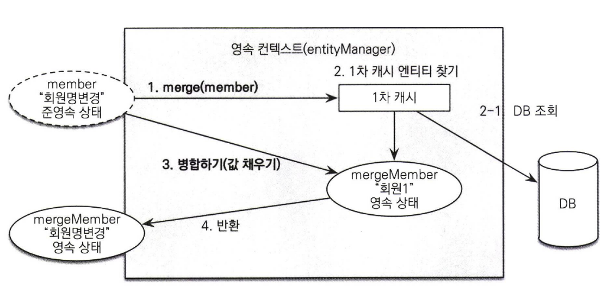
1. merge()를 실행한다.
2. 파라미터로 넘어온 준영속 엔티티의 식별자 값으로 1차 캐시에서 엔티티를 조회한다.
2-1. 만약 1차 캐시에 엔티티가 없으면 데이터베이스에서 엔티티를 조회하고 1차 캐시에 저장한다.
3. 조회한 영속 엔티티에 member 엔티티값을 채워 넣는다.(member 엔티티의 모든 값을 mergeMember에 밀어 넣는다.)
   (commit 시 변경 감지 기능이 동작해서 회원1이 회원변경명으로 변경된다.)
4. mergeMember를 반환한다.
- 파라미터로 넘어온 엔티티는 병합 후에도 준영속 상태로 남아있다.
- member와 mergeMember은 서로 다른 인스턴스다.

```java
  //Member mergeMember = em2.merge(member); //아래코드로 변경
  member = em2.merge(member);
```
- 준영속 상태인 member은 이제 사용할 필요가 없다. 따라서 다음과 같이 준영속 엔티티를 참조하던 변수를 영속 엔티티를 참조하도록 변경하는 것이 안전하다.
- 넣었던 그릇에 넣는게 안전하다.
#### 비영속 병합
```java
Member member = new Member();
Member newMember = em.merge (member);//비 영 속 병합 
tx.commit () ;
```
- 병합은 파라미터로 넘어온 엔티티의 식별자 값으로 영속성 컨텍스트를 조회하고 찾는 엔티티가 없으면 데이터베이스에서 조회한다.
- 만약 데이터베이스에서도 발견하지 못하면 새로운 엔티티를 생성해서 병합한다.
- 병합은 준영속, 비영속을 신경쓰지 않는다.
- 식별자 값으로 엔티티를 조회할 수 있으면 불러서 병합하고 조회할 수 없으면 새로 생성해서 병합한다.
- 병합은 save or update 기능을 수행한다.
