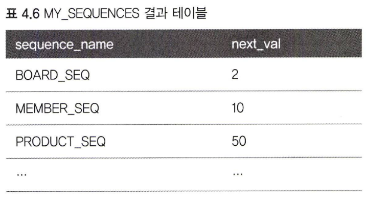
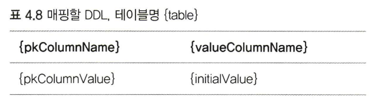

# 4장 엔티티 매핑

<b>✨설명 전 Point 잡고 가기✨</b> 

1. JPA를 사용하는데 가장 중요한 일은 엔티티와 테이블을 정확하게 매핑하는 것이다.

2. 매핑 어노테이션을 지원하는데 크게 4가지로 분류해보면 아래와 같다. (대표 어노테이션만 기입)<br>

    1) 객체 - 테이블 매핑 : @Entity ,@Table<br>
    2) 기본키  매핑 : @Id<br>
    3) 필드와 컬럼 매핑 : @Column<br>
    4) 연관관계 매핑 : @ManyToOne, @JoinColum<br>

3. 이번 장에서는 객체와 테이블 매핑, 기본 키 매핑, 필드와 컬럼 매핑을 알아본다.

> 참고 : 매핑 정보는 XML이나 어노테이션 중 선택해서 기술하면 된다.<br>
         각각 장단점이 있지만 어노테이션을 사용하는 쪽이 좀 더 쉽고 직관적이다.
         (책에서는 어노테이션만 기술하고 있다.)
         

## 4.1 @Entity
  1. JPA를 사용해서 테이블과 매핑할 클래스는 @Entity 어노테이션을 필수로 붙여야다.
  2. @Entity가 붙은 클래스는 JPA가 관리하게 된다.
  3. @Entity속성 정리
     |속성|기능|기본값|
     |-----|---------------|-------|
     |name|JPA에서 사용할 엔티티 이름을 지정한다.<br> 만약 다른 패키지에 이름이 같은 엔티티 클래스가 있다면 name 속성을 가지고 이름을 지정해서 충돌하지 않도록 해야한다.|클래스 이름을 그대로 사용한다.|
  4. @Entity 주의사항
     1) JPA가 엔티티를 생성할 때 기본생성자를 사용하므로 __기본 생성자는 필수__ 로 있어야 한다.
        ```java 
        // 1. 직접 만든 기본 생성자
        public Member(){}
      
        // 2. 임의의 생성자
        public Member(String name){
          this.name = name;
        }  
        ```
        - 자바는 생성자가 하나도 없으면 기본 생성자를 자동으로 만들어준다.
        - 근데 기본 생성자를 사용하지 않고 따로 생성자를 만들게 되면 자바가 기본생성자를 만들어주지 않는다.
        - 그래서 JPA가 기본생성자를 사용할 수 있게 코드1번과 같이 기본생성자를 추가로 만들어줘야 한다. 
        
     2) __final 클래스,enum,interface,inner 클래스에서는 사용할 수 없다.__ <br>
         - 개념 1번
     3) __저장할 필드에 final을 사용하면 안된다.__
         - 질문 1번
        
## 4.2 @Table
1. @Table 어노테이션은 엔티티와 매핑할 테이블을 지정해준다.
2. 생략하면 매핑한 엔티티 이름을 테이블 이름으로 사용한다.
3. @Table 속성 정리
    |속성|기능|기본값|
    |-----|---------------|-------|
    |name |매핑할 테이블 이름을 지정한다. |엔티티 이름을 사용한다. |
    |catalog|catalog 기능이 있는 데이터베이스에서 catalog를 매핑한다.| |
    |스키마|schema 기능이 있는 데이터베이스에 schema를 매핑한다. | |
    |uniqueConstraints(DDL)|DDL 생성 시에 유니크 제약조건을 만든다.<br>2개 이상의 복합 유니크 제약조건도 만들 수 있다. <br> 이 기능은 스키마 자동 생성 기능을 사용해서 DDL을 만들 때만 사용된다. | |
   
## 4.3 다양한 매핑 사용
```java 
package jpabook.start;
import javax.persistence.*
import java.util.Date;

@Entity
@Table(name = "MEMBER")
public class Member{

    @Id
    @Column(name = "NAME")
    private String id;

    @Column(name ="NAME")
    private String userName;

    private Integer age;

    @Enumerated(EnumType.String)
    private RoleType roleType;       //①

    @Temporal(TemporalType.TIMESTAMP)
    private Date createDate;         //②

    @Temporal(TemporalType.TIMESTAMP)
    private Date lastModifiedDate;

    @Lob
    private String description       //③

    //Getter,Setter
    ...

}

public enum RoleType(){
    ADMIN, USER
}
```
소스코드 보면<br>
① roleType : 자바의 enum을 사용해서 회원 타입을 구분했다. enum을 사용하려면 @Enumerated 어노테이션을 매핑해야한다.<br>
  - 개념 2번<br>
② createdData, lastModifiedDate : 자바의 날짜 타입은 @Temporal을 사용해서 매핑한다. <br>
③ description : 설명하는 필드는 길이 제한이 없다. 데이터베이스의 VARCHAR 타입대신 CLOB으로 저장해야 한다. @Lob을 사용하면 CLOB,BLOB 타입을 매핑할 수 있다.

## 4.4 데이터베이스 스키마 자동 생성
1. JPA는 데이터베이스 스키마를 자동으로 생성하는 기능을 지원한다.
2. JPA는 매핑정보와 데이터베이스 방언을 사용해서 데이터베이스 스키마를 생성한다.
   (스키마를 생성한다? : 직접 생성은 아니고 엔티티 클래스 기반으로 데이터베이스 테이블을 생성하고 관리하며 뷰를 매핑하고 관리하는 것이 가능해서 저렇게 표현한듯)
3. 스키마 자동 생성 기능을 사용하려면 persistence.xml에 아래 속성을 추가해야한다.
```xml
<property name = "hibernate.hbm2ddl.auto" value = "create"/>
```
 - 위 속성을 추가하면 애플리케이션 실행 시점에 데이터베이스 테이블을 자동으로 생성한다.
4. hibernate.show_sql 속성을 true로 설정하고 콘솔에 실행되는 테이블의 생성 DDL을 출력해보면 아래와 같다.
```txt
Hibernate:
drop table MEMBER if exists 
Hibernate:
create table MEMBER (
    ID varchar(255) not null, 
    NAME varchar(255), 
    age integer, 
    roleType varchar(255), 
    createdDate timestamp, 
    lastModifiedDate timestamp, 
    description clob, 
    primary key (ID)
)
```
- 출력된 DDL을 확인해보면 기존 테이블을 삭제하고 다시 생성한 것을 볼 수 있다.
- 위 예시는 MYSQL의 DDL이고 이는 데이터베이스 방언에 따라서 자동 생성되는 DDL은 달라진다.
5. 스키마 자동 생성 기능이 만든 DDL은 운영환경에서 사용할 만큼 완벽하지 않다. 그래서 개발 환경이나 매핑작업을 할 때 참고하는 정도로만 사용하자.
6. hibernate.hbm2ddl.auto 속성 정리
    |옵션|설명|
    |------|---------------|
    |create|기존 테이블을 삭제하고 새로 생성한다.(DROP + CREATE)|
    |create-drop|create 속성에 추가로 애플리케이션을 종료할 때 생성한 DDL을 제거한다.(DROP + CREATE + DROP)|
    |update|데이터베이스 테이블과 엔티티 매핑정보를 비교해서 변경사항만 수정한다.|
    |validate|데이터베이스 테이블과 엔티티 매핑정보를 비교해서 차이가 있으면 경고를 남기고 애플리케이션을 실행하지 않는다.<br>이 설정은 DDL을 수정하지 않는다.|
    |none|유효하지 않는 옵션 값으로 자동 생성 기능을 사용하지 않는다.<br>none으로 옵션을 주거나 아니면 hibernate.hbm2ddl.auto 속성 자체를 삭제해도 좋다.|
7. HBM2DDL 사용시 주의사항
  - 운영 서버에서 create,create-drop,update처럼 ddl을 수정하는 옵션은 절대 사용하면 안된다. 운영중인 데이터베이스의 테이블이나 컬럼이 삭제될 수 있다.
  - 꼭 개발 서버나 개발 단계에서만 사용해야한다.
  - 추천 전략
    - 개발 초기 단계에는 create 또는 update 설정한다.
    - 초기화 상태로 자동화된 테스트를 진행하는 개발 환경과 CI서버에는 create 또는 create-drop을 설정한다.
    - 테스트 서버는 update 또는 validate를 설정한다.
    - 스테이징과 운영서버는 validate 또는 none을 설정한다.
8. JPA는 2.1부터 스키마 자동생성 기능을 표준으로 지원한다.
    - none,create,create-drop,drop 옵션 사용가능하다.
    - update,validate 옵션은 지원하지 않는다.
9. hibernate.ejb.naming_strategy 속성을 사용하면 이름 매핑 전략을 변경할 수 있다.
```xml
<property name = "hibernate.ejb.naming_strategy" value ="org.hibernate.ImprovedNamingStrategy">
```
- java는 카멜 표기법을 사용하고 데이터베이스는 언더스코어를 주로 사용한다.
- 엔티티와 테이블을 매핑하려고 하면 표기법 때문에 @Column 어노테이션의 name 속성으로 명시적으로 이름을 지어줘야한다.
- 하이버네이트는 org.hibernate.cfg.ImprovedNamingStrategy 클래스를 제공해서 테이블 명이나 컬럼 명이 생략되면 자바의 카멜 표기법을 테이블의 언더스코어 표기법으로 매핑한다.

## 4.5 DDL 생성 기능
```java
@Entity
@Table(name = "MEMBER")
public class Member{

    @Id
    @Column(name="ID")
    private String id;

    @Column(name = "NAME", nullable = false, length = 10) //추가
    private String username;
    ... 
}
```
1. 회원이름이 필수로 입력되야해서 null을 입력할 수 없게 nullable 옵션(null?)을 false(No)로 설정한다.
2. 회원이름은 10자를 초과하면 안되니 length 를 10으로 설정한다.
```sql
create table MEMBER (
    ID varchar(255) not null,
    NAME varchar(10) not null,
    primary key (ID)
)
```
3. 1번과 2번처럼 매핑정보를 입력하면 그에 맞는 DDL을 생성해준다.
```java
@Entity(name="Member")
@Table(name="MEMBER",uniqueConstraints = {!@uniqueConstraint(
    name = "NAME_AGE_UNIQUE",    
    columnNames = {"NAME","AGE"}    
)}
public class Member{
    ...
}
```
```sql
ALTER TABLE MEMBER
ADD CONSTRAINT NAME_AGE_UNIQUE UNIQUE (NAME, AGE)
```
4. @Table의 uniqueConstrains 속성을 가지고 유니크 제약조건을 걸어주면 실행된 DDL에서 유니크 제약 조건이 추가된 것을 볼 수 있다.
5. length와 nullable,uniqueConstrains 속성을 포함해서 이런 기능들은 단지 DDL을 자동 생성할 때만 사용되고 JPA의 실행로직에는 영향을 주지 않는다.
6. DDL 자동 생성 기능을 사용하지 않을때 필요는 없지만 그래도 개발자가 엔티티만 보고도 손쉽게 다양한 제약조건을 파악할 수 있다는 장점은 있다.
   
## 4.6 기본 키 매핑
### 4.6.1 기본 키 직접 할당 전략
 1. 기본키를 직접 할당하려면 @Id로 매핑하면된다.
 2. @Id 어노테이션을 적용할 수 있는 자바 타입이 있다.
    - 자바 기본형
    - 자바 래퍼형 (Integer)
    - String
    - java.util.Data
    - java.math.BigDecimal
    - java.math.BigInteger
```java
Board board = new Board(); 
board.setld("idl") / / 기본 키직접 할당 
em.persist(board);
```
 3. 기본 키 직접 할당 전략은 em.persist()로 엔티티를 저장하기 전에 애플리케이션에서 기본키를 직접 할당하는 방법이다.
 4. 식별자 값 없이 저장하면 예외가 발생하는데 이는 JPA 표준에 정의되어 있지 않다.
    그래서 하이버네이트를 구현체로 사용하면 JPA 최상위 예외인 javax.persistence.PersistenceException 예외가 발생하는데
    내부에 하이버네이트 예외인 org.hibernate.id.ldentifierGenerationException 예외를 포함하고 있다는 점을 알고 있자.
    
### 4.6.2 IDENTITY 전략
 1. IDENTITY는 기본키 생성을 데이터베이스에 위임하는 전략이다.
 2. 주로 MySQL,PostgreSQL,SQL Server,DB2에서 사용한다.
 3. IDENTITY전략은 데이터베이스 값을 저장하고 나서야 기본 키 값을 구할 수 있을 때 사용한다.
    예시) MYSQL의 AUTO_INCREMENT 기능
```java
@Entity
public class Board {
    @Id
    @GeneratedValue(strategy = GenerationType.IDENTITY)
    private Long id;
    ...
}
```
 4. 데이터베이스에서 식별자를 생성하는 경우 @GeneratedValue 어노테이션을 사용해야하고 식별자 생성 전략을 선택해줘야 하는데
    IDENTITY 전략으로 strategy에 GenerationType.IDENTITY를 지정한다.
```java
private static void logic(EntityManager em) {
Board board = new Board(); 
em.persist(board);
System.out.println(Mboard.id = n + board.getId()); //출력 board.id = 1
}
```
 5. em.persist()를 호출해서 엔티티를 저장한 직후에 할당된 식별자 값을 출력하니 1이 나온다.
 6. 출력된 1은 저장 시점에 데이터베이스가 생성한 값을 JPA가 조회한거다.
 7. 엔티티가 영속 상태가 되려면 식별자가 반드시 필요한데 IDENTITY 식별자 생성 전략은 엔티티를 데이터베이스에 저장해야지만 식별자를 구할 수 있으므로
    persist()를 호출하는 즉시 INSERT SQL이 데이터베이스에 전달된다. 따라서 이 전략은 트랜잭션을 지원하는 쓰기 지연이 동작하지 않는다.
 8. IDENTITY 전략은 데이터를 데이터베이스에 INSERT한 후에 기본키를 값을 조회할 수 있어서 JPA가 추가로 데이터베이스를 조회해야한다.
    하이버네이트는 JDBC3에 추가된 Statement.getGeneratedKeys()를 사용해서 데이터베이스와 한번만 통신할 수 있게 한다.
    
### 4.6.3 SEQUENCE 전략
 1. 데이터베이스 시퀀스는 유일한 값을 순서대로 생성하는 특별한 데이터베이스 오브젝트다.
 2. SEQUENCE 전략은 이 시퀀스를 사용해서 기본키를 생성한다.
 3. SEQUENCE 전략은 시퀀스를 지원하는 오라클,PostgreSQL,DB2,H2 데이터베이스에서 사용할 수 있다.

```sql
CREATE TABLE BOARD (
ID BIGINT NOT NULL PRIMARY KEY, 
DATA VARCHAR(255)

//시퀀스 생성
CREATE SEQUENCE B0ARD_SEQ START WITH 1 INCREMENT BY 1;
```
 4. SEQUENCE 전략을 사용하려면 먼저 데이터베이스에 시퀀스를 생성해야한다.
```java
@Entity
@SequenceGenerator(
    name = "BOARD_SEQ_GENERATOR",
    sequenceName = "BOARD_SEQ",    //매핑할 데이터베이스 시퀀스 이름
    initiaValue=1,allocationSize =1
)
public class Board {
    @Id
    @GeneratedValue(strategy = GenerationType.SEQUENCE, generator = "BOARD_SEQ_GENERATOR")
    private Long id;
    ...
}
```
 5. @SequenceGenerator를 사용해서 BOARD_SEQ_GENERATOR라는 시퀀스 생성기를 등록했다. (@GeneratedValue 옆에 시퀀스 생성기 작성 가능)
 6. sequenceName 속성의 이름으로 BOARD_SEQ 지정했는데 이는 JPA가 시퀀스 생성기를 실제 데이터베이스 BOARD_SEQ 시퀀스와 매핑했다는 거다.
 7. 시퀀스 키로 사용할 필드에 GenerationType.SEQUENCE로 설정하고 generator = "BOARD_SEQ_GENERATOR"로 방금 등록한 시퀀스 생성시를 선택하게 매핑 정보를 입력한다
```java
private static void logic(EntityManager em) {
Board board = new Board(); 
em.persist(board);
System.out.println(Mboard.id = n + board.getId()); //출력 board.id = 1
}
```
 8. 위 IDENTITY 전략에서도 보여준 코드와 동일한데 SEQUENCE 전략을 사용하면 결과는 동일하게 나온다. 단지, 내부 동작 방식이 다르다.
 9. SEQUENCE 전략의 내부 동작 방식을 보면, em.persist()를 호출할 때 먼저 데이터베이스 시퀀스를 사용해서 식별자를 조회한다. 그리고 조회한 식별자를 엔티티에 할당한 후에 엔티티를 영속성 컨텍스트에 저장한다. 이후 트랜잭션을 커밋해서 플러시가 일어나면 엔티티를 데이터베이스에 저장한다.
10. @SequenceGenerator 속성 저리
    |속성|기능|기본값|
    |-----|---------------|-------|
    |name |식별자 생성기 이름이다.|필수입력|
    |sequenceName |데이터베이스에 등록되어있는 시퀀스 이름이다.|hibernate_sequence|
    |initialValue|DDL 생성시에만 사용되는 속성으로 시퀀스 DDL을 생성할 때 처음 시작하는 수를 지정한다.|1|
    |allocationSize|시퀀스 한 번 호출에 증가하는 수(성능 최적화에 사용됨)|50|
    |catalog,schema|데이터베이스 catalog,schema 이름||
11. 위 속성으로 매핑할 DDL은 아래와 같다.
```sql
create sequence [sequenceName]
start with [initialValue] increment by [allocationSize]
```
12.SEQUENCE 전략과 최적화에 대해서 추가적으로 보자면
  1. 식별자를 구하려고 데이터베이스 시퀀스를 조회하고 조회한 시퀀스를 기본키 값으로 사용해서 데이터베이스에 저장한다. 이렇게 SEQUENCE 전략은 식별자를 조회하는 추가작업이 필요해서 데이터베이스와 2번 통신을 하게 된다.
  2. 그래서 JPA는 시퀀스에 접근하려는 횟수를 줄이기 위해 @SequenceGenerator.allocationSize를 사용한다.
  3. 기본값 50이면 시퀀스를 한번에 50 증가시킨 다음에 1~50까지는 메모리에서 식별자를 할당하는거다. 그리고 또 51이 되면 시퀀스 값을 100으로 증가시킨 다음 51~100까지 메모리에서 식별자를 할당한다.
  4. 이렇게 시퀀스 값을 선점하면 여러 JVM이 동시에 동작해도 기본키 값이 충돌되지 않는 장점이 있다.
  5. 반면에 데이터베이스에 직접 접근해서 데이터를 등록할 때 시퀀스 값이 한번에 많이 증가한다는 점도 있다. 이런 상황이 부담스럽고 INSERT 성능이 중요하지 않으면 allocationSize 값을 1로 설정하면된다.
  6. 이러한 기능도 앞서 설명한 hibernate.id.new_generator_mappings 속성을 true로 설정해야지 설명한 최적화 방법이 저장된다. 
    
### 4.6.4 TABLE 전략
1. 테이블 전략은 키 생성 전용 테이블을 하나 만들고 여기에 이름과 값으로 사용할 컬럼을 만들어 데이터베이스 시퀀스를 흉내내는 전략이다.
```sql
create table MY_SEQUENCES (
    sequence_name varchar(255) not null ,
    next_val bigint,
    primary key ( sequence_name )
```
2. TABLE 전략을 사용하려면 먼저 키 생성 용도로 사용할 테이블을 만든다.
```java
@Entity
@TableGenerator(
    name = "BOARD_SEQ_GENERATOR"
    table = "MY_SEQUENCES"
    pkColumnValue = "BOARD_SEQ", allocationSize = 1
)
public class Board {
    @Id
    @GeneratedValue(strategy = GenerationType.TABLE, generator = "BOARD_SEQ_GENERATOR")
    private Long id;
    ...
}
```
1. @TableGenerator를 사용해서BOARD_SEQ_GENERATOR라는 테이블 키 생성기를 등록한다.
2. MY_SEQUENCES 테이블을 키 생성용 테이블로 매핑하고 BOARD_SEQ와 시퀀스와 매핑했다.
3. TABLE 전략을 사용하기 위해 GenerationType.TABLE로 설정하고 테이블 생성기를 사용하기 위해 generator = "BOARD_SEQ_GENERATOR" 입력했다.
4. TABLE 전략은 시퀀스대신에 테이블을 사용한다는 것만 제외하면 SEQUENCE 전략과 내부방식이 같다.
5. 키 생성용 테이블에 다음 할당할 데이터값이 들어가 있지 않아도 JPA가 값을 INSERT하면서 초기화하므로 값을 미리 넣어둘 필요는없다.

7. @TableGenerator 속성 기능
   |속성|기능|기본값|
   |-----|---------------|-------|
   |name|식별자 생성기 이름 지정한다.|필수|
   |table|키생성 테이블 이름을 지정한다.|hibernate_sequences|
   |pkColumnName|시퀀스 컬럼명을 지정한다. |sequence_name(필수)|
   |valueColumnName|시퀀스 값 컬럼명을 지정한다. |next_val(필수)|
   |pkColumnValue|키로 사용할 값 이름을 지정한다.|엔티티 이름|
   |initalValue|초기 값. 마지막|0|
   |allocationSize|시퀀스 한번 호출에 증가하는 수(성능최적화에 사용됨)|50|
   |catalog,schema|데이터베이스 catalog,schema 이름||
   |uniqueConstraint(DDL)|유니크 제약 조건을 지정할 수 있다.||
   
8. TABLE 전략과 최적화를 알아보면 TABLE 전략은 값을 조회하면서 SELECT 쿼리를 사용하고 다음 값으로 증가시키기 위해 UPDATE 쿼리를 사용한다. 이 전략은 SEQUENCE 전략과 비교해서 데이터베이스와 한번 더 통신하는 단점이 있다. 이러한 단점을 보함하고자 @TableGenerator.allocationSize를 사용해서 최적화시킨다. 
### 4.6.5 AUTO 전략
```java
@Entity
public class Board {
    @Id
    @GeneratedValue(strategy = GenerationType.AUTO) 
    private Long id;
    ...
}
```
1. AUTO는 선택한 데이터베이스 방언에 따라 IDENTITY,SEQUENCE,TABLE 전략 중 하나를 자동으로 선택한다.
   (스키마 자동 생성 기능을 사용한다면 미리 준비가 되어 있어야할 SEQUENCE와 키 생성 용 테이블이 없어도 JPA가 적절한 시퀀스나 키 생성용 테이블을 만들어준다)
3. 데이터베이스를 변경해도 코드를 수정할 필요가 없다.
4. 특히 키 생성 전략이 아직 확정되지 않은 개발 초기 단계나 프로토타입 개발 시 편리하게 사용가능하다.

### 4.6.6 기본 키 매핑 정리

## 4.7 필드와 컬럼 매핑 : 레퍼런스
## 4.8 정리
## 실전 예제 | 1. 요구사항 분석과 기본 매핑
