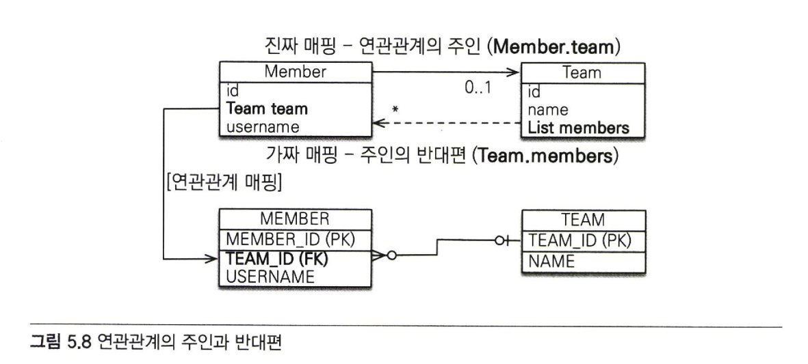
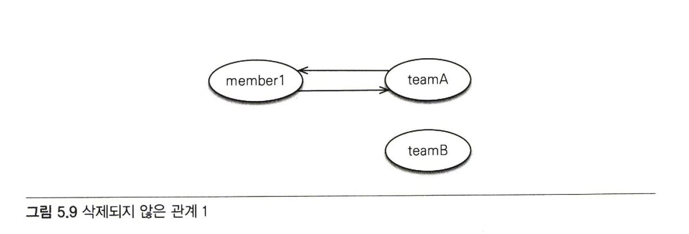

# 5장 연관관계 매핑 기초

<b>✨설명 전 Point 잡고 가기✨</b> 

1. 객체의 참조와 테이블의 외래키를 매핑하는 것이 5장의 목표다.
2. 연관관계 매핑을 이해하기 위한 핵심 키워드를 보면 방향,다중성,연관관계의 주인이 있다.
  1) 방향은 단방향과 양방향 두개가 있는데 둘 중 한쪽만 참조하는 것을 단방향 관계라고 하고 양쪽 모두 서로 참조하는 것을 양방향 관계라고 한다.
     (방향은  객체관계에서만 존재하고 테이블은 항상 양방향이다.)
  2) 다중성은 다대일,일대다,일대일,다대다 로 표현할 수 있다.
  3) 연관관계의주인은 객체를 양방향 연관관계로 만들면 연관관계의 주인을 정해야한다.

## 5.1 단방향 연관관계
### 5.1.1 순수한 객체 연관관계
```java
public class Member {
  private String id; 
  private String username;
  private Team team; //팀의 참조 보관

  public void setTeam(Team team) { 
    this,team = team;
  }
//Getter, Setter ...
```
1. Member 엔티티가 Team 엔티티를 참조할 수 있게 설정했다.
   
2.객체는 참조를 사용해서 연관관계를 탐색할 수 있다.(객체 그래프 탐색)
### 5.1.2 테이블 연관관계
```sql
CREATE TABLE MEMBER (
  MEMBER_ID VARCHAR(255) NOT NULL, 
  TEAM_ID VARCHAR(255),
  USERNAME VARCHAR(255),
  PRIMARY KEY (MEMBER_ID)
)
CREATE TABLE TEAM (
  TEAM_ID VARCHAR(255) NOT NULL, 
  NAME VARCHAR(255),
  PRIMARY KEY (TEAM_ID)
)
ALTER TABLE MEMBER ADD CONSTRAINT FK_MEMBER_TEAM 
  FOREIGN KEY (TEAM_ID)
  REFERENCES TEAM
```
1. 테이블 생성시 외래키도 설정해준다.
```sql
INSERT INTO TEAM(TEAM_ID, NAME) VALUES('teaml','팀') ;
INSERT INTO MEMBER(MEMBER_ID, TEAM_ID, USERNAME)
VALUES ('member1','team1','회원1')
INSERT INTO MEMBER(MEMBER_ID, TEAM_ID, USERNAME)
VALUES ('member2','team1','회원2')
```
2. 외래키 제약조건에 맞게 데이터를 생성한다.
```sql
SELECT T,*
FROM MEMBER M
JOIN TEAM T ON M.TEAM_ID = T.TEAM_ID 
WHERE M.MEMBER_ID =  'member1'
```
3. 데이터베이스는 외래키를 사용해서 연관관계를 탐색할 수 있다. 이를 join이라고 한다.
### 5.1.3 객체 관계 매핑
   
```java
@Entity
public class Member {
  @Id
  @Column(name = "MEMBER_ID"〉 
  private String id;
  private String username;

  //연관관계매핑
  @ManyToOne
  @ JoinColumn (name="TEAM_ID"}
  private Team team;

  //연관관계설정
  public void setTeam(Team team) { 
  this.team = team;
  }
  //Getter, Setter ...
}
```
```java
@Entity
public class Team {
  @Id
  @Column(name = "TEAM ID") 
  private String id;
  private String name;
  //Getter, Setter ...
}
```
1. 객체 연관관계 설정시 Member객체에 team 필드를 사용했고 테이블 연관관계 설정시 회원 테이블의 TEAM_ID 외래키 컬럼을 사용했다.
2. Member.team과 MEMBER.TEAM_ID를 매핑하는 것이 연관관계 매핑이다.
3. 객체와 테이블의 연관관계를 매핑하기 위해 @ManyToOne 과 JoinColumn(name="TEAM_ID")를 사용한다.
### 5.1.4 JoinColumn
1. 외래키를 매핑할 때 사용한다.
2. @JoinColumn 주요 속성
    |속성|기능|기본값|
    |-----|---------------|-------|
    |name |매핑할 외래캐 이름을 지정한다. |필드명_참조하는 테이블의 기본키 컬럼명|
    |referencedColumnName |외래 키가 참조하는 대상 테이블의 컬럼명|참조하는 테이블의 기본 키 컬럼명|
    |foreignKey(DDL) |외래 키 제약조건을 직접 지정할 수 있다. 이 속성은 테이블을 생성할 때만 사용한다.| |
    |unique<br>nullable<br>insertable<br>updatable<br>columnDefinition<br>table|@Column의 속성과 동일하다.| |
3. @JoinColumn을 생략하면 [필드명_참조하는 테이블의 기본키 컬럼명]기본값으로 team_TEAM_ID 외래키를 사용한다.
### 5.1.5 @ManyToOne
1. 연관관계를 매핑할 때 이렇게 다중성을 나타내는 어노테이션은 필수인데 그중 @ManyToOne은 다대일 관계를 표현한다.
2. @ManyToOne 속성
    |속성|기능|기본값|
    |-----|---------------|-------|
    |optional |false로 설정하면 연관된 엔티티가 항상 있어야 한다.|true|
    |fetch |글로벌 페치 전략을 설정한다.| @ManyToOne=FetchType.EAGER(즉시로딩)<br>@OneToMany=FetchType.LAZY(지연로딩)|
    |cascade |영속성 전이 기능을 사용한다.| |
    |targetEntity |연관된 엔티티의 타입 정보를 설정한다. 컬렉션을 사용해도 제네릭으로 타입 정보를 알 수 있어서 잘 사용하지 않는다.| |

```java
@OneToMany
private List<Member> members;  // 제네릭으로 타입 정보를 알 수 있다.
@OneToMany(targetEntity=Member.class)
private List members; //제네릭이 없으면 타입 정보를 알 수 없다.
```
4. 제너릭으로 타입정보를 지정하면 @targetEntity로 따로 반환타입을 설정하지 않아도 알 수 있다.
   
## 5.2 연관관계 사용
### 5.2.1 저장
```java
public void testSave() {
  //팀1 저장
  Team teaml = new Team("teaml", "팀1"〉; 
  em.persist(teaml);

  / / 회원 1 저장
  Member member1 = new Member("member1","회원1");
  memberl.setTeam(teaml) ; //연관관계 설정 member1 -> teaml 
  em.persist(member1);
  //회원2 저장
  Member member2 = new Member ("member2","회원2") ; 
  member2.setTeam(teaml); / / 연관관계 설정 member2 -> teaml 
  em.persist(member2);
}
```
1. 연관관계 사용시 저장은 특별한거 없이 Member 객체와 관련된 Team객체를 setTeam으로 member와 team의 연관관계를 설정해주면된다.
```sql
INSERT INTO TEAM (TEAM_ID, NAME) VALUES ('teaml','팀1')
INSERT INTO MEMBER (MEMBER_ID, NAME, TEAM_ID) VALUES ('member1','회원1', 'teaml')
INSERT INTO MEMBER (MEMBER_ID, NAME, TEAM_ID) VALUES ('member2','회원2', 'teaml')
```
2. 등록 쿼리를 생성하게되면 위와 같은데 회원 테이블의 외래키 값으로 참조한 팀의 식별자 값인 team1이 입력된다.
### 5.2.2 조회
1. 연관관계가 있는 엔티티를 조회하는 방법은 크게 객체 그래프 탐색(객체 연관관계를 사용한 조회)와 객체지향 쿼리 사용(JPQL) 두가지가 있다.
```java
Member member = em.find (Member.class,"memberl") ;
Team team = member. getTeam(); / / 객체 그래프 탐색 
System.out.println ("팀 이름 = " + team. getName()) ; //팀1
```
2. 저장시 연관관계 설정을 해주면 meber.getTeam()을 사용해서 member와 연관된 team 엔티티를 조회할 수 있다.
```java
private static void queryLogicJoin(EntityManager em) {

String jpql = "select m from Member m join m.team t where" +t.name=: teamName;

List<Member> resultList = em.createQuery(jpql, Member.class) .setParameter("teamName", "팀1").getResultList() ;

  for (Member member : resultList) {
  System.out.println ("[query] member.username="+ member.getUsername());
  }
}
//결 과 : [query] member.username:회원 1 
//결 과 : [query] member.username=회원2
```
3. JPQL에서 회원이 팀과 관계를 가지고 있는 필드(m.team)를 통해서 Member와 Team조인을 했다.
### 5.2.3 수정
```java
private static void updateRelation(EntityManager em) {
  //새로운 팀2
  Team team2 = new Team("team2","팀2") ; 
  em.persist(team2);

  // 회원 1 에 새로운 팀2 설정
  Member member = em.find (Member.class"memberl") ; 
  member.setTeam(team2);
}
```
1. 연관관계 사용 수정도 불러온 엔티티의 값만 변경해두면 트랜잭션 커밋할때 플러시가 일어나면서 변경 감지 기능이 작동한다. 그래서 변경사항을 데이터베이스에 자동으로 반영한다. 이렇게 참조대상(team1->team2)만 변경해주면 JPA가 자동으로 처리한다.
### 5.2.4 연관관계 제거
```java
private static void deleteRelation(EntityManager em) {
  Member member1 = em.find(Member.class,"memberl") ; 
  member1.setTeam(null) ; //연관관계 제거
}
```
```sql
UPDATE MEMBER 
SET TEAM_ID=null,
WHERE ID='member1'
```
1. 연관관계 제거하는 것도 특별한거 없이 참조하는 대상을 null로 설정해 연관관계도 null로 만드는거다.
### 5.2.5 연관관계 삭제
```java
memberl.setTeam(null) ; //회원1 연관관계 제거 
member2.setTeam(null) ; //회원2 연관관계 제거 
em.remove (team) ; //팀 삭제
```
1. 연관된 엔티티를 삭제하려면 기존에 있던 연관관계를 먼저 제거하고 삭제해야 한다. 그렇지 않으면 외래키 제약조건으로 인해 오류가 발생한다.
2. 연관관계 제거후 삭제한다.
## 5.3 양방향 연관관계
   
1. 연관된 엔티티들 사이에서 서로 참조가 가능한 관계를 양방향 연관관계라고 한다.
2. 회원과 팀은 회원 기준으로 다대일 관계로 팀 기준으로 일대다 관계다.
3. 일대다 관계인 팀은 여러 건과 연관관계를 맺을 수 있으므로 컬렉션을 사용해야한다. 그래서 Team.members를 List 컬렉션으로 추가한다.
>JPA는 List를 포함해서 Collection,set,map같은 다양한 컬렉션을 지원한다.

4. 데이터베이스 테이블은 외래키 하나만으로 양방향 조회가 가능하므로 처음부터 양방향 관계다.
### 5.3 양방향 연관관계 매핑
```java
©Entity
public class Member {
  @1d
  @Column (name = "MMEMBER_ID") 
  private String id;
  private String username;

  @ManyToOne
  @JoinColumn (name="TEAM_ID") 
  private Team team;

  //연관관계 설정
  public void setTeam(Team team) { 
    this.team = team;
  }
  //Getter, Setter
}
```
```java
SEntity
public class Team {
  @Id
  @Column(name = "TEAM_ID")
  private String id;
  private String name;

  //추가
  @OneToMany (mappedBy = "team")
  private List<Member> members = new ArrayList<Member> () ;

  //Getter, Setter
  ...
}
```
1. Member 엔티티뿐만 아니라 Team 엔티티도 Member를 참조할 수 있게 수정했다.
2. Team 기준 일대다 관계여서 @OneToMany와 다건을 조회할 수 있어 컬렉션인 List<Member>members를 추가했다.
3. mappedBy 속성은 양방향 매핑일때 사용하는데 반대쪽 매핑의 Member.team필드 이름값으로 값을 줬다.(연관관계의 주인)
### 5.4 일대다 컬렉션 조회
```java
public void biDirection() {
  Team team = em.find(Team.class, "team1") ; 
  List<Member> members = team.getMembers(); //(팀 -> 회원) 

  //객체 그래프 탐색
  for (Member member : members) {
    System. out. println ("member. username ="+ member.getUsername());
  }
}
//==결과==
/ /member.username = 회원1 
/ /member.username = 회원2
```
1. 양방향 연관관계를 설정해서 team에서 member 객체를 조회할 수 있게되었다.
## 5.4 연관관계의 주인
1. 단방향일때는 외래키를 한 엔티티만 소유해서 단방향으로 참조를 하면되지만 양방향일때는 외래키를 관리해야할 엔티티를 설정해줘야한다.
2. 테이블은 외래키 하나로 두 테이블의 연관관계를 관리하지만 엔티티는 외래키는 하나인데 객체의 참조는 둘이여서 차이가 발생한다.
3. 그래서 JPA에서는 두 객체 연관관계 중 하나를 정해서 테이블의 외래키를 관리해야하기 때문에 외래키를 관리하는 연관관계의 주인을 설정해줘야한다.
### 5.4.1 양방향 매핑의 규칙 : 연관관계의 주인
1. 연관관계의 주인만 데이터베이스 연관관계와 매핑되고 외래키를 관리(등록,수정,삭제)할 수 있다.
2. 주인이 아닌 쪽은 읽기만할 수 있다.
3. 연관관계의 주인을 정한다는 말은 사실 외래키 관리자를 선택하는 것이다.
4. 주인이 아닌 필드만 mppedBy 속성을 사용한다.
### 5.4.2 연관관계의 주인은 외래키가 있는 곳

1. 물리적인 외래키를 가지고 있는 건 Member 객체인데 Team 객체가 외래키를 관리하기엔 물리적으로 전혀 다른 테이블이다.
   실제 외래키를 관리해야하는데 객체에 연관관계의 주인으로 선택해줘야 한다.
```java
class Team {
  @OneToMany (mappedBy=,"team") //MappedBy 속성의 값은 연관관계의 주인인 Member.team 
  private List<Member> members = new ArrayList<Member>();
  ```
}
2. 주인이 아닌 Team.members에 mappedBy ="team" 속성을 사용해서 주인이 아님을 설정한다.
3. 정리하자면 연관관계의 주인만 데이터베이스 연관관계와 매핑이되고 외래키를 관리할 수 있다. 주인이 아닌 반대편은 읽기만 가능하고 외래키 변경을하지 못한다.
>데이터베이스 테이블의 다대일 일대다 관계에서는 항상 다 쪽이 외래 키를 가진다. 다 쪽인 @ManyToOne은 항상 연관관계의 주인이 되므로 mappedBy 설정을할 수 없다. 따라서 @ManyToOnedpsms mappedBy 속성이없다.
## 5.5 양방향 연관관계 저장
```java
public void testSave() {
  //팀1 저장
  Team teaml = new Team("teaml", "팀1"〉; 
  em.persist(teaml);

  / / 회원 1 저장
  Member member1 = new Member("member1","회원1");
  memberl.setTeam(teaml) ; //연관관계 설정 member1 -> teaml 
  em.persist(member1);
  //회원2 저장
  Member member2 = new Member ("member2","회원2") ; 
  member2.setTeam(teaml); / / 연관관계 설정 member2 -> teaml 
  em.persist(member2);
}
```
1. 연관관계의 주인인 Member 객체는 외래키를 관리할 수 있기때문에 연관관계를 설정하고 데이터베이스에 반영할 수 있다.
2. 주인이 아닌 방향은 값을 설정하지 않아도 데이터베이스에는 연관관계 주인이 잘 관리하기때문에 외래키 값이 정상 입력된다.
```java
teaml.getMembers().add(member 1); //무시(연관관계의 주인이 아님) 
teaml.getMembers().add(member2); //무시(연관관계의 주인이 아님)
```
3. Team 객체는연관관계의 주인이 아니여서 외래키 설정을 해도 데이터베이스에 저장할 때 무시가되서 외래키에 영향을 주지 않는다.
   (뒤에서 배우지만 이 작업은 DB에서 무시되어도 순수한 객체를 고려해 해줘야한다.)
## 5.6 양방향 연관관계 주의점
1. 양방향 연관관계를 설정하고 가장 흔히 하는 시수는 연관관계의 주인에는 값을 입력하지 않고 주인이 아닌 곳에만 값을 입력하는거다. 데이터베이스에 외래 키값이 정상적으로 저장되지 않으면 이부분부터 의심하자.
2. 연관관계의 주인만이 외래 키의 값을 변경할 수 있다.
### 5.6.1 순수한 객체까지 고려한 양방향 연관관계
```java
public void test순수한객체_양방향 () {
  // 팀 1
  Team teaml = new Team("teaml","팀1");
  Member member1 = new Member ("member1", 회원l);
  Member member2 = new Member ("member2", 회원2);
  
  member1.setTeam(teaml) ; //연관관계 member 1 -> teaml
  member2.setTeam(teaml) ; // 연관관계 설정 member2 -> teaml

  List<Member> members = teaml.getMembers(); 
  System.out.println(nmernbers.size = ” + members.size ()》;
}
//결과: members. size = 0
```
1. 연관관계의 주인인 Member 객체에 연관관계를 설정 후 DB에 저장되겠지만 연관관계에서 주인이 아닌 객체는 DB반영 전까지는 관계와 별개로 따로 값을 가진다.
2. 그래서 mebmer 객체 2개에 team1로 세팅해 team1에 소속시켰지만 team1의 회원을 참조해서 가져오면 0건이다.
3. 이렇게 JPA를 사용하지 않는 순수한 객체 상태에서 심각한 문제가 발생할 수 있다.
4. 그래서 객체 관점에서 양쪽 방향에 모두 값을 입력해주는 것이 가장 안전하다.
```java
public void test순수한객체_양방향 () {
  // 팀 1
  Team teaml = new Team("teaml","팀1");
  Member member1 = new Member ("member1", 회원l);
  Member member2 = new Member ("member2", 회원2);
  
  member1.setTeam(teaml) ; //연관관계 member 1 -> teaml
  teaml.getMembers().add(member 1) ; //연관관계 설정 teaml -〉 member 1

  member2.setTeam(teaml) ; // 연관관계 설정 member2 -> teaml
  teaml.getMembers().add(member2) ; //연관관계 설정 teaml -> member2

  List<Member> members = teaml.getMembers();
  System.out.println ("members.size ="+ members .size ()) ; //결과: members. size = 2
}
```  
5. 양방향 관계시 순수한 객체 상태 동작도 고려해 양쪽 모두 관계를 맺어줘야한다. 
### 5.6.2 연관관계 편의 메소드
1. 양방향 연관관계는 결국 양쪽 모두 다 신경써야한다.
2. (연관관계 설정)
```java
public class Member {
  private Team team;

  public void setTeam(Team team) { 
    this.team = team; 
    team.getMembers().add(this);
  }
}
```
 - 리팩토링해서 연관관계를 맺는 set함수를 수정하면 실수를 줄이고 양방향 연관관계 설정을 보기 좋게할 수 있다.
### 5.6.3 연관관계 편의 메소드 작성시 주의사항


1. 연관관계 편의 메소드에서 연관관계 설정하는 부분에도 삭제되야할 관계가 살아있는 버그가 있다.
3. 기존 팀이 있으면 기존 팀과 회원의 연관관계를 삭제하는 코드를 추가해야한다. 
4. (연관관계 삭제 후 설정)
```java
public void setTeam(Team team) {
  / / 기존 팀과 관계를 제거 
  if (this.team != null) {
  this.team.getMembers().remove(this);
  }
  this.team = team;
  team.getMembers().add(this);
}
```
5. 관계를 끊고 연관관계를 맺어주는게 확실하다.


