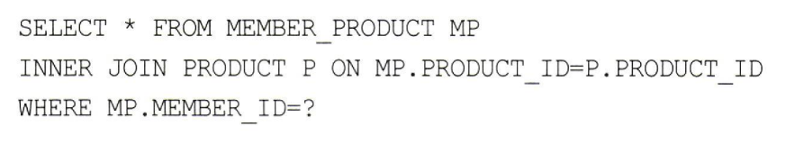
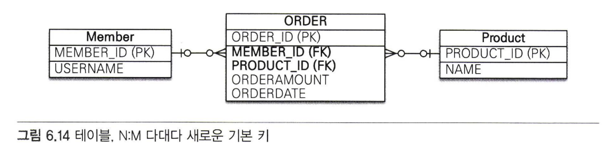
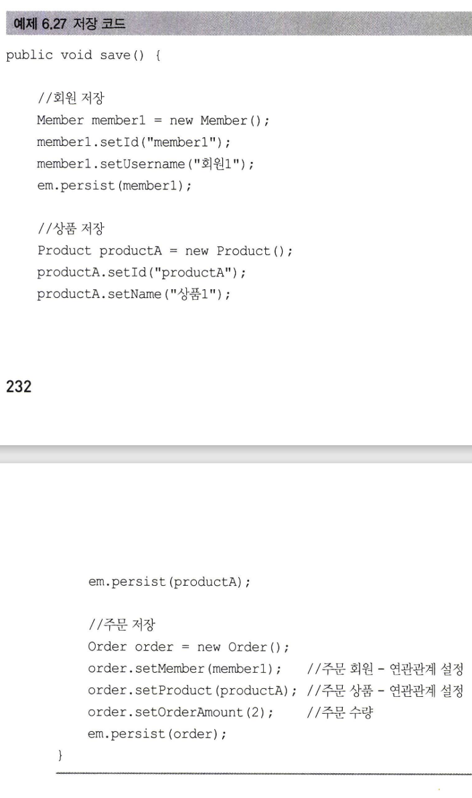

# 6장_다양한 연관관계 매핑

<b>✨설명 전 Point 잡고 가기✨</b> 
 
 - 다중성과 단방향,양방향을 고려한 모든 연관관계를 본다. 

## 6.1 다대일
- 객체 양방향 관계에서 연관관계의 주인은 항상 다쪽이다.

## 6.2.1 다대일 단방향 [N:1]


- Team 하나에 Member 여러명이 포함되는 관계다.

 |
--- | --- | 
- Member는 Team을 참조할 수 있지만 Team에서는 Member를 참조하는 필드가 없다.
- 따라서 Member와 Team은 다대일 단방향 연관관계다.

```java
@ManyToOne
@JoinColumn(name ="TEAM_ID")
private Team team;
```
- @JoinColumn(name ="TEAM_ID")로 team필드와 MEMBER 테이블의 TEAM_ID 외래키와 매핑했다.

## 6.2.1 다대일 양방향 [N:1,1:N]


- 실선이 연관관계의 주인이고 점선은 연관관계의 주인이 아니다.

|
--- | --- | 

- Team에서 Member를 참조할 수 있는 members 필드가 있다.
- Member에서 Team을 참조하고 Team에서 Member도 참조할 수 있다.
- 서로가 서로를 참조할 수 있으므로 이 관계는 양방향 연관관계다.
- 양방향 연관관계 특징
  - 양방향은 외래키가 있는 쪽이 연관관계의 주인이다.
    - 일대다와 다대일 연관관계는 항상 다(N)에 외래 키가 있다.
    - JPA는 외래 키를 관리할 때 연관관계의 주인만 사용한다. (주인아닌것은 JPA에게 뭘해도 무시되자녀)
    - (주인이 아닌것은 그럼 왜 존재하냐?) 주인이 아닌 Team.members는 조회를 위한 JPQL이나 객체 그래프 탐색을 사용한다.
  - 양방향 연관관계는 항상 서로를 참조해야한다.
    ```java
    public void setTeam(Team team){
      this.team = team;
      //무한루프에 빠지지 않도록 체크
      if(!team.getMembers().contains(this)){
        team.getMember().add(this);
      }
    }
    ```
    - 항상 서로 참조하게 하려면 연관관계 편의 메소드를 작성하는 것이 좋다.
    - 연관관계 편의 메소드는 한곳에만 작성하거나 양쪽 다 작성할 수 있는데, 양쪽 모두 작성하면 무한루프에 빠지므로 주의해야한다.
## 6.2 일대다
- 일대다 관계는 엔티티를 하나 이상 참조할 수 있으므로 자바 컬렉션인 Collection,List,Set,Map 중 하나를 사용한다.
### 6.2.1 일대다 단방향

- 일대다 단방향 관계는 특이점이 있다.
- 보통 자신이 매핑한 테이블의 외래키를 관리하는데 이 매핑은 반대쪽 테이블에 있는 외래키를 관리한다.
- Member 테이블에 외래키가 있어서 일반적으로 Member 엔티티에 외래키를 관리하게끔 하는데 외래키를 매핑할 수 있는 참조 필드가 없다.
- 반대쪽 Team 엔티티에서만 Member를 참조할 수 있는 필드가 존재한다.
  
|
--- | --- | 
- 일대다 단방향 관계를 매핑할 때는 @JoinColumn을 명시해야한다.
- @JoinColumn을 명시하지 않는다면 JPA는 연결 테이블을 중간에 두고 연관관계를 관리하는 조인 테이블 전략을 기본으로 사용해서 매핑한다. (7.4절)
#### 일대다 단방향 매핑의 단점
|
--- | --- | 
- 일대다 단방향 매핑의 단점은 매핑한 객체가 관리하는 외래키가 다른 테이블에 있다는 점이다.
- 본인 테이블에 외래키가 있으면 엔티티의 저장과 연관관계 처리를 INSERT SQL 한번으로 끝낼 수 있지만
  다른 테이블에 외래키가 있으면 연관관계를 처리하기 위한 UPDATE SQL을 추가로 실행해야한다.
#### 일대다 단방향 매핑보다는 다대일 양방향 매핑을 사용하자
- 일대다 단방향 매핑을 사용하면 엔티티를 매핑한 테이블이 아닌 다른 테이블의 외래키를 관리해야 한다.
- 성능 문제도 있지만 관리도 부담스럽다.
- 해결 방법은 일대다 단방향 매핑 대신에 다대일 양방향 매핑을 사용하는거다.
- 상황에 따라 다르겠지만 일대다 단방향 매핑보다는 다대일 양방향 매핑을 권장한다. 
### 6.2.2 일대다 양방향
- 일대다 양방향과 다대일 양방향은 사실 똑같은 말이지만 연관관계의 주인으로 가정해서 분류하면 일대다 양방향 매핑은 존재하지 않는다.
- 양방향 매핑에서 @OneToMany는 연관관계의 주인이 될 수 없기 때문이다.
- 데이터베이스 특성상 일대다,다대일 관계는 항상 다 쪽에 외래키가 있다. 그래서 주인은 항상 다 쪽인 @ManyToOne을 사용한 곳이다.
- 이런 이유로 @ManyToOne에는 mappedBy속성이 없다.

- 그렇다고 일대다 양방향 매핑이 완전히 불가능한 것은 아니다.
- 다대일 단방향 매핑을 읽기 전용으로 하나 추가하면 된다.
  
|
--- | --- |
- Member에서 Team을 참조할 수 있는 필드를 만들었다. (다대일 단방향 매핑 추가)
- 일대다 단방향 매핑과 같은 TEAM_ID 외래키 컬럼을 매핑핬는데 이렇게 되면 둘다 같은 키를 관리하므로 문제가 발생할 수 있다.
- 일대다 양방향 매핑을 알아보고 있으니 일대다에서만 외래키를 관리할 수 있게 다대일 쪽은 insertable = false,updatable=false로 설정해서 읽기만 가능하게 한다.
- 이러한 방법은다대일 단방향 매핑을 읽기 전용으로 추가해서 일대다 양방향 처럼 보이도록하는 방법이다.
- 일대다 단방향 매핑이 가지는 단점은 그대로 가진다. 될 수 있으면 다대일 양방향 매핑을 사용하자.
## 6.3 일대일
- 일대일 관계는 양쪽이 서로 하나의 관계만 가진다.
- 일대일 관계는 주 테이블이나 대상 테이블 둘 중 어느곳이나 외래키를 가질 수 있다.
- 어느곳이나 외래키를 가질 수 있으니 주테이블이나 대상 테이블 중 누가 외래키를 가질지 선택해야한다.
### 6.3.1 주 테이블에 외래키
- 객체지향 개발자들은 주 테이블에 외래키가 있는 것을 선호한다. 
- 주 테이블에 외래키를 두고 대상 테이블을 참조한다.
- JPA도 주 테이블에 외래키가 있으면 좀 더 편리하게 매핑할 수 있다. 
- 주 테이블이 외래키를 가지고 있으므로 주 테이블만 확인해도 대상 테이블과 연관관계가 있는지 알 수 있다.
#### 단방향

- Member와 Locker은 일대일 관계다.
- MEMBER 테이블(주)에 LOCKER_ID 외래키에 유니크 제약 조건을 추가했다.
  

- 일대일 관계이므로 객체 매핑에 @OneToOne을 사용했다.
- Member에 @JoinColumn으로 외래키를 매핑하고 Team에 id 필드를 TEAM의 TEAM_ID와 매핑했다.
  
#### 양방향

- Locker 에서도 Member을 참조할 수 있게 Member 필드를 추가한다.
  

- 서로 참조가 가능한 양방향이므로 외래키를 관리할 연관관계의 주인을 정해줘야한다.
- 주 테이블에 외래키 관리하므로 MEMBER 테이블이 외래키를 가지고 있어 Member.locker가 연관관계의 주인이다.
- Locker의 member에 mappedBy를 선언해서 연관관계의 주인이 아니라고 알려준다. (주인아님~)
  
### 6.3.2 대상 테이블에 외래키
- 일반적으로 보통 대상 테이블에 외캐키를 두는 것을 선호한다.
- 일대일에서 일대다로 변경할 때 테이블 구조를 그대로 유지할 수 있다.
  
#### 단방향

- 일대일 관계 중 대상 테이블에 외래키가 있는 단방향 관계는 JPA에서 지원하지 않는다. (JPA 2.0부터는 지원하는걸로 변경)
- 단방향 관계를 Locker에서 Member 방향으로 수정하거나 양방향 관계로 만들고 Locker를 연관관계의 주인으로 설정해야 한다.

#### 양방향  

- Member에서도 locker 필드를 가지고 Team 참조할 수 있고 Team에서도 member 필드를 가지고 Member를 참조할 수 있다. (양방향)


- __일대일 매핑에서 대상 테이블에 외래키를 두고 싶으면 양방향으로 매핑을한다.__
- 주 엔티티인 Member 엔티티 대신에 대상 엔티티인 Loker를 연관관계의 주인으로 만들어서 LOCKER 테이블의 외래키를 관리하도록 했다.
  (부모 테이블의 기본 키를 자식 테이블에서도 기본키로 사용하는 일대일 관계는 7.3.5절에서 설명한다.)
> 주의
: 프록시를 사용할 때 외래키를 직접 관리하지 않는 일대일 관계는 지연로딩으로 설정해도 즉시로딩이 된다.
프록시의 한계 때문에 발생하는 문제인데 프록시 대신 bytecode instrumentation을 사용하면 해결할 수 있다.
프록시와 지연 로딩은 8장에서 배운다.)

## 6.4 다대다

- 관계형 데이터베이스는 정규화된 테이블 2개로 다대다 관계를 표현할 수 없다.
  (+ 다대다 관계는 한 테이블의 여러 행이 다른 테이블의 여러 행과 연결될 수 있기때문에 단일한 기본키를 정의할 수 없다.)
- 보통은 다대다 관계를 일대다,다대일 관계로 풀어내는 연결 테이블을 사용한다.
- 회원들은 상품을 주문하고 반대로 상품들은 회원들에 의해 주문된다. 둘은 다대다 관계다.
- 다대다 관계이기때문에 회원테이블과 상품 테이블만으로는 이관계를 표현할 수 없다.


- 다대다 관계를 풀어내기위해 중간에 Member_Product 연결 테이블을 추가했다.
- 다대다 관계를 일대다,다대일 관계로 풀어냈다.

     
- 객체는 테이블과 다르게 객체 2개로 다대다 관계를 표현할 수 있다.
```java
//에시
for (Course course : student2.getCourses()) {
   System.out.println(course.getCourseName());
}
```   
- 컬렉션을 사용해서 상품들을 참조하면 반대로 상품들도 컬렉션을 사용해서 회원들을 참조하면 된다 
- 컬렉션인 student2 객체에서 cource를 참조한다. (반대도 가능)

### 6.4.1 다대다: 단방향
|
--- | --- | 
- 회원과 상품 엔티티는 @ManyToMany로 매핑했다.
- ★ 여기서 중요한 점은 @ManyToMany와 @JoinTable을 사용해서 연결 테이블을 바로 매핑한 것이다.
- 따라서 회원과 상품을 연결하는 회원_상품(Member_Prodect) 엔티티 없이 매핑을 완료할 수 있다.
- @JoinTable 속성
  - name : 연결테이블을 지정한다. (MEMBER_PRODUCT 테이블 선택)
  - joinColumns : 현재 방향인 회원과 매핑할 조인 컬럼 정보를 지정한다.(MEMBER_ID)
  - inverseJoinColumns : 반대 방향인 상품과 매핑할 조인 컬럼 정보를 지정한다. (PRODUCT_ID)
- MEMBER_PRODUCT 테이블은 다대다 관계를 일대다,다대일 관계로 풀어내기 위해 필요한 연결 테이블일 뿐이고 @ManyToMany로 매핑한 덕분에 다대다 관계를 사용할 때는 이 연결 테이블을 신경쓰지 않아도 된다.
  
#### 다대다 단방향 저장
|
--- | --- | 
- 다대다 단방향 관계에서 중간 테이블을 두어 일대다,다대일로 풀어낸 상태에서 회원과 상품의 연관관계를 설정하면 연결 테이블에도 값이 저장된다.
- 중간 테이블인 MEMBER_PRODUCT에도 INSERT SQL이 실행된 것을 볼 수 있다.
  
#### 다대다 단방향 탐색
|
- member.getProduct()를 호출하면 SQL이 실행된다.
- 연결 테이블인 MEMBER_PRODUCT 테이블과 상품 테이블을 조인해서 연관된 상품을 조회한다.
- @ManyToMany 덕분에 복잡한 다대다 관계를 애플리케이션에서는 아주 단순하게 사용할 수 있게 되었다.

### 6.4.2 다대다: 양방향
     
- 다대다 매핑으로 역방향도 @ManyToMany를 사용한다.
- 양방향 관계이니 연관관계의 주인을 설정해줘야하는데 다대다 양방향은 원하는 곳에 mappedBy를 지정해주면된다.

```java
public void addProduct(Product product) {
 products.add(product) ;
 product.getMembers().add(this);
}
```
- 양방향 관계에서 연관 관계를 설정할 때 양쪽 모두 지정해줘야 하니 연관관계 편의 메소드를 추가해서 한번에 관리하는게 편하다

- 여기까지 하면 양방향 연관관계로 만들었으므로 projuct.getMembers()를 사용해서 역방향으로 객체 그래프를 탐색할 수 있다. 

### 6.4.3 다대다: 매핑의 한계와 극복, 연결 엔티티 사용

- @ManyToMany를 사용하면 연결 테이블을 자동으로 처리해주므로 도메인 모델이 단순해지고 여러가지로 편리하다.
- 그러나 이 매핑을 실무에서 사용하기에는 한계가 있다.
- 중간 테이블에 컬럼을 추가하면 매핑할 수 없기 때문에 더는 @ManyToMany를 사용할 수 없다.
  (@ManyToMany 어노테이션 옵션엔 역방향 순방향 컬럼만 매핑가능, 다른 컬럼들은 매핑할 수 없음)
  

- 결국 연결 테이블을 매핑하는 연결 엔티티를 만들고 이곳에 추가한 컬럼들을 매핑해야 한다.
- 엔티티 간의 관계도 테이블 관계처럼 다대다에서 일대다 다대일 관계로 풀어야 한다.
- 회원상품(MemberProduct)엔티티를 추가했다.
- 

- 회원과 회원상품을 양방향 관계로 만들었다.
- 회원상품 엔티티 쪽이 외래 키를 가지고 있으므로 연관관계의 주인이다.
- 연관관계의 주인이 아닌 회원의 member.memberProducts에는 mappedBy를 사용했다.


- 상품 엔티티에서 회원상품 엔티티로 객체 그래프 탐색 기능이 필요하지 않다고 판단해서 연관관계를 만들지 않았다.
  (물건 상품이 어떤 회원한테 갔는지 궁금하지 않음)
  
|
--- | --- | 
- ★ 회원상품 엔티티와 회원상품 식별자 클래스가 중요하다.
- 회원상품 엔티티를 보면 기본키 매핑하는 @Id와 외래키 매핑하는 @JoinColumn 을 동시에 사용해서 한번에 매핑했다.
- 회원상품 엔티티 맨 상단에 @IdClass를 사용해서 복합 기본키를 매핑했다.

#### 복합 기본 키 (=복합키)
- 회원상품 엔티티는 기본키가 MEMBER_ID와 PRODUCT_ID로 이루어진 복합 기본키(=복합키)다.
- ★JPA에서 복합키를 사용하려면 별도의 __식별자 클래스__를 만들어야 한다. 엔티티에 @IdClass를 사용해서 식별자 클래스를 지정하면 된다.
- 여기에서 MemberProductId 클래스를 복합 키를 위한 식별자 클래스로 사용한다.
- 복합키를 위한 식별자 클래스의 특징(★)
  - 복합키는 별도의 식별자 클래스로 만들어야한다.
  - Serializable을 구현해야 한다.
  - equals와 hashCode 메소드를 구현해야 한다.
  - 기본생성자가 있어야 한다.
  - 식별자 클래스는 public이 있어야 한다.
  - @IdClass를 사용하는 방법 외에 @EmbeddedId를 사용하는 방법도 있다. 
>자바 IDE에는 대부분 equals,hashCode메소드를 자동으로 생성해주는 기능이 있다.

#### 식별관계
- 부모 테이블의 기본키를 받아서 자신의 기본키 + 외래키로 사용하는 것을 데이터베이스 용어로 식별관계라 한다.
- 회원상품은 회원과 상품의 기본키를 받아서 자신의 기본키로 사용한다.
- 자기 잔신의 기본키로 사용함과 동시에 관계를 위한 외래키로 사용이 된다.
- MemberProductedId 식별자 클래스로 두 기본키를 묶어서 복합 기본키로 사용한다.

#### 저장 (복합키)

- 회원상품 엔티티는 데이터베이스에 저장될 때 연관된 회원의 식별자와 상품의 식별자를 가져와서 자신의 기본 키 값으로 사용한다.

#### 조회 (복합키)

- 식별자 클래스 객체에 복합 키값들을 세팅한 다음 find()의 식별자 매개변수에 세팅해서 조회한다.
- 이렇게 복합키를 사용하는 방법은 복잡하다.
- 복합키는 항상 식별자 클래스를 만들어야 한다.
- @IdClass 또는 @Embedded도 사용해야한다. 그리고 식별자 클래스에 equals와 hashcode도 구현해야한다.
- 이렇게 복합키를 사용하면 ORM 매핑에서 처리할 일이 많아진다.
- 복합키를 사용하지 않고 간단히 다대다 관계를 구성하는 방법을 아래서 알아보자.
### 6.4.4 다대다: 새로운 기본키의 사용  

- 데이터베이스에 자동으로 생성해주는 대리키를 Long값으로 해서 기본키 생성전략을 사용하는것이다.
- 간편하고 거의 영구히 쓸 수 있으며 비즈니스에 의존하지 않는다.
- ORM 매핑 시에 복합키를 만들지 않아도 되므로 간단히 매핑을 완성할 수 있다.
- ORDER_ID라는 새로운 기본키를 하나 만들고 MEMBER_ID,PRODUCT_ID 컬럼은 외래키로만 사용한다.

- ORDER_ID 대리키를 사용함으로써 식별 관계에 복합키를 사용하는 것보다 매핑이 단순하고 이해가 쉽다.
- 이전 예제에서 대리키 ORDER_ID가 추가됬다고 엔티티가 수정되지 않았다.

#### 저장 및 조회 (대리키)
|
--- | --- | 
- 식별자 클래스를 사용하지 않아서 코드가 한결 단순해졌다.
- 이처럼 새로운 기본키를 사용해서 다대다 관계를 풀어내는 것도 좋은 방법이다.

### 6.4.5 다대다 연관관계 정리
- 다대다 관계를 일대다 다대일 관계로 풀어내기 위해 연결 테이블을 만들 때 식별자를 어떻게 구성하지 선택해야한다.
- 식별자 구성
  - 식별 관계 : 받아온 식별자를 기본키 + 외래키로 사용한다.
  - 비식별 관계 : 받아온 식별자를 외래키로만 사용하고 새로운 식별자를 추가한다. (★추천-복합키를 위한 식별자 클래스X,단순,편하게 ORM 매핑)
