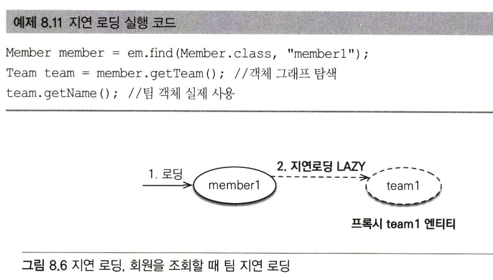

# 8장_프록시와 연관관계 관리

<b>✨설명 전 Point 잡고 가기✨</b> 

- 프록시와 즉시로딩,지연로딩
  - 객체는 객체 그래프로 연관된 객체들을 탐색한다.
  - 객체가 데이터베이스에 저장되어 있어 연관된 객체를 마음껏 탐색하기는 어려움이 있다.
  - 이런 어려움을 JPA 구현체들은 프록시라는 기술을 사용해서 해결했다.
  - 프록시를 사용하게 되면 연관된 객체를 처음부터 데이터베이스에서 조회하는 것이 아니라 실제 사용하는 시점에 데이터베이스에서 조회할 수 있다.
    (자주 사용되는 객체들은 실제 사용하는 시점이 아니라 조인을 통해서 미리 함께 조회하는 것이 효과적이다.)
  - JPA는 즉시로딩, 지연로딩 모두 지원한다. 
- 영속성 전이와 고아 객체
  - JPA는 연관된 객체를 함께 저장하거나 함께 삭제 할 수 있는 1) 영속성 전이와 2) 고아객체 제거라는 편리한 기능을 제공한다.

## 8.1 프록시
- 프록시 객체는 가짜 객체로, 지연로딩 기능을 사용할때 실제 엔티티 객체 대신에 데이터베이스 조회를 지연할 수 있게 해준다.
> JPA 표준 명세는 지연 로딩의 구현 방법을 JPA 구현체에게 위임했다.<br>
  JPA 구현체인 하이버네이트 구현체는 지연 로딩을 하기 위해 1) 프록시 사용 2) 바이트코드 수정 이렇게 두가지 방법에 대해 제공한다.

### 8.1.1 프록시 기초

```java
Member member = em.find (Member.class, "memberl") ;
```
- JPA에서 식별자로 엔티티 하나를 조회할 때는 EntityManager.find()를 사용한다.
- em.find() 메소드는 영속성 컨텍스트에 엔티티가 없으면 데이터베이스를 조회한다.
- 엔티티를 직접 조회하면 조회한 엔티티를 실제 사용하든 사용하지 않든 데이터베이스를 조회한다.


```java
Member member = em.getReference(Member.class, "memberl");
```
- EntityManager.getReference(); 메소드를 사용하면 엔티티를 실제 사용하는 시점까지 데이터베이스 조회를 미룰 수 있다.
- em.getRefernce();를 호출하면 JPA는 데이터베이스를 조회하지 않고 실제 엔티티 객체도 생성하지 않는다.
- 대신 데이터베이스 접근을 위한 프록시 객체를 반환한다.

#### 프록시의 특징
1) 프록시 구조

- 프록시 클래스는 실제 클래스를 상속 받아서 만들어지므로 실제 클래스와 겉 모양이 같다.
- 사용하는 입장에서는 진짜 객체인지 프록시 객체인지 구분하지 않고 사용하면 된다. 
2) 프록시 위임

- 프록시 객체는 실제 객체에 대한 참조(target)를 보관한다.
- 프록시 객체의 메소드를 호출하면 프록시 객체는 실제 객체의 메소드를 호출한다.

#### 프록시 객체의 초기화

- 프록시 객체의 초기화는 연관된 객체를 실제로 사용하기 위해 메소드를 호출할 때 데이터베이스를 조회해서 실제 엔티티 객체를 생성하는 것을 말한다.
- member.getName()할 때 프록시 객체의 초기화가 된다.
  
#### 프록시 클래스 예상코드

 |
|-----|-----|
1. 프록시 객체 member에 getName()을 호출해서 실제 데이터를 조회한다.
2. 프록시 객체는 실제 엔티티가 생성되어 있지 않으면 영속성 컨텍스트에 실제 엔티티 생성을 요청한다.
   이를 프록시 초기화라고 한다. (단, 영속성 컨텍스트에 실제 엔티티 있을시 조회 안함)
3. 영속성 컨텍스트는 데이터베이스를 조회해서 실제 엔티티 객체를 생성한다.
4. 프록시 객체는 생성된 실제 엔티티 객체의 참조를 Member 프록시 객체의 target 멤버변수에 보관한다.
5. 프록시 객체는 실제 엔티티 객체의 getName()을 호출해서 결과를 반환한다.

#### 프록시의 특징
1. 프록시 객체는 처음 사용할 때 한번만 초기화 된다.
2. 프록시 객체를 초기화한다고 프록시 객체가 실제 엔티티로 바뀌는 것은 아니다.
   (프록시 객체가 초기화가 되면 프록시 객체를 통해서 실제 엔티티에 접근할 수 있다.)
3. 프록시 객체는 원본 엔티티를 상속받은 객체이므로 타입체크시에 주의해서 사용해야한다.

<details>
<summary>추가 내용</summary>

<!-- summary 아래 한칸 공백 두어야함 -->
## 타입체크시에 주의사항
프록시 객체가 원본 엔티티와 같은 타입으로 간주된다면, instanceof 연산자는 원본 엔티티와 프록시 객체를 구분하지 못할 수 있다. <br>
원본 엔티티와 프록시 객체가 다른 구현을 갖기 때문에 예기치 않은 동작을 일으킬 수 있으니 프록시 객체를 타입체크할 때에는 instanceof 연산자를 사용하는 것보다는
객체가 원본 엔티티의 인스턴스인지를 확인하는 다른 방법을 사용하는 것이 더 안전하다.

## 타입체크를 주의해야하는 이유
1. 동작의 일관성 유지: 프록시 객체와 실제 객체는 다른 동작을 할 수 있습니다
2. 메서드 호출 시의 차이: 프록시 객체와 실제 객체는 메서드 호출 시에도 차이가 있을 수 있다.
   (프록시 객체는 데이터를 로드하는 등의 추가 작업을 수행할 수 있음)
3. 성능 및 부하 관리:  프록시 객체와 실제 객체를 명확히 구분하여 필요한 시점에만 데이터를 로드하여 성능을 최적화할 수 있다.
4. 예외 처리: 프록시 객체와 실제 객체를 명확히 구분하여 예외 처리를 관리할 수 있다.
   (데이터 로딩에 실패한 경우에 대한 처리를 프록시 객체와 실제 객체 각각 다르게 처리해야 할 때가 있다.)
</details>

5. 영속성 컨텍스트에 찾는 엔티티가 이미 있으면 데이터베이스를 조회할 필요가 없으므로 em.getReference()를 호출해도 프록시가 아닌 실제 엔티티를 반환한다.
6. 초기화 영속성 컨텍스트의 도움을 받아야 가능하다. 따라서 영속성 컨텍스트의 도움을 받을 수 없는 준영속 상태의 프록시를 초기화하면 문제가 발생한다.
   (하이버네이트는 org.hibernate.LazylnitializationException  예외를 발생시킨다.)

#### 준영속 상태와 초기화 
```java
//MemberProxy 반환
Member member = em.getReference (Member.class,"id1");
transaction.commit();
em.close (); //영속성 컨텍스트 종료

member.getName() ; //준영속 상태 초기화 시도，
                   //org.hibernate.LazylnitializationException 예외 발생
```
- em.close() 메소드로 영속성 컨텍스트를 종료해서 member는 준영속 상태다.
- 준영속 상태인 member 객체를 getName()으로 호출하면 프록시를 초기화해야하는데 영속성 컨텍스트가 없으므로 실제 엔티티를 조회할 수 없어서 예외가 발생한다.
> JPA 표준 명세는 지연 로등(프록시_에 대한 내용을 JPA 구현체에 맡겼다. 따라서 준영속 상태의 엔티티를 초기화할 때 어떤 일이 발생할지는 표준 명세에는 정의되어있지는 않고 하이버네이트를 사용하면 org.hibernate.LazylnitializationException 예외가 발생한다.

### 8.1.2 프록시와 식별자
```java
Team team = em.getReference(Team.class,"team1") ; //식별자 보관 
team.getId(); //초기화 되지 않음
```
- getReference()로 엔티티를 프록시로 조회할 때 식별자(PK)값을 파라미터로 전달하는데 프록시 객체는 이 식별자 값을 보관한다.
- 프록시 객체는 식별자 값을 가지고 있으므로 식별자 값을 조회하는 team.getId()를 호출해도 초기화 되지 않는다.
- 단, 엔티티 접근 방식을 프로퍼티(@Access(AccessType.PROPERTY))로 설정한 경우에만 초기화하지 않는다.
-  getId()에 엔티티 접근 방식을 프로퍼티로 지정하면 식별자 값을 가져오는 메소드라는 것을 인식할 수 있는데필드로 지정하면 getId()가 어떤 메소드 인지 모른다.
-  그래서 엔티티 접근 방식이 필드면 (@Access(AccessType.PROPERTY)) 프록시 객체를 초기화한다.

```java
Member member = em.find (Member.class,"member1") ;
Team team = em.getReference (Team.class, "team1") ; //SQL을 실행하지 않음 
member.setTeam(team); //연관관계 설정
```
- 연관관계를 설정할 때는 식별자 값만 사용하므로 프록시를 사용하면 데이터베이스 접근 횟수를 줄일 수 있다. (식별자 team)
- 연관관계를 설정할 때는 엔티티 접근 방식을 필드로 설정해도 프록시를 초기화하지 않는다. (파라미터에 들어가는 값이 식별자인걸 알 수 있으니까~)

### 8.1.3 프록시 확인
- JPA가 제공하는 PersistenceUnitUtil.isLoaded(Object entity) 메소드를 사용하면 프록시 인스턴스의 초기화 여부를 확인할 수 있다.
- 결과값
  - false : 아직 초기화되지 않는 프록시 인스턴스
  - true : 이미 초기화 되었거나 프록시 인스턴스가 아닌 경우
```java
boolean isLoad = em.getEntityManagerFactory().getPersistenceUnitUtil().isLoaded(entity);
/ / 또는 boolean isLoad = emf.getPersistenceUnitUtil().isLoaded(entity);
System.out.println ("isLoad ="+ isLoad) ; / / 초기화 여부 확인
```

- 조회한 엔티티가 진짜 엔티티인지 프록시로 조회한 것인지 확인하려면 클래스 명을 직접 출력해보면된다.
> 프록시 강제 초기화
org.hibernate.Hibernate. initialize (order .getMember ()) ; / / 프록시 초기화
하이버네이트의 initalize()메소드를 사용하면 프록시를 강제로 초기화할 수 있다.
JPA 표준에는 프록시 강제 초기화 메소드가 없고 단지 초기화 여부만 확인할 수 있다. 

## 8.2 즉시로딩과 지연로딩
## 8.2.1 즉시로딩
```java
@Entity
public class Member {
  // …
  @ManyToOne (fetch = FetchType.EAGER)
  @JoinColumn(name = "TEAM_ID")
  private Team team;
}
```
- 즉시로딩 : 엔티티를 조회할 때 연관된 엔티티도 함께 조회한다.
- 즉시로딩은 (@ManyToMany(fetch = FetchType.EAGER))로 설정한다.

 |
|----|----|
- 회원을 조회하는 순간 연관된 팀 엔티티도 같이 조회한다.
- JPA 구현체는 즉시 로딩을 최적화하기 위해 가능하면 조인쿼리를 사용한다.
- 회원과팀을 조인해서 쿼리 한번으로 두 엔티티를 모두 조회한다.

  
>NULL 제약조건과 JPA 조인 전략
: 즉시 로딩 실행 SQL에서 JPA가 내부조인(INNER JOIN)이 아닌 외부조인(LEFT OUTER JOIN)을 사용한 것을 유심히 봐야한다.<br>
  회원 테이블에 TEAM_ID 외래키는 NULL값을 허용하고 있다. JPA는 NULL인경우까지 고려해 외부조인을 사용한다.
  그러나 내부조긴이 성능최적화에서 더 유리하다. 외래키에 NOT NULL 제약조건 설정하면 값있는 걸 보장하니 그때부터 내부조인만 사용해도된다.
  @JoinColumn에 nullable= false을 설정해서 이 외래키는 NULL값을 허용하지 않는다고 알려주면 JPA는 외부 조인 대신에 내부조인을 사용한다.
```java
  @Entity
  public class Member {
    // …
    @ManyToOne(fetch = FetchType.EAGER)
    @JoinColumn(name = "TEAM_ID", nullable = false)
    private Team team;
    ...
  }
```
  > nullable 설정에 따른 조인 전략
    ■ @JoinColumn(nullable - true)： NULL 허용(기본값), 외부 조인 사용 
    ■ @JoinColumn(nullable - false)： NULL 허용하지 않음, 내부 조인 사용
      또는 다음처럼 @ManyToOne.optional = false로 설정해도 내부 조인을 사용한다.
  ```java
  @Entity
  public class Member {
    // …
    @ManyToOne(fetch = FetchType.EAGER,optical =false)
    @JoinColumn(name = "TEAM_ID", nullable = false)
    private Team team;
    ...
  }
  ```
> JPA는 선택적 관계면 외부 조인을 사용하고 필수 관계면 내부 조인을 사용한다.
## 8.2.2 지연로딩
```java
@Entity
public class Member {
  // …
  @ManyToOne (fetch = FetchType.LAZY)
  @JoinColumn(name = "TEAM_ID")
  private Team team;
}
```
- 지연로딩 : 연관된 엔티티를 실제 사용할 때 조회한다.
- 지연로딩은 (@ManyToMany(fetch = FetchType.LAZY))로 설정한다.


- 회원만 조회하고 팀은 조회하지 않는다.
```java
Team team = member.getTeam(); 
```
- 대신 조회한 회원의 TEAM 멤버변수에 프록시 객체를 넣어둔다.
- 이 프록시 객체는 실제 사용될 때까지 로딩을 미룬다.

```java
team.getName(); //팀 객체 실제 사용
```
- 실제 데이터가 필요한 순간이 되어서야 데이터베이스를 조회해서 프록시 객체를 초기화한다.
```sql
SELECT * FROM MEMBER
WHERE MEMBER_ID = 'member1'
```
- em.find (Member.class, "memberl") 호줄 시 실행되는 SQL이다.
```sql
SELECT * FROM TEAM
WHERE TEAM ID = 'team1'
```
- team.getName () 호출로 프록시 객체가 초기화되면서 실행되는 SQL이다.
> 조회 대상이 영속서 컨텍스트에 있으면 프록시 객체를 사용할 이유가 없다. 따라서 프록시가 아닌 실제 객체를 사용한다.

## 8.2.3 즉시로딩, 지연로딩 정리
- 지연로딩은 연관된 엔티티를 프록시로 조회하고 프록시를 실제 사용할 때 초기화하면서 데이터베이스를 조회한다.
- 즉시로딩은 연관된 엔티티를 즉시 조회하고 하이버네이트는 가능하면 sql 조인을 사용해서 한번에 조회한다.

## 8.3 지연로딩 활용

- Member와 연관된 Team은 자주 함께 사용되서 [즉시로딩]으로 설정했다.
- Member와 연관된 Order은 가끔 사용되서 [지연로딩]으로 설정했다.
- Order와 연관된 Product는 자주 함께 사용되서 [즉시로딩]으로 설정했다.
  
 |
- Member과 Team의 연관관계를 FetchType.EAGER로 설정했다.
- 따라서 회원 엔티티를 조회 하면 연관된 팀 엔티티도 즉시 조회한다.
- 회원 엔티티와 팀 엔티티를 JOI해서 한번에 조회한다. (SQL실행)
  
- Member과 Order의 연관관계를 FetchType.LAZY로 설정했다.
- 회원 엔티티를 조회할 때 연관된 주문내역 엔티티는 프록시로 조회되서 실제 실행될 때까지 로딩을 지연한다.
- 회원 엔티티를 조회할 때는 회원만 조회한다.(회원 SQL)
- member.getTeam()로 실제 주문내역을 사용할때 주문내역 조회하고 엔티티를 생성해서 반환받는다. (주문내역 SQL)

### 8.3.1 프록시와 컬렉션 래퍼

- 즉시로딩한 객체는 실선으로 표현했고 지연로딩한 객체는 점선으로 표현했다.
- 지연로딩을 사용하면 실제 엔티티가 아닌 프록시 객체를 사용한다.
- 프록시 객체는 실제로 자신이 사용되기전까지는 데이터베이스 실행하지 않는다.
```java
Member member = em.find(Member.class, "member1") ;
List<Order> orders = member.getOrders();
System.out.println("orders = n + orders.getClass().getName());
" 결과: orders = rg.hibernate.collection.internal,PersistentBag
```
- 하이버네이트는 엔티티를 영속상태로 만들때 엔티티에 컬렉션이 있으면 엔티티를 추적하고 관리할 목적으로 원본 컬렉션을 하이버네이트가 제공하는 내장 컬렉션으로 변경한다. 이것을 컬렉션 래퍼라고 한다.
- 출력 결과를 보면 컬렉션 래퍼인 org.hibernate.collection.internal.PersistentBag이 반환된다.
- 엔티티를 지연하면 프록시 객체를 사용해서 지연로딩을 해준다.
- 컬렉션은 컬렉션 래퍼가 지연로딩을 처리해준다.
- 컬렉션 래퍼도 컬렉션에 대한 프록시 역할을 하므로 따로 구분하지 않고 프록시로 부른다.
- member.getOrders()를 호줄해도 컬렉션은 조기화되지 않는다.
- 컬렉션은 member.getOrders().get(0) 처럼 컬렉션에서 실제 데이터를 조회할 때 데이터베이스를 조회해서 초기화한다.


- 주문내역과 상품의 로딩 방법을 FetchType.EAGER로 설정했다.
- 지연로딩 상태인 주문내역을 초기화할 때 연관된 상품도 함께 로딩된다.

### 8.3.2 JPA 기본 페치 전략

- JPA 기본 패치 전략은 연관된 엔티티가 하나면 즉시로딩을 하고 컬렉션이면 지연로딩을 하는거다.
- 컬렉션을 로딩하는 것은 비용이 많이 들고 잘못하면 너무 많은 데이터를 로딩할 수 있기 때문이다.
- 추천하는 방법은 모든 연관관계에 지연로딩을 사용하는거다.
- 개발이 어느 정도 완료단계에 왔을 때 실제 사용하는 상황을 보고 꼭 필요한 곳에만 즉시 로딩을 사용하도록 최적화하면 된다.
- 참고로 SQL을 직접 사용하면 이런 유연한 최적화가 어렵다. 예를 들어 SQL로 각각의 테이블을 조회해서 처리하다가 조인으로 한 번에 조회하도록 변경하려면 많은 SQL과 애플리케이션 코드를 수정해야한다.
### 8.3.3 컬렉션에 FetchType.EAGER 주의점
- 컬렉션을 하나이상 즉시로딩하는 것은 권장하지 않는다.
  - 컬렉션이 하나이상인 경우 문제가 생길 가능성은 서로 다른 컬렉션을 2개 이상 조인할때다. (A(1)-N,M(다))
  - JPA는 이렇게 조회된 결과를 메모리에서 필터링해서 반환한다.
  - 따라서 2개 이상의 컬렉션을 즉시 로딩으로 설정하는 것은 권장하지 않는다.
- 컬렉션 즉시로딩은 항상 외부조인을 사용한다.
  +++++
## 8.4 영속성 전이 : CASCADE
## 8.5 고아 객체
## 8.6 영속성 전이 + 고아 객체, 생명주기

-----------------------------------------


- Team 하나에 Member 여러명이 포함되는 관계다.

 |

```java

``` 
